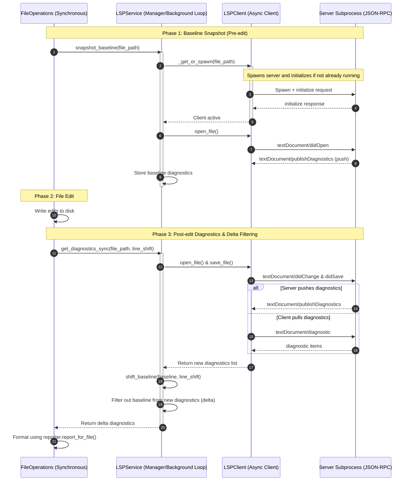

# agent/lsp Design Documentation

## Goal
The `agent/lsp` directory implements the Language Server Protocol (LSP) integration for the Hermes Agent. Its primary purpose is to provide post-write semantic lints (diagnostics) when the agent makes edits to codebase files (such as via `write_file` or `patch` tools).

Main tasks performed by this subsystem:
*   **Workspace Detection:** Restricts LSP activation to files residing within Git worktrees to prevent spawning unnecessary background daemons in non-project folders.
*   **Server Management:** Resolves file mappings to appropriate language servers, manages subprocess lifecycles, and automatically bootstraps missing binaries to a sandboxed directory (`<HERMES_HOME>/lsp/bin/`).
*   **JSON-RPC Client:** Handles framing and JSON-RPC communication with language servers over standard input/output.
*   **Delta-Filtering:** Captures diagnostics baseline snapshots immediately before an edit and filters out pre-existing errors from post-edit diagnostics. Remaps line numbers for baseline diagnostics based on edit diffs to handle inserted or deleted lines without triggering false positive diagnostics.
*   **Formatted Reporting:** Generates clean, XML-wrapped diagnostics logs tailored for consumption by the LLM.

## File Enumeration
*   [__init__.py](file:///home/castincar/hermes-agent/agent/lsp/__init__.py): Exposes package entry points. Lazily initializes and provides access to the singleton `LSPService`, registers `atexit` hooks for clean subprocess termination, and handles service shutdown.
*   [cli.py](file:///home/castincar/hermes-agent/agent/lsp/cli.py): Implements command-line handlers for the `hermes lsp` subcommands (`status`, `list`, `install`, `install-all`, `restart`, `which`) to inspect and troubleshoot language servers.
*   [client.py](file:///home/castincar/hermes-agent/agent/lsp/client.py): Contains the `LSPClient` class, which manages standard streams of the language server child process, implements text document synchronization (`didOpen`, `didChange`, `didSave`), handles diagnostics pull requests, and implements wait-for-push mechanics.
*   [eventlog.py](file:///home/castincar/hermes-agent/agent/lsp/eventlog.py): Implements structured logging for the LSP subsystem (`hermes.lint.lsp`), deduping status information and warning messages once-per-session to avoid polluting the main agent logs.
*   [install.py](file:///home/castincar/hermes-agent/agent/lsp/install.py): Contains the installation recipes (`INSTALL_RECIPES`) and platform package manager runners (`npm`, `go`, `pip`) to stage language server binaries in the local `lsp/bin` directory.
*   [manager.py](file:///home/castincar/hermes-agent/agent/lsp/manager.py): Implements `LSPService`, which runs the asyncio event loop on a background daemon thread, manages the mapping of active clients, and implements baseline capturing and delta comparison.
*   [protocol.py](file:///home/castincar/hermes-agent/agent/lsp/protocol.py): Provides basic JSON-RPC 2.0 framing, encoding, decoding, and custom protocol/request exceptions.
*   [range_shift.py](file:///home/castincar/hermes-agent/agent/lsp/range_shift.py): Builds a piecewise-linear line remapping map using `difflib.SequenceMatcher.get_opcodes()` to shift diagnostic line coordinates after content modifications.
*   [reporter.py](file:///home/castincar/hermes-agent/agent/lsp/reporter.py): Formats diagnostics into XML summaries bounded by maximum length and severity for agent tool output.
*   [servers.py](file:///home/castincar/hermes-agent/agent/lsp/servers.py): Defines the registry of supported servers, command construction patterns, language IDs, and workspace root resolvers (e.g., checking for `package.json`, `Cargo.toml`).
*   [workspace.py](file:///home/castincar/hermes-agent/agent/lsp/workspace.py): Provides utilities to walk directory hierarchies, identify project markers, find Git worktrees, and verify whether a file is within the active workspace.

## Workflow
The diagram below shows the runtime flow of a file edit and how pre-edit baselines and post-edit diagnostics are captured, shifted, and delta-filtered.



## System Architecture
The relationship between files in this directory and external modules is illustrated below:

```
                    +------------------------------------+
                    |   tools.file_operations (Caller)   |
                    +-----------------+------------------+
                                      |
                                      v
                    +-----------------+------------------+
                    |           agent.lsp                |
                    |         (__init__.py)              |
                    +-----------------+------------------+
                                      |
                                      v
                    +-----------------+------------------+
                    |            manager                 |    <---+ (Query / Control)
                    |          (LSPService)              |        |
                    +--------+------------------+--------+        |
                             |                  |                 |
         +-------------------+                  +-----------+     |
         |                                                  |     |
         v                                                  v     |
+--------+-----------+                             +--------+-----+-----+
|      servers       |                             |       client        |
|   (ServerDef &     |                             |    (LSPClient)      |
|    Registry)       |                             +--------+-----+------+
+--------+-----------+                                      |     |
         |                                                  |     | (JSON-RPC)
         v                                                  v     v
+--------+-----------+                             +--------+-----+-----+
|     workspace      |                             |      protocol       |
| (Root & Git work-  |                             | (Framer & Envelope) |
|  tree resolution)  |                             +---------------------+
+--------------------+                                       |
                                                             v
+--------------------+                             +---------------------+
|      install       |<----------------------------+  Server Subprocess  |
| (auto-install to   |                             |   (e.g., pyright,   |
|  lsp/bin staging)  |                             |    gopls, clangd)   |
+--------------------+                             +---------------------+

       - - - - - - - - - Support Modules - - - - - - - - - -
       [range_shift]  - Remaps baseline diagnostics via diff opcodes
       [reporter]     - Formats final delta diagnostics for the agent
       [eventlog]     - Structured, deduped logging (hermes.lint.lsp)
       [cli]          - hermes lsp command line interface handler
```
