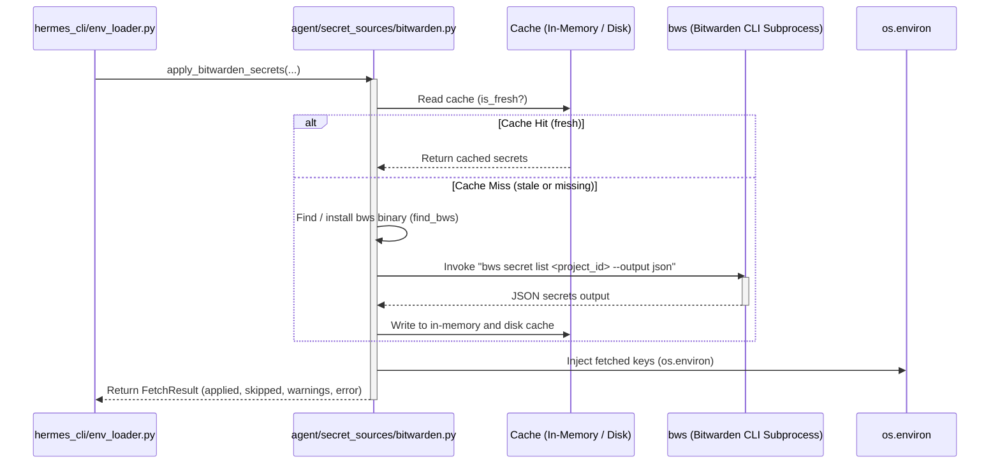

# agent/secret_sources Design Documentation

## Goal
The `agent/secret_sources` directory manages the integration of external secret sources to securely supply environment-variable-shaped credentials at process startup. By retrieving secrets dynamically, Hermes avoids the need to store sensitive keys (e.g., LLM provider API keys) in plaintext in the user's `~/.hermes/.env` file. These integrations run non-destructively: they only populate environment variables that are not already defined, ensuring that local shell exports and `.env` file settings retain precedence.

## File Enumeration
* [__init__.py](file:///home/castincar/hermes-agent/agent/secret_sources/__init__.py)
  Provides the module level documentation for the external secret sources package.
* [bitwarden.py](file:///home/castincar/hermes-agent/agent/secret_sources/bitwarden.py)
  Implements the integration with Bitwarden Secrets Manager (using the `bws` CLI). It handles automatic download and verification of the pinned `bws` binary, invoking the CLI as a subprocess to list secrets for a specific project, and caching the fetched credentials across processes using a two-layer cache (in-memory and a secure local JSON file).

## Workflow
The sequence diagram below shows how credentials are loaded and cached from Bitwarden Secrets Manager during process startup.



## System Architecture
The relationships between the secrets module, CLI command layers, local storage, and the upstream Bitwarden endpoint are illustrated below.

```
+-----------------------------------------------------------------------------------+
|                                 Hermes Core / CLI                                 |
|                                                                                   |
|  +---------------------------+             +----------------------------------+   |
|  | hermes_cli/env_loader.py  |             |    hermes_cli/secrets_cli.py     |   |
|  +-------------+-------------+             +-----------------+----------------+   |
|                |                                             |                    |
|                | (Calls apply_bitwarden_secrets)             | (CLI Setup/Sync/   |
|                v                                             v Status/Install)    |
|  +-----------------------------------------------------------+----------------+   |
|  |                        agent/secret_sources/bitwarden.py                   |   |
|  +---------+--------------------+----------------------------+----------------+   |
|            |                    |                            |                    |
|            | (downloads binary) | (invokes)                  | (reads/writes)     |
|            v                    v                            v                    |
|    +---------------+    +---------------+            +---------------+            |
|    | GitHub        |    | bws binary    |            | bws_cache.json|            |
|    | Releases      |    | (Subprocess)  |            | (Disk Cache)  |            |
|    +---------------+    +-------+-------+            +---------------+            |
|                                 |                                                 |
|                                 | (HTTP API)                                      |
|                                 v                                                 |
|                      +--------------------+                                       |
|                      |  Bitwarden Cloud / |                                       |
|                      |  Self-hosted Vault |                                       |
|                      +--------------------+                                       |
+-----------------------------------------------------------------------------------+
```
