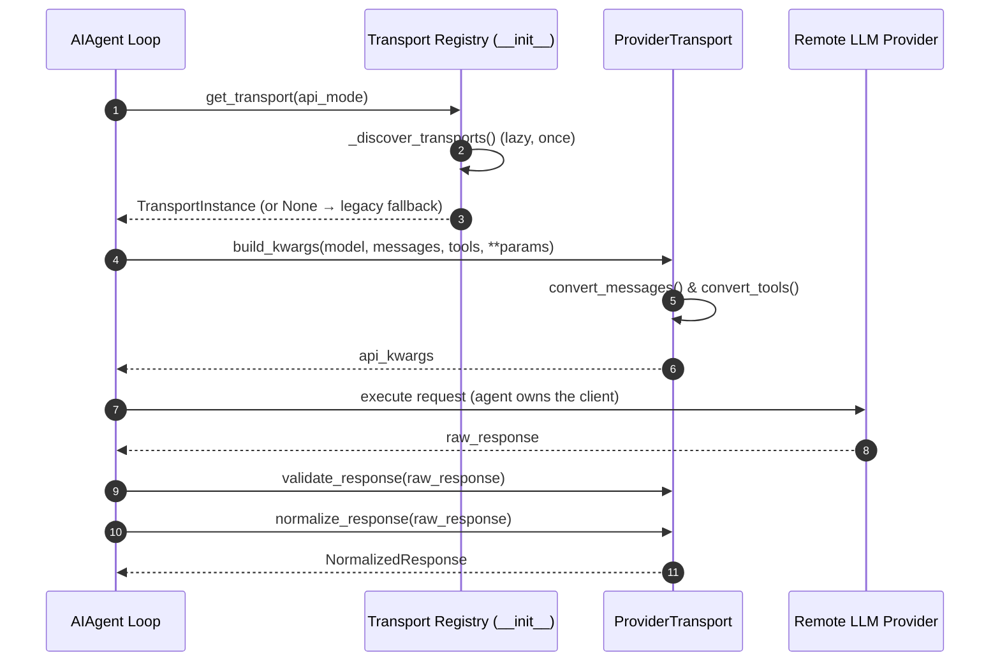
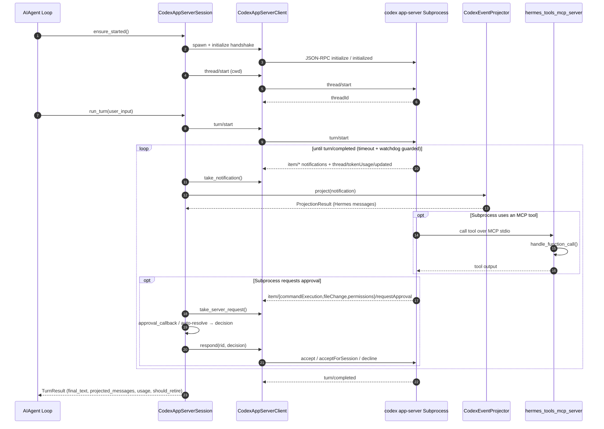

# agent/transports Design Documentation

## Goal
The `agent/transports` directory is a modular transport/adapter layer that abstracts provider-specific API formats, validation rules, and protocol quirks. Each transport converts OpenAI-shaped messages/tools into a provider-native request and normalizes the raw response back into one shared `NormalizedResponse` type. This keeps the core agent loop (`AIAgent` in `run_agent.py`) provider-agnostic while preserving prompt caching, unified token accounting, and consistent retry/interrupt interfaces across multiple LLM backends (Anthropic, Bedrock, OpenAI-compatible Chat Completions, and the OpenAI Responses/Codex API).

A transport owns the **data path only** (`convert_messages → convert_tools → build_kwargs → normalize_response`). Client construction, streaming, credential refresh, prompt caching, interrupt handling, and retry logic stay on `AIAgent`. Most transports delegate the heavy lifting to sibling adapter modules outside this directory (`agent/anthropic_adapter.py`, `agent/bedrock_adapter.py`, `agent/codex_responses_adapter.py`).

This directory also hosts the **Codex app-server runtime** — an optional opt-in path (gated by `model.openai_runtime == "codex_app_server"`) where the `codex` CLI owns the agent loop in a subprocess. These modules manage the stdio JSON-RPC lifecycle, bridge approval prompts, project Codex events back into Hermes' message shape, and expose Hermes' own tools to Codex via an MCP server.

## File Enumeration
* `__init__.py`: Transport registry. Holds the `_REGISTRY` dict and exposes `register_transport(api_mode, cls)`, `get_transport(api_mode)`, and re-exports the `types` helpers (`NormalizedResponse`, `ToolCall`, `Usage`, `build_tool_call`, `map_finish_reason`). `get_transport` lazily imports all transport modules once (`_discover_transports`) so they auto-register; returns `None` for an unknown api_mode (lets call sites fall back to legacy code paths), re-running discovery on a miss to tolerate partial/order-dependent imports.
* `base.py`: `ProviderTransport` ABC. Declares the required surface: `api_mode` (property), `convert_messages`, `convert_tools`, `build_kwargs`, `normalize_response`. Provides default no-op implementations of `validate_response` (→ True), `extract_cache_stats` (→ None), and `map_finish_reason` (identity).
* `types.py`: Shared normalized dataclasses. `ToolCall` (id/name/arguments + `provider_data`, with backward-compat `.function`/`.type`/`.call_id`/`.response_item_id`/`.extra_content` properties), `Usage`, and `NormalizedResponse` (content/tool_calls/finish_reason/reasoning/usage + `provider_data`, with backward-compat accessors for `reasoning_content`, `reasoning_details`, `anthropic_content_blocks`, `codex_reasoning_items`, `codex_message_items`). Protocol-specific state lives in `provider_data` dicts so the shared surface stays minimal. Factory helpers: `build_tool_call()` (auto-JSON-serializes args, collects extras into provider_data) and `map_finish_reason()` (maps via a dict, defaults to `"stop"`).
* `anthropic.py`: `AnthropicTransport` for `api_mode='anthropic_messages'`. Delegates conversion to `agent/anthropic_adapter.py`. Normalizes content blocks (text/thinking/tool_use), maps `stop_reason`, collects `reasoning_details`, and preserves verbatim ordered content blocks (`anthropic_content_blocks`) only when a turn interleaves signed thinking with tool_use (so replay doesn't invalidate thinking-block signatures). Strips the `mcp_` prefix on OAuth-injected tool names. `validate_response` accepts empty content for `end_turn`/`refusal`; `extract_cache_stats` reads Anthropic cache token counts.
* `bedrock.py`: `BedrockTransport` for `api_mode='bedrock_converse'`. Delegates to `agent/bedrock_adapter.py`. Converts to the Bedrock Converse API shape and tags kwargs with `__bedrock_converse__`/`__bedrock_region__` sentinels the agent pops before the boto3 call. Normalizes both raw boto3 dicts and already-normalized SimpleNamespace responses.
* `chat_completions.py`: `ChatCompletionsTransport` for the default `api_mode='chat_completions'` (~16 OpenAI-compatible providers — OpenRouter, Nous, NVIDIA, Qwen, Ollama, DeepSeek, xAI, Kimi, etc.). Messages/tools are near-identity; `convert_messages` strips wire-incompatible fields (Codex items, `tool_name`, `_`-prefixed scaffolding markers, and Gemini `extra_content` unless the target model is Gemini-family). `build_kwargs` has two paths: a `ProviderProfile`-driven path (`_build_kwargs_from_profile`, used for all known providers) and a legacy flag path for unregistered providers. Handles reasoning effort, temperature, `extra_body` assembly, and Gemini `thinking_config` translation. Module helpers: `_build_gemini_thinking_config`, `_snake_case_gemini_thinking_config`, `_is_gemini_openai_compat_base_url`, `_model_consumes_thought_signature`. `normalize_response` preserves Gemini `extra_content`, `reasoning`/`reasoning_content`, `reasoning_details`, and OpenAI structured refusals.
* `codex.py`: `ResponsesApiTransport` for `api_mode='codex_responses'`. Delegates to `agent/codex_responses_adapter.py`. Adapts chat flow to the OpenAI Responses API (xAI/Grok, chatgpt.com/backend-api/codex, GitHub/Copilot backends), managing cross-turn encrypted reasoning replay, issuer-kind stamping (so foreign-issuer reasoning blocks are dropped on model swaps), `prompt_cache_key`/xAI cache routing, and backend-specific kwarg quirks. Adds `preflight_kwargs()` to sanitize/validate kwargs before the call.
* `codex_app_server.py`: `CodexAppServerClient` — the wire-level speaker for `codex app-server` (codex 0.125+). Newline-delimited JSON-RPC 2.0 over stdio: spawns the subprocess, runs the `initialize` handshake, drives requests, and routes replies/notifications/server-requests to bounded queues via background reader threads (synchronous, not async). Also defines `CodexAppServerError`, and module functions `parse_codex_version()` and `check_codex_binary()` (version-gate helpers used by setup/startup). Adds Kanban writable-root sandbox args when `HERMES_KANBAN_TASK` is set.
* `codex_app_server_session.py`: `CodexAppServerSession` — one Codex thread per Hermes session. Drives `thread/start`/`turn/start`, polls notifications, projects them via `CodexEventProjector`, bridges server-initiated approval requests (exec / fileChange / permissions / MCP elicitation) to Hermes' approval flow, handles interrupts (`turn/interrupt`), captures token usage (`thread/tokenUsage/updated`), and returns a `TurnResult`. Includes resilience logic: turn-timeout + post-tool quiet watchdog, dead-subprocess detection, `<turn_aborted>` marker handling, OAuth-failure classification (→ `codex login` hint), and `should_retire` signaling so wedged sessions respawn. Maps Hermes terminal security mode → Codex permission profile.
* `codex_event_projector.py`: `CodexEventProjector` + `ProjectionResult`. Translates Codex `item/*` notifications into standard OpenAI-shaped `{role, content, tool_calls, tool_call_id}` messages so `agent/curator.py` (memory/skill review) keeps working. Materializes messages only on `item/completed`; maps agentMessage/userMessage/reasoning/commandExecution/fileChange/mcpToolCall/dynamicToolCall (and opaque fallbacks), tracking a `tool_iterations` counter for the skill-nudge gate. `_deterministic_call_id()` keeps tool_call ids stable across replay for prefix-cache validity.
* `hermes_tools_mcp_server.py`: A stateless FastMCP server (`python -m agent.transports.hermes_tools_mcp_server`) that exposes a curated subset of Hermes tools (web search/extract, browser automation, vision, image generation, skills, TTS, and Kanban worker/orchestrator commands) back to the Codex subprocess. Pulls authoritative tool schemas from `model_tools.get_tool_definitions()` and dispatches via `handle_function_call()`. Deliberately omits codex-native tools (shell/file/patch) and `_AGENT_LOOP_TOOLS` (delegate_task/memory/session_search/todo) that need live AIAgent state.

## Workflow

### Standard Provider Request Flow


### Codex App-Server Session Execution Flow


## System Architecture

```
                      +-----------------------------+
                      |     AIAgent (run_agent.py)   |
                      +--------------+---------------+
                                     |
             +-----------------------+------------------------+
             |                                                |
             v                                                v
     [ get_transport ]  (__init__.py)            [ CodexAppServerSession ]
             |                                                |
             v                                                v
     +---------------+                            +------------------------+
     |   _REGISTRY   |  ProviderTransport (base)  |  CodexAppServerClient  |
     +-------+-------+                            +-----------+------------+
             |                                                | JSON-RPC stdio
     +-------+--------+--------------+                         v
     |       |        |             |              +----------------------+
     v       v        v             v              |   codex app-server   |
[Anthropic][Bedrock][ChatComplet.][Codex]         |      subprocess      |
     |       |        |             |              +----+-------------+---+
     v       v        v             v                   |             |
 (anthropic (bedrock (providers/  (codex_responses      | events      | MCP tool call
  _adapter) _adapter) profiles)    _adapter)            v             v
                                              +---------+--------+  +-+------------------+
        all → NormalizedResponse (types.py)   |CodexEventProjector|  |hermes_tools_mcp_   |
                                              +---------+--------+  |server (FastMCP)    |
                                                        |          +---------+----------+
                                                        v                    |
                                              [Hermes messages]   handle_function_call()
                                                                  → [Hermes core tools]
```
