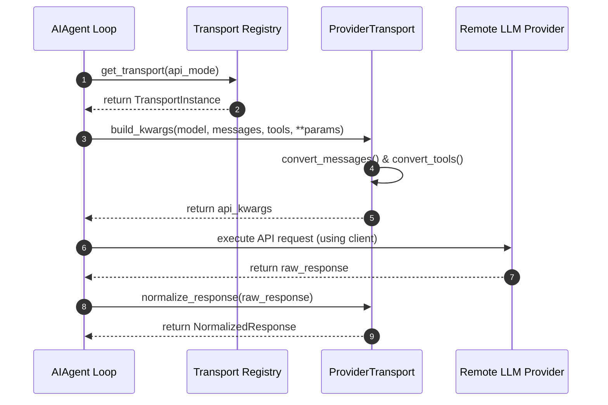
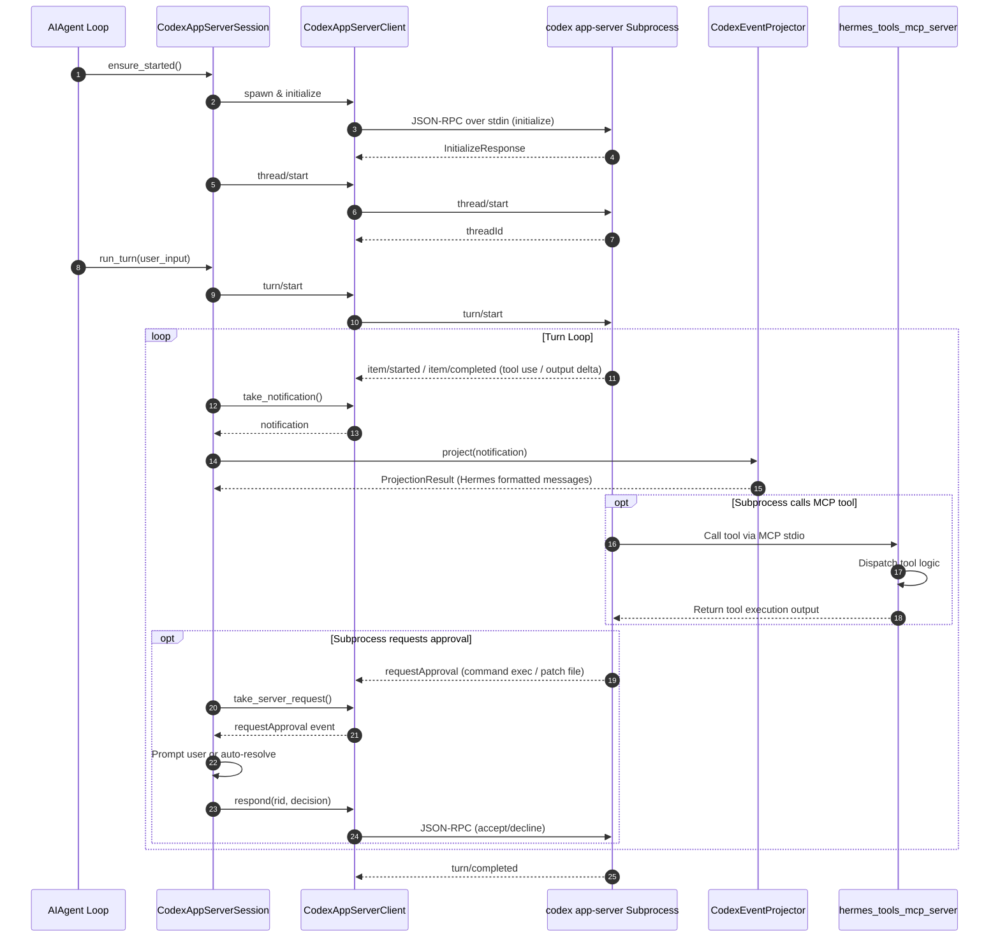

# agent/transports Design Documentation

## Goal
The `agent/transports` directory provides a modular transport and adapter layer that abstracts provider-specific API formats, validation schemas, and protocol quirks. By converting messages/tools to provider-native structures and normalizing raw responses into a standard format, it acts as a translation layer. This ensures that the core agent loop (`AIAgent`) remains provider-agnostic and maintains prompt caching, unified token accounting, and consistent retry/interrupt interfaces across multiple LLM backends (Anthropic, Bedrock, OpenAI-compatible, and Codex/Responses).

In addition to API translation, this directory hosts the Codex App-Server runtime adapter, providing stdio JSON-RPC process lifecycle control, approval prompt bridging, event projection, and a Model Context Protocol (MCP) server that exposes Hermes' core capabilities back to Codex.

## File Enumeration
* [__init__.py](file:///home/castincar/hermes-agent/agent/transports/__init__.py): Implements the dynamic discovery registry for provider transports. Exposes the primary entry point `get_transport(api_mode)` to load transport modules on-demand.
* [base.py](file:///home/castincar/hermes-agent/agent/transports/base.py): Defines the `ProviderTransport` abstract base class which dictates the required API signature (`convert_messages`, `convert_tools`, `build_kwargs`, `normalize_response`, and `validate_response`) for all adapter implementations.
* [types.py](file:///home/castincar/hermes-agent/agent/transports/types.py): Defines the unified dataclasses used across all transports: `NormalizedResponse`, `ToolCall`, and `Usage`, along with backward-compatibility properties (e.g. mapping `codex` and `gemini` metadata via `provider_data`).
* [anthropic.py](file:///home/castincar/hermes-agent/agent/transports/anthropic.py): Implements `AnthropicTransport` for the `anthropic_messages` api_mode. Converts messages/tools to Claude's format, manages token usage and cache stats, and handles Claude-specific features like signed reasoning/thinking blocks.
* [bedrock.py](file:///home/castincar/hermes-agent/agent/transports/bedrock.py): Implements `BedrockTransport` for the `bedrock_converse` api_mode. Converts OpenAI-like schemas to Bedrock Converse API parameters and handles AWS boto3 response structures.
* [chat_completions.py](file:///home/castincar/hermes-agent/agent/transports/chat_completions.py): Implements `ChatCompletionsTransport` for the default `chat_completions` api_mode. Handles OpenAI-compatible endpoints (Nous, OpenRouter, DeepSeek, etc.) and resolves reasoning efforts, structured safety refusals, and provider-specific body parameter adjustments.
* [codex.py](file:///home/castincar/hermes-agent/agent/transports/codex.py): Implements `ResponsesApiTransport` for `codex_responses`. Adapts standard conversation flow to the OpenAI Responses API schema (Grok/xAI, chatgpt.com backend), managing cross-turn encrypted reasoning state and caching keys.
* [codex_app_server.py](file:///home/castincar/hermes-agent/agent/transports/codex_app_server.py): Implements `CodexAppServerClient`, a synchronous JSON-RPC 2.0 stdio client wrapper that manages the lifecycle of the spawned `codex app-server` subprocess.
* [codex_app_server_session.py](file:///home/castincar/hermes-agent/agent/transports/codex_app_server_session.py): Manages the high-level session, turn execution (`CodexAppServerSession`), interrupt signals, and approval decisions (like execution and file change patch requests) for the local Codex subprocess.
* [codex_event_projector.py](file:///home/castincar/hermes-agent/agent/transports/codex_event_projector.py): Translates and projects `item/*` events emitted by the Codex app-server into standard OpenAI-compatible messages (`{role, content, tool_calls}`) to keep core curate/skill routines functioning.
* [hermes_tools_mcp_server.py](file:///home/castincar/hermes-agent/agent/transports/hermes_tools_mcp_server.py): Defines a stateless Model Context Protocol (MCP) server that exposes a curated subset of Hermes tools (e.g. search, browser, vision, kanban worker commands) back to the Codex child process.

## Workflow

### Standard Provider Request Flow


### Codex App-Server Session Execution Flow


## System Architecture

```
                      +-----------------------------+
                      |    AIAgent (run_agent.py)   |
                      +--------------+--------------+
                                     |
             +-----------------------+-----------------------+
             |                                               |
             v                                               v
     [ get_transport ]                            [ CodexAppServerSession ]
             |                                               |
             v                                               v
     +---------------+                            +-----------------------+
     |   _REGISTRY   |                            |  CodexAppServerClient |
     +-------+-------+                            +-----------+-----------+
             |                                                | (JSON-RPC stdio)
     +-------+-------------------------+                      v
     |       |         |               |           +----------------------+
     v       v         v               v           |  codex app-server    |
 [Anthropic][Bedrock][ChatCompletions][Codex]      |      subprocess      |
                                                   +----+------------+----+
                                                        |            |
                                      (Event Project)   v            v (MCP tool call)
                                            +-----------+-------+  +-+-------------------+
                                            |CodexEventProjector|  |hermes_tools_mcp_... |
                                            +-----------+-------+  +---------+-----------+
                                                        |                    |
                                                        v                    v
                                                [Hermes Messages]    [Hermes Core Tools]
```
