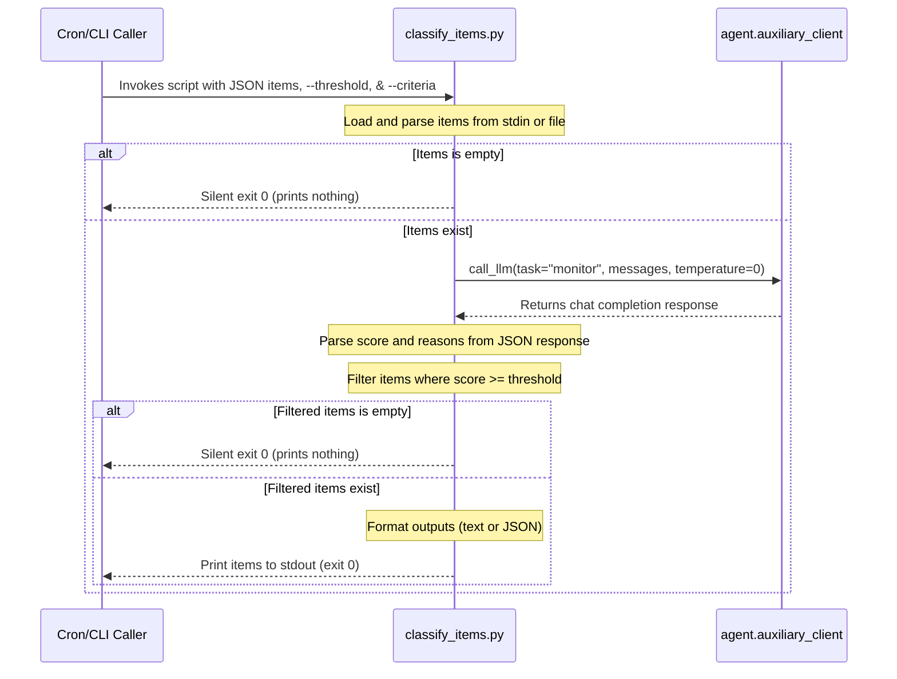

# cron/scripts Design Documentation

## Goal
The `cron/scripts` directory contains executable helper scripts designed to run as part of the cron subsystem or as standalone command-line components. The primary goal of this directory is to house proactive background monitoring, ingestion, and filtering logic (such as the proactive urgency-monitor pattern). These scripts fetch or receive candidate items, evaluate them against configured criteria using a cheap/fast auxiliary LLM, and filter out below-threshold noise so that only actionable notifications or summaries are surfaced to the user.

## File Enumeration
- [__init__.py](file:///home/castincar/hermes-agent/cron/scripts/__init__.py): Package initializer defining the `cron.scripts` namespace.
- [classify_items.py](file:///home/castincar/hermes-agent/cron/scripts/classify_items.py): A CLI utility implementing the urgency-monitor pattern. It reads candidate items in JSON format (from stdin or a specified file), formats them, and requests scoring from the configured monitor LLM using the auxiliary client. Items are scored on a scale from 0 to 10 against user importance criteria; items meeting or exceeding the specified threshold are printed to stdout (in text or JSON format). If no items meet the threshold, the script outputs nothing and exits with a status of 0.

## Workflow


## System Architecture
```
               ┌─────────────────────────────────┐
               │    Cron Job / CLI Invocation    │
               └────────────────┬────────────────┘
                                │
                                │ reads candidates
                                │ via stdin/file
                                ▼
 ┌─────────────────────────────────────────────────────────────┐
 │ cron/scripts                                                │
 │                                                             │
 │   ┌─────────────────────────────────────────────────────┐   │
 │   │                  classify_items.py                  │   │
 │   │                                                     │   │
 │   │  - Parses JSON input                                │   │
 │   │  - Scores candidates via auxiliary client           │   │
 │   │  - Outputs items above target threshold             │   │
 │   └──────────────────────────┬──────────────────────────┘   │
 └──────────────────────────────┼──────────────────────────────┘
                                │
                                │ calls call_llm(task="monitor")
                                ▼
 ┌─────────────────────────────────────────────────────────────┐
 │ agent/auxiliary_client.py                                   │
 │                                                             │
 │  - Communicates with configured monitor LLM provider        │
 └─────────────────────────────────────────────────────────────┘
```
