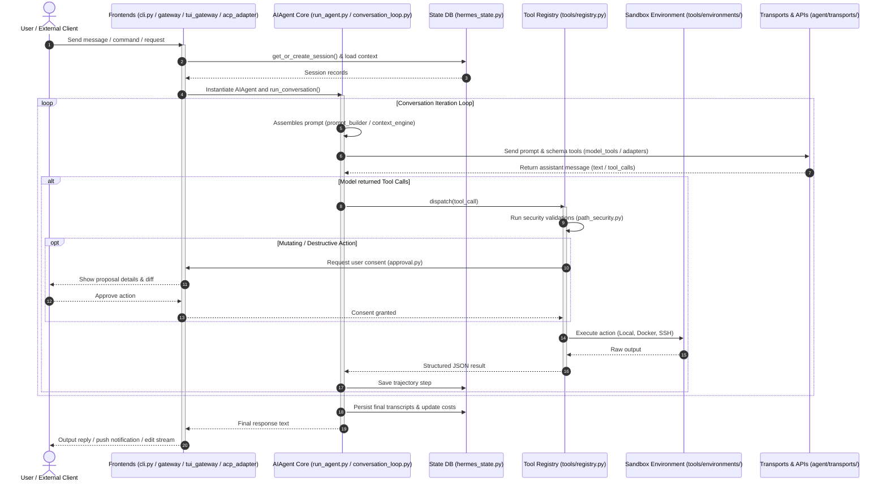

# Project Root Design Documentation

## Goal
The repository root (`hermes-agent/`) is the central orchestration hub of the Hermes Agent codebase. It houses the main execution entry points (interactive CLI, asynchronous gateways, batch trial runners, and editor sidecars), state management structures, tool-definition schemas, and key utility modules. 

The primary tasks of this subsystem include:
*   **Agent Execution Coordination:** Exposing the high-level `AIAgent` class that interfaces with the model transports, assemblies prompts, and manages the main turn loop.
*   **CLI User Session Management:** Directing terminal input prompts, styling output responses, and routing inline slash commands.
*   **Dynamic Capabilities Definition:** Mapping model-facing tool schemas and matching incoming function calls to corresponding tool-registry handlers.
*   **State & Audit Persistence:** Managing SQLite connection pools for chat session transcripts, task checkmarks, semantic memory, and system trace trajectories.
*   **Global Subsystem Integration:** Linking together sub-components such as the messaging gateways (`gateway/`), custom tool implementations (`tools/`), cron automation scheduler (`cron/`), standard ACP adapters (`acp_adapter/`), and TUI websockets (`tui_gateway/`).

---

## File Enumeration

### Subdirectories (with existing Design Documents)
*   [agent/DESIGN.md](agent/DESIGN.md): The core intelligence and request/response execution engine. Coordinates adapters (Anthropic, Gemini, Bedrock), context summary compaction, rate-limiting pools, and local LSP diagnostics.
*   [tools/DESIGN.md](tools/DESIGN.md): The capability and extension layer of the agent. Enforces path validation, manages user consent diffs, handles MCP clients, and directs sandbox environments.
*   [hermes_cli/DESIGN.md](hermes_cli/DESIGN.md): Argparse parser hierarchies, profile isolation directories, setup wizards, local HTTP client proxies, and dashboard authentication.
*   [gateway/DESIGN.md](gateway/DESIGN.md): Messaging bridge linking the agent core to platforms like Telegram, Discord, Slack, Matrix, and custom webhooks.
*   [cron/DESIGN.md](cron/DESIGN.md): Timezone-aware scheduled background timers and parameter-slotted suggestion blueprints.
*   [acp_adapter/DESIGN.md](acp_adapter/DESIGN.md): Stdio JSON-RPC server mapping agent capabilities to editor environments like Zed.
*   [tui_gateway/DESIGN.md](tui_gateway/DESIGN.md): Bidirectional Websocket/stdio RPC controller that powers Ink terminal interfaces and dashboard consoles.
*   [apps/desktop/DESIGN.md](apps/desktop/DESIGN.md): Design guidelines, primitive components styling, and multi-locale string definitions for the Electron application.

### Python Modules & Shell Scripts
*   [run_agent.py](../run_agent.py): The main conversation loop class (`AIAgent`). Controls prompt builder triggers, model completion calls, budget iteration limits, tool execution routing, and cost updates.
*   [cli.py](../cli.py): Main terminal interface controller class (`HermesCLI`). Uses `prompt_toolkit` and `Rich` to handle interactive user sessions, slash commands, autocomplete indexes, and screen displays.
*   [model_tools.py](../model_tools.py): Discovers and parses LLM tool definitions. Formats tool lists into OpenAI/Anthropic schemas and resolves execution targets via `handle_function_call()`.
*   [toolsets.py](../toolsets.py): Groups specific categories of capabilities (e.g. `web`, `vision`, `terminal`, `file`) and registers default enabled toolsets in `_HERMES_CORE_TOOLS`.
*   [hermes_state.py](../hermes_state.py): Persistence manager (`SessionDB`) backed by SQLite. Includes full-text search (FTS5) for querying past conversations, memory records, goals, and attachments.
*   [hermes_constants.py](../hermes_constants.py): Declares common static paths, configuration filenames, and profile paths (`get_hermes_home()`, `display_hermes_home()`).
*   [hermes_logging.py](../hermes_logging.py): Standardizes logging across Hermes sub-processes. Configures profile-aware logs for the agent, gateways, and errors.
*   [hermes_time.py](../hermes_time.py): Timezone-aware clock utility exposing `now()` based on configured IANA settings.
*   [batch_runner.py](../batch_runner.py): Orchestrates batch data generation or SWE validation trials in parallel across multiple model configurations or input datasets.
*   [trajectory_compressor.py](../trajectory_compressor.py): Trims conversation logs and replaces middle turns with concise summaries to fit target token budgets.
*   [mcp_serve.py](../mcp_serve.py): Stdio Model Context Protocol (MCP) server that exposes messaging histories, chat events, and approval requests to external clients.
*   [mini_swe_runner.py](../mini_swe_runner.py): Lightweight software engineering task coordinator that spawns commands inside Local, Docker, or Modal environments.
*   [toolset_distributions.py](../toolset_distributions.py): Maps probability weights to toolsets for selecting random tools during batch generation datasets.
*   [hermes_bootstrap.py](../hermes_bootstrap.py): Ensures UTF-8 standard stream compatibility on Windows host environments.
*   [utils.py](../utils.py): Shared utility functions for directory management, system detail checks, and basic value coercion.

---

## Workflow

The Mermaid diagram below shows how the master frontend systems (CLI, Gateway, TUI, ACP) load configurations, spin up the central agent core execution loop, and interact with the sandbox and approval gateways:



---

## System Architecture

The following ASCII block diagram demonstrates the architectural relationships between the frontend entry points, the root coordination managers, the core execution layers, and the underlying environments:

```
+-------------------------------------------------------------------------------------------------+
|                                         User Interfaces                                         |
|                                                                                                 |
|  +--------------------+   +--------------------+   +--------------------+   +----------------+  |
|  |     cli.py         |   | gateway/run.py     |   | tui_gateway/       |   | acp_adapter/   |  |
|  |  (Interactive CLI)  |   | (Telegram, Discord)|   | (Ink / WebSocket)  |   | (Zed / Editors)|  |
|  +---------+----------+   +---------+----------+   +---------+----------+   +--------+-------+  |
+------------|------------------------|------------------------|-----------------------|----------+
             |                        |                        |                       |
             +------------------------+-----------+------------+-----------------------+
                                                  |
                                                  v
+-------------------------------------------------------------------------------------------------+
|                                 Root Coordination Managers                                      |
|                                                                                                 |
|  +-------------------------------------+           +-----------------------------------------+  |
|  |          run_agent.py               |           |            model_tools.py               |  |
|  |      (AIAgent Loop controller)      |           |     (Discovery & Schema mapping)        |  |
|  +------------------+------------------+           +--------------------+--------------------+  |
|                     |                                                   |                       |
|                     v                                                   v                       |
|  +-------------------------------------+           +-----------------------------------------+  |
|  |          hermes_state.py            |           |            toolsets.py                  |  |
|  |     (SessionDB SQLite storage)      |           |      (Preset capability bundles)        |  |
|  +-------------------------------------+           +-----------------------------------------+  |
+-------------------------------------------------------------------------------------------------+
                                                  |
                                                  v
+-------------------------------------------------------------------------------------------------+
|                                     Subsystem Execution Core                                    |
|                                                                                                 |
|  +-------------------------------------+           +-----------------------------------------+  |
|  |          agent/ Subdirectory        |           |          tools/ Subdirectory            |  |
|  |  - context_compressor.py            |           |  - registry.py & tool_executor.py       |  |
|  |  - prompt_builder.py & system_prompt |           |  - path_security.py & threat_patterns.py|  |
|  |  - transports/ & *_adapter.py       |           |  - tool definitions (files, browser, mcp|  |
|  +-------------------------------------+           +--------------------+--------------------+  |
+-------------------------------------------------------------------------|-----------------------+
                                                                          |
                                                                          v
+-------------------------------------------------------------------------------------------------+
|                                 Target Execution Environments                                   |
|                                                                                                 |
|                  +-------------------------------------------------------------+                |
|                  |                     tools/environments/                     |                |
|                  |       (Local Execution, Docker Container, SSH Remote,       |                |
|                  |              Modal Cloud, Daytona Workspace)                |                |
|                  +-------------------------------------------------------------+                |
+-------------------------------------------------------------------------------------------------+
```
