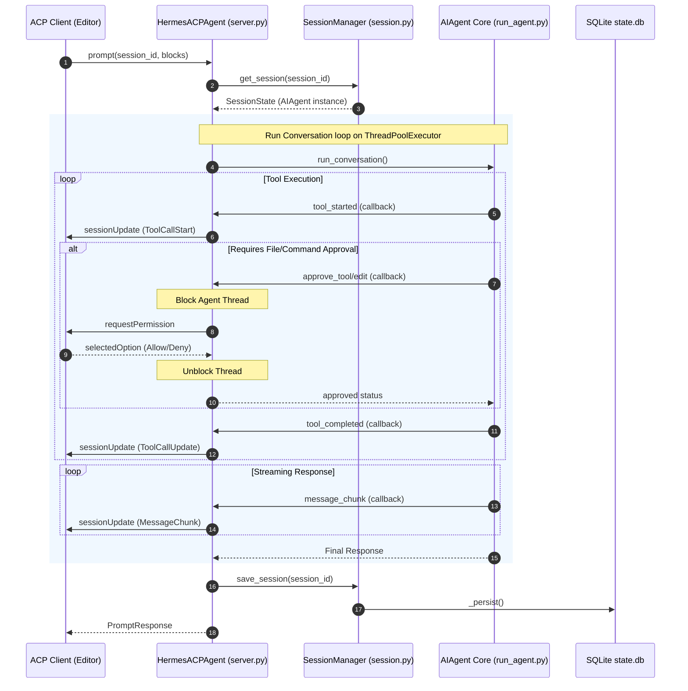

# acp_adapter Design Documentation

## Goal
The `acp_adapter` directory implements the **Agent Communication Protocol (ACP)** adapter for `hermes-agent`. Its primary goal is to expose the agent core as a standard, stdio-based JSON-RPC server that editors (like Zed) can launch and communicate with. It manages the lifecycle of ACP sessions, translates editor-requested prompts and options into internal agent invocations, and maps internal tool executions, agent thinking states, and progress events into standard ACP notifications. It also integrates editor-side permissions and file edit approvals back into the agent's runtime execution.

## File Enumeration
* [__init__.py](../../acp_adapter/__init__.py): Simple package initialization file identifying the directory as the ACP adapter module.
* [__main__.py](../../acp_adapter/__main__.py): Entry point wrapper allowing execution of the adapter via `python -m acp_adapter`.
* [auth.py](../../acp_adapter/auth.py): Resolves the active model provider configuration and exposes available authentication methods (agent-managed or terminal-based) to the ACP client during the handshake.
  - `detect_provider()`: Resolves active provider (e.g. OpenRouter, Azure Entra ID, etc.).
  - `build_auth_methods()`: Returns compatible ACP auth methods.
* [edit_approval.py](../../acp_adapter/edit_approval.py): Manages pre-execution approval for file modification tools (`write_file`, `patch`). It binds a requester callback to a `ContextVar` that prompts the client for interactive authorization.
  - `maybe_require_edit_approval()`: Intercepts mutations and requests permission if a requester is bound.
  - `make_acp_edit_approval_requester()`: Returns a thread-safe requester mapping to ACP permission requests.
  - `should_auto_approve_edit()`: Checks if the edit fits the current workspace or session auto-approval policy.
* [entry.py](../../acp_adapter/entry.py): CLI entry point that processes CLI arguments, sets up logging to stderr (leaving stdout clean for JSON-RPC messages), ensures environment setup, and executes `acp.run_agent(...)`.
* [events.py](../../acp_adapter/events.py): Contains callback factories that map internal agent execution hooks to ACP client session updates.
  - `make_tool_progress_cb()`: Instantiates progress callbacks for starting tools.
  - `make_thinking_cb()`: Instantiates callbacks for streaming thought text.
  - `make_step_cb()`: Instantiates callbacks for tool completions, also translating `todo` results to ACP plan updates.
  - `make_message_cb()`: Instantiates callbacks for streaming final assistant response chunks.
* [permissions.py](../../acp_adapter/permissions.py): Bridges dangerous commands (e.g. arbitrary terminal execution) to the client using the ACP permission system.
  - `make_approval_callback()`: Returns a Hermes-compatible approval callback that schedules the async permission request and blocks the worker thread until a user responds.
* [provenance.py](../../acp_adapter/provenance.py): Builds session lineage metadata under `_meta.hermes` by traversing the parent-child history (including compression rotations) in the sqlite database.
  - `build_session_provenance()`: Resolves parent links, root session, and compression depth for the active session.
* [server.py](../../acp_adapter/server.py): The main server implementation (`HermesACPAgent`) inheriting from `acp.Agent`. It processes incoming JSON-RPC methods, routes prompt execution to background threads, manages configuration options, and intercepts local slash commands.
* [session.py](../../acp_adapter/session.py): Thread-safe session manager (`SessionManager`) mapping ACP sessions to `AIAgent` instances. Manages in-memory state and SQL-based persistence/restoration, and handles Windows-to-WSL workspace path translations.
  - `SessionManager`: Creates, restores, forks, lists, and cleans up active sessions.
* [tools.py](../../acp_adapter/tools.py): Maps Hermes tools (e.g., `read_file`, `terminal`, `web_search`) to ACP `ToolKind` values and constructs rich start/complete notification payloads (like diff blocks and execution summaries).

## Workflow



## System Architecture

```
+-------------------------------------------------------------+
|                        ACP Client                           |
|                    (e.g., Zed Editor)                       |
+-------------------------------------------------------------+
                               ^
                               | (JSON-RPC over stdio)
                               v
+-------------------------------------------------------------+
|                         acp_adapter                         |
|                                                             |
|   +-----------------------------------------------------+   |
|   |                      entry.py                       |   |
|   +-----------------------------------------------------+   |
|                              |                              |
|                              v                              |
|   +-----------------------------------------------------+   |
|   |                      server.py                      |   |
|   |                 (HermesACPAgent)                    |   |
|   +-----------------------------------------------------+   |
|        |                   |                    |           |
|        v                   v                    v           |
|  +------------+     +------------+      +---------------+   |
|  | session.py |     |  tools.py  |      |   events.py   |   |
|  | (Manager)  |     +------------+      +---------------+   |
|  +------------+                                             |
|        |                   |                    |           |
|        v                   v                    v           |
|  +------------+     +------------+      +---------------+   |
|  | sqlite DB  |     |  auth.py   |      | permissions.py|   |
|  | (state.db) |     +------------+      |      &        |   |
|  +------------+     | provenance.py |   |edit_approval  |   |
|                     +------------+      +---------------+   |
|                                                 |           |
+-------------------------------------------------|-----------+
                                                  |
                                                  v
                                      +-----------------------+
                                      |      AIAgent Core     |
                                      |     (run_agent.py)    |
                                      +-----------------------+
```
