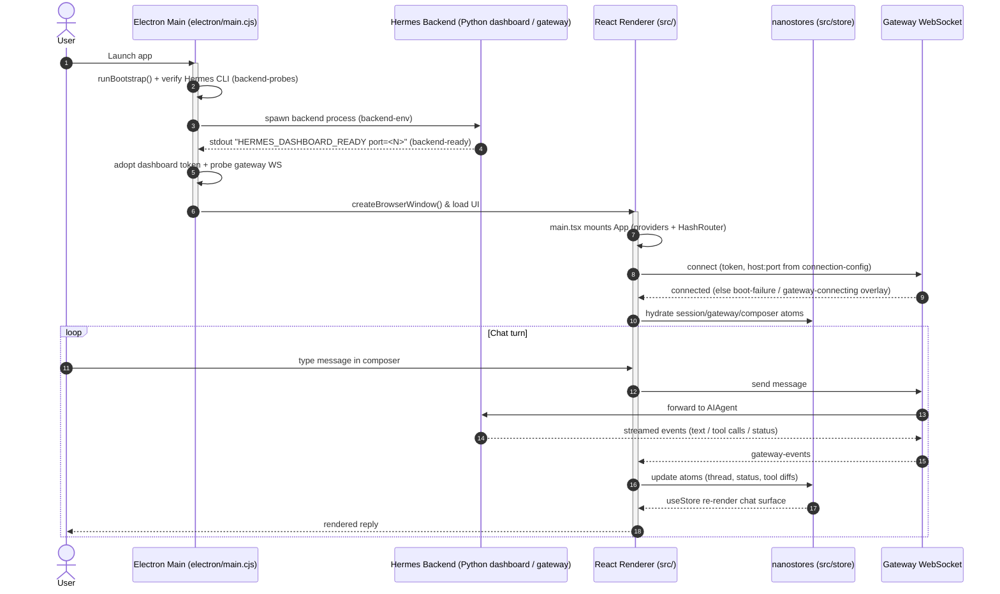

# Desktop App & Design System

## Goal

`apps/desktop` is the **Electron desktop client** for Hermes. It is a two-process
app: a Node **main process** (`electron/`, CommonJS `.cjs`) that bootstraps and
supervises the Python Hermes backend, owns native OS integration, and brokers
IPC; and a **React renderer** (`src/`, TypeScript + Vite) that talks to the
running backend's dashboard over a gateway WebSocket and renders the chat,
session, settings, and overlay UI.

The bulk of this document is the **design system** the renderer must follow —
the primitives, tokens, and conventions every component is built from. The
**File & Directory Enumeration**, **Workflow**, and **System Architecture**
sections at the end map the directory's structure and runtime flow.

---

## Design System

Conventions for the Electron desktop app (`apps/desktop`). Read this before
adding a component, overlay, or style. The rule of thumb: **one source per
concern, tokens over literals, flat over boxed.** If you reach for a raw color,
a one-off shadow, a bespoke button, or a hardcoded `px-*` on a control — stop,
there's already a primitive for it.

## Principles

1. **Flat, not boxed.** No card-in-card, no divider borders inside a panel.
   Group with whitespace and a single hairline, never nested rounded boxes.
2. **Borderless + shadow for elevation.** Overlays float on `shadow-nous` + a
   `--stroke-nous` hairline, not hard borders.
3. **One primitive per concern.** One `Button`, one set of control variants,
   one `SearchField`, one `Loader`, one `ErrorState`. Migrate onto them; don't
   fork.
4. **Tokens, not literals.** Reference CSS vars (`--ui-*`, `--shadow-nous`,
   `--theme-*`), never raw hex / ad-hoc rgba in components.
5. **Style lives in the primitive.** Variants and sizes own padding, radius,
   color, chrome. Call sites pass a `variant`/`size`, not `className` overrides
   that re-specify those.

## Surfaces & elevation

Every overlay / dialog / toast (boot-failure, install, notifications,
model-picker, onboarding, prompt-overlays, updates, base `Dialog`) uses:

```
shadow-nous           /* downward-weighted, layered contact→ambient falloff */
border-(--stroke-nous) /* currentColor hairline, theme-adaptive */
```

Both are CSS vars in `src/styles.css` — tune in one place, everything inherits.
Don't add per-overlay `shadow-[…]` or `border-(--ui-stroke-secondary)`
one-offs; if elevation needs to change, change the token.

## Stroke & color tokens

| Token | Use |
| --- | --- |
| `--ui-stroke-primary…quaternary` | hairlines, in descending strength |
| `--ui-stroke-tertiary` | the default in-panel divider / list hairline |
| `--stroke-nous` | the overlay hairline (pairs with `shadow-nous`) |
| `--ui-text-primary / -secondary / -tertiary` | text hierarchy |
| `--ui-bg-quaternary` | soft control fill (secondary button) |
| `--chrome-action-hover` | hover fill for quiet controls |
| `--theme-primary`, `--ui-accent` | brand/accent |

Never hardcode `border-gray-*`, `bg-white`, `text-black`, etc. The white tile in
`BrandMark` is the one sanctioned literal (the mark needs a fixed backdrop).

## Buttons — one component

`src/components/ui/button.tsx` is the single source. Pick a `variant` + `size`;
do **not** pass `h-*`, `px-*`, `py-*`, or icon-size overrides.

**Variants:** `default` (primary), `destructive`, `secondary` (soft fill —
the default non-primary look), `outline` (transparent + 1px inset ring, no
fill/shadow), `ghost`, `link`, `text` (boxless quiet inline — "Cancel",
"Clear"), `textStrong` (bold underlined inline affordance — "Change",
"Open logs").

**Sizes:** `default`, `xs`, `sm`, `lg`, `inline` (flush, zero box — for buttons
that sit inside a heading/sentence; replaces `h-auto px-0 py-0`), and the icon
family `icon` / `icon-xs` / `icon-sm` / `icon-lg` / `icon-titlebar`.

Notes:
- Text buttons are square (no radius) and sized by padding + line-height (no
  fixed heights). Only icon buttons carry the shared 4px radius.
- SVGs inherit `size-3.5` (`size-3` at `xs`). Don't re-set icon size.
- Polymorph with `asChild` when the button must render as a link/Slot.

## Form controls

- **`controlVariants`** (`src/components/ui/control.ts`) is the shared shape for
  `Input` / `Textarea` / `SelectTrigger`. New text-entry controls compose it.
- **`SearchField`** — borderless, underline-on-focus, auto-width. The only
  search input. Don't build boxed search bars; don't wrap it in a bordered tile.
  Empty lists hide their search field.
- **`SegmentedControl`** — the choice control for small mutually-exclusive sets
  (color mode, tool-call display, usage period). Replaces radio piles and
  pill rows.
- **`Switch`** (`size="xs"`) — bare, with `aria-label`. No bordered text wrapper.

## Layout

- **Gutters:** `PAGE_INSET_X` (`src/app/layout-constants.ts`) for page side
  padding; `PAGE_INSET_NEG_X` to bleed a child to the edge. Don't hardcode
  `px-6`/`px-8` on pages.
- **Master/detail overlays:** `OverlaySplitLayout` + `OverlaySidebar` /
  `OverlayMain`. Cron, profiles, etc. ride this — don't rebuild a titlebar
  shell.
- **Rows:** `ListRow` (settings `primitives.tsx`) for label/description/action
  rows. Flat, flush-left; no per-row indentation that fights flush headers.
- **No dividers between rows** unless the list genuinely needs them; prefer
  spacing. When you do need one, it's a single `--ui-stroke-tertiary` hairline.

## Feedback & empty/error/loading states

- **Loading:** `Loader` (`src/components/ui/loader.tsx`) — animated math/ascii
  curves (`lemniscate-bloom` for long ops). Never ship the literal text
  "Loading…".
- **Errors:** `ErrorState` + the canonical `ErrorIcon` (no bg chip). One look
  for the React boundary, in-dialog errors, and the boot-failure banner. Pass
  nodes for title/description so Radix `DialogTitle`/`Description` can flow
  through for a11y.
- **Logs:** `LogView` — no bg, hairline border, tight padding, small mono.
  Every place we surface raw logs uses it.
- **Empty:** `EmptyState` / `EmptyPanel` — don't hand-roll centered empties.

## Iconography & brand

- **`Codicon`** is the icon set. No mixing icon libraries inline.
- **`BrandMark`** (`src/components/brand-mark.tsx`) is the brand glyph — the
  `nous-girl` mark on a white tile, softly rounded, identical in light/dark.
  It replaced scattered Sparkles glyphs in updates / onboarding / about. Use it
  for hero/brand moments; don't reintroduce decorative star/sparkle icons.

## Motion

- Quick, functional transitions (~100ms on controls). Respect
  `prefers-reduced-motion` for anything beyond a fade.
- Choreographed exits (e.g. onboarding's "matrix" fade-down) stagger per-element
  then settle the surface — the outer container's fade is *delayed* so it
  doesn't swallow the inner animation. Don't let a global fade race the detail.

## i18n

- Every user-facing string goes through `useI18n()` (`src/i18n/context.tsx`).
  No literals in JSX.
- **Update all locales together** — `en`, `ja`, `zh`, `zh-hant`. A string change
  in `en.ts` that skips the others is a regression (drifted punctuation,
  stale labels). Keep trailing-punctuation and tone consistent across all four.

## State (TypeScript)

Mirrors the repo TS style (see root `AGENTS.md`):

- Shared/cross-component state → small **nanostores**, not prop-drilling.
  Each feature owns its atoms; shared atoms live in `src/store`.
- Rendering components subscribe with `useStore`; non-render actions read with
  `$atom.get()`.
- Colocated action modules over god hooks. A hook owns one narrow job.
- Keep persistence beside the atom that owns it. Route roots stay thin.
- Prefer `interface` for public props; extend React primitives
  (`React.ComponentProps<'button'>`, `Omit<…>`).

## Affordances

- `cursor-pointer` at the primitive level (Button, dropdown/select) — don't
  hardcode it per call site.
- Global focus-ring reset; titlebar actions have no active-background state.
- `Esc` closes every dismissable overlay/dialog (install/onboarding excluded);
  close is an x-icon, not the word "Close".

## Before you add something — checklist

- [ ] Reuse a primitive (`Button`, `SearchField`, `SegmentedControl`,
      `ListRow`, `Loader`, `ErrorState`, `LogView`) instead of forking one?
- [ ] Tokens (`--ui-*`, `shadow-nous`, `--stroke-nous`) — zero raw colors /
      one-off shadows?
- [ ] No `className` overriding a primitive's padding / size / radius / chrome?
- [ ] Overlay uses `shadow-nous` + `border-(--stroke-nous)`, no hard border?
- [ ] Flat — no card-in-card, no gratuitous row dividers?
- [ ] All four locales updated for any new/changed string?
- [ ] `cursor-pointer`, focus ring, and `Esc`-to-close behave?

---

## File & Directory Enumeration

### Top-level files

*   [package.json](../../../apps/desktop/package.json): App manifest — Electron/Vite/React deps, build and dev scripts.
*   [index.html](../../../apps/desktop/index.html): Vite HTML entry; mounts the renderer at `#root`.
*   [vite.config.ts](../../../apps/desktop/vite.config.ts): Vite build/dev config for the renderer bundle.
*   [tsconfig.json](../../../apps/desktop/tsconfig.json): TypeScript compiler config.
*   [eslint.config.mjs](../../../apps/desktop/eslint.config.mjs): Lint rules for `.ts`/`.tsx`.
*   [components.json](../../../apps/desktop/components.json): shadcn/ui primitive-generator config.
*   [preview-demo.html](../../../apps/desktop/preview-demo.html): Standalone harness for the local-preview feature.
*   [README.md](../../../apps/desktop/README.md): Build/run instructions for the desktop app.

### `electron/` — Node main process (CommonJS)

Bootstraps and supervises the Python backend, owns native OS integration, and
exposes a hardened IPC bridge to the renderer. Every module has a colocated
`*.test.cjs`.

*   [main.cjs](../../../apps/desktop/electron/main.cjs): Process entry — creates `BrowserWindow`s, wires IPC, spawns the backend, and orchestrates the other modules below.
*   [preload.cjs](../../../apps/desktop/electron/preload.cjs): Context-bridge preload exposing the vetted IPC surface to the renderer.
*   [bootstrap-runner.cjs](../../../apps/desktop/electron/bootstrap-runner.cjs) / [bootstrap-platform.cjs](../../../apps/desktop/electron/bootstrap-platform.cjs): First-run bootstrap of the Hermes CLI and per-platform/WSL detection.
*   [backend-probes.cjs](../../../apps/desktop/electron/backend-probes.cjs) / [backend-ready.cjs](../../../apps/desktop/electron/backend-ready.cjs): Verify the Hermes CLI is importable and wait for the `HERMES_DASHBOARD_READY port=<N>` line that signals the backend has bound its socket.
*   [backend-env.cjs](../../../apps/desktop/electron/backend-env.cjs) / [connection-config.cjs](../../../apps/desktop/electron/connection-config.cjs): Assemble the backend's environment and resolve dashboard host/port/token connection settings.
*   [gateway-ws-probe.cjs](../../../apps/desktop/electron/gateway-ws-probe.cjs): Probe the gateway WebSocket for reachability before the UI connects.
*   [dashboard-token.cjs](../../../apps/desktop/electron/dashboard-token.cjs): Mint/adopt the dashboard auth token shared with the renderer.
*   [session-windows.cjs](../../../apps/desktop/electron/session-windows.cjs): Multi-window session registry and per-session window URLs.
*   [hardening.cjs](../../../apps/desktop/electron/hardening.cjs): Electron security hardening (CSP, navigation/permission guards).
*   [oauth-net-request.cjs](../../../apps/desktop/electron/oauth-net-request.cjs): Native `net` helpers for OAuth/JSON requests from the main process.
*   [fs-read-dir.cjs](../../../apps/desktop/electron/fs-read-dir.cjs) / [workspace-cwd.cjs](../../../apps/desktop/electron/workspace-cwd.cjs) / [git-root.cjs](../../../apps/desktop/electron/git-root.cjs) / [git-worktrees.cjs](../../../apps/desktop/electron/git-worktrees.cjs): Filesystem, working-directory, and git workspace/worktree resolution for the file rail.
*   [update-remote.cjs](../../../apps/desktop/electron/update-remote.cjs): Self-update remote/channel resolution.
*   [vscode-marketplace.cjs](../../../apps/desktop/electron/vscode-marketplace.cjs): Fetch/search VS Code marketplace themes.
*   [desktop-uninstall.cjs](../../../apps/desktop/electron/desktop-uninstall.cjs): Clean-uninstall routine.
*   [windows-child-process.test.cjs](../../../apps/desktop/electron/windows-child-process.test.cjs): Windows child-process spawn behavior tests.
*   `entitlements.mac.plist` / `entitlements.mac.inherit.plist`: macOS code-signing entitlements.

### `src/` — React renderer (TypeScript)

*   [main.tsx](../../../apps/desktop/src/main.tsx): Renderer entry — mounts `App` inside the error boundary, i18n, theme, haptics, and React-Query providers via a `HashRouter`.
*   [hermes.ts](../../../apps/desktop/src/hermes.ts): Typed client/contract for talking to the Hermes backend from the renderer.
*   [styles.css](../../../apps/desktop/src/styles.css): Global stylesheet and the single source for design tokens (`--ui-*`, `shadow-nous`, `--stroke-nous`).
*   [global.d.ts](../../../apps/desktop/src/global.d.ts) / [vite-env.d.ts](../../../apps/desktop/src/vite-env.d.ts): Ambient TypeScript declarations (IPC bridge, Vite env).

Subdirectories of `src/`:

*   [app/](../../../apps/desktop/src/app): Feature surfaces and routes — `shell` (titlebar/app frame), `chat`, `session`, `settings`, `agents`, `artifacts`, `command-center`, `command-palette`, `cron`, `gateway`, `messaging`, `overlays`, `profiles`, `right-sidebar`, `skills`. `layout-constants.ts` holds page gutters.
*   [components/](../../../apps/desktop/src/components): Shared React components — `ui/` (the primitives: `Button`, `SearchField`, `Loader`, `ErrorState`, …), `chat/`, `assistant-ui/`, `pane-shell/`, plus top-level overlays (boot-failure, install, onboarding, model-picker, notifications, prompt-overlays) and `brand-mark.tsx`.
*   [store/](../../../apps/desktop/src/store): Per-feature **nanostores** atoms (session, composer, panes, gateway, cron, notifications, updates, …) with colocated tests — the renderer's shared-state layer.
*   [lib/](../../../apps/desktop/src/lib): Pure helpers and runtime glue — gateway events/URLs, chat runtime/messages, markdown/ansi rendering, desktop FS, storage, session search/export, and `keybinds/`.
*   [hooks/](../../../apps/desktop/src/hooks): Cross-feature React hooks (media query, mobile, resize observer, image download, worktree info).
*   [i18n/](../../../apps/desktop/src/i18n): `useI18n()` context and the four locale tables (`en`, `ja`, `zh`, `zh-hant`).
*   [themes/](../../../apps/desktop/src/themes): Theme context and theme definitions.
*   [fonts/](../../../apps/desktop/src/fonts) / [types/](../../../apps/desktop/src/types): Bundled fonts and shared type definitions.

### Other directories

*   [scripts/](../../../apps/desktop/scripts): Dev/build harnesses (perf drivers, no-HMR dev wrapper).
*   [public/](../../../apps/desktop/public): Static assets served as-is (design-system assets, `hermes-frames`).
*   [assets/](../../../apps/desktop/assets) / [pr-assets/](../../../apps/desktop/pr-assets): App icons and PR/marketing imagery.

---

## Workflow

How the desktop app boots, attaches to the Python backend, and runs a chat turn:



---

## System Architecture

```
+-----------------------------------------------------------------------------+
|                         Electron Main Process (electron/, .cjs)             |
|                                                                             |
|  +----------------------+  +----------------------+  +-------------------+  |
|  | Bootstrap / Probes   |  | Backend Supervisor   |  | Native OS / IPC   |  |
|  | bootstrap-runner     |  | spawn + backend-env  |  | preload (bridge)  |  |
|  | bootstrap-platform   |  | backend-ready (port) |  | hardening (CSP)   |  |
|  | backend-probes       |  | dashboard-token      |  | session-windows   |  |
|  |                      |  | gateway-ws-probe     |  | fs / git / worktree|  |
|  +----------------------+  +----------+-----------+  +-------------------+  |
+--------------------------------------|--------------------------------------+
              | spawn + ready signal    | IPC (contextBridge)
              v                         v
+----------------------------+   +-----------------------------------------+
|  Hermes Python Backend     |   |        React Renderer (src/, TS/Vite)   |
|  (dashboard + gateway WS)  |   |                                         |
|  - AIAgent / run_agent.py  |   |  main.tsx → App (providers + router)    |
|  - serves dashboard port   |   |                                         |
+-------------+--------------+   |  +-----------+  +--------------------+   |
              |                  |  |  app/     |  |  components/       |   |
              |  Gateway         |  |  shell    |  |  ui/ (primitives)  |   |
              |  WebSocket       |  |  chat     |  |  chat/ overlays    |   |
              +<---------------->|  |  session  |  |  brand-mark        |   |
                                 |  |  settings |  +--------------------+   |
                                 |  +-----+-----+                          |
                                 |        |  subscribe / actions           |
                                 |        v                                |
                                 |  +-----------+  +--------------------+   |
                                 |  | store/    |  | lib/  (runtime,    |   |
                                 |  | nanostores|  | gateway-events,    |   |
                                 |  |           |  | markdown, fs)      |   |
                                 |  +-----------+  +--------------------+   |
                                 |  i18n/ (en·ja·zh·zh-hant)  themes/      |
                                 +-----------------------------------------+
```
