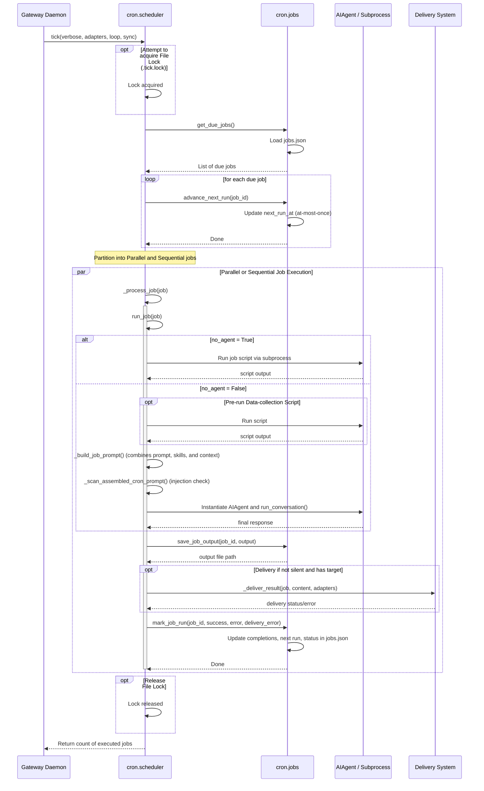

# cron Design Documentation

## Goal
The `cron` directory manages the scheduled execution of automated agent tasks and standalone script watchdogs. It handles task persistence, timezone-aware schedule calculations (supporting cron expressions, intervals, and one-shots), parallel/sequential execution thread pools, prompt construction (integrating system guidelines, user prompts, skills/bundles, and context chained from preceding jobs), safety validation (injection scanning), output logging, and multi-channel delivery. It also manages user automation suggestions via a seed catalog and slot-parameterized blueprints.

## File Enumeration
- [__init__.py](../../cron/__init__.py): Package initializer exposing job management functions (`create_job`, `get_job`, `list_jobs`, `remove_job`, `update_job`, `pause_job`, `resume_job`, `trigger_job`, `JOBS_FILE`) and the primary scheduler entrypoint `tick()`.
- [jobs.py](../../cron/jobs.py): Storage and management of scheduled jobs in `~/.hermes/cron/jobs.json`. It exposes functions to parse schedules, compute next run times (via `croniter`), perform CRUD operations on job objects, track job execution outcomes, save output files, and rewrite skill references during curator migrations.
- [scheduler.py](../../cron/scheduler.py): The scheduler execution daemon. Exposes `tick()` to find and run due jobs, using cross-platform file locks to prevent concurrent runs. Manages concurrent execution via sequential/parallel thread pools. Performs prompt building, pre-run script execution, prompt-injection checks, `AIAgent` invocation, and output delivery.
- [suggestions.py](../../cron/suggestions.py): Manages proposed automations proposed to the user, stored in `~/.hermes/cron/suggestions.json`. Provides interfaces to load, add, dismiss, or accept suggestions. Upon acceptance, delegates to `cron.jobs.create_job`.
- [suggestion_catalog.py](../../cron/suggestion_catalog.py): Defines curated built-in starter suggestions (e.g., daily briefing, important-mail monitor, weekly review) that can be seeded into the suggestions file.
- [blueprint_catalog.py](../../cron/blueprint_catalog.py): Catalog of parameterized automation templates ("blueprints") with typed inputs ("slots"). Validates slot values and maps them to standard job specifications, forms, deep links, and slash commands.
- [scripts/DESIGN.md](scripts/DESIGN.md): Design documentation for the child scripts directory.
- [scripts/__init__.py](../../cron/scripts/__init__.py): Module namespace initializer for scripts.
- [scripts/classify_items.py](../../cron/scripts/classify_items.py): A CLI monitoring script implementing the urgency-monitor pattern, filtering candidate JSON items based on LLM-rated urgency.

## Workflow


## System Architecture
```
                                ┌─────────────────┐
                                │ Gateway Daemon  │
                                └─────────┬───────┘
                                          │ periodically ticks
                                          ▼
                                ┌─────────────────┐
                     ┌──────────┤ cron/scheduler  ├──────────┐
                     │          └─────────┬───────┘          │
                     │                    │                  │
                     ▼                    ▼                  ▼
            ┌────────────────┐   ┌────────────────┐   ┌────────────────┐
            │   cron/jobs    │   │    AIAgent     │   │ cron/scripts/  │
            └────────────────┘   │ (run_agent.py) │   │ classify_items │
            - jobs.json          └────────────────┘   └────────────────┘
            - next_run_at        (LLM execution)       (no_agent/prerun)
                     ▲
                     │ creates on accept
                     │
            ┌────────────────┐
            │   suggestions  │
            └────────▲───────┘
                     │
       ┌─────────────┴─────────────┐
       │                           │
┌──────────────┐            ┌──────────────┐
│  suggestion_ │            │  blueprint_  │
│   catalog    │            │   catalog    │
└──────────────┘            └──────────────┘
```
