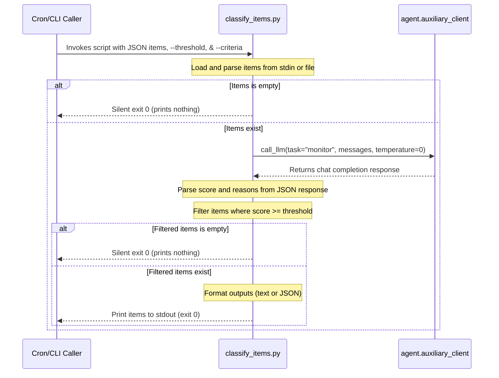

# cron/scripts Design Documentation

## Goal
The `cron/scripts` directory contains executable helper scripts designed to run as part of the cron subsystem or as standalone command-line components. The primary goal of this directory is to house proactive background monitoring, ingestion, and filtering logic (such as the proactive urgency-monitor pattern). These scripts fetch or receive candidate items, evaluate them against configured criteria using a cheap/fast auxiliary LLM, and filter out below-threshold noise so that only actionable notifications or summaries are surfaced to the user.

## File Enumeration
- [__init__.py](../../../cron/scripts/__init__.py): Package initializer for `cron.scripts`. Scripts here are runnable via `python3 -m cron.scripts.<name>`.
- [classify_items.py](../../../cron/scripts/classify_items.py): CLI utility implementing the urgency-monitor pattern. Reads candidate items as JSON (a list, or `{"items": [...]}`, or a single object) from stdin or `--input-file`. It builds one batch prompt (showing each item's salient fields — title/subject/summary/text/body/from/sender/url) and makes a single `call_llm(task="monitor", temperature=0, max_tokens=1024)` request. The classifier returns a JSON array of `{index, score (0-10), reason}` objects (one per item); the script parses them locally (tolerating markdown fences) and emits only items scoring at or above `--threshold` (default 7), in `--format` `text` (default, Markdown blocks) or `json`. Empty input or no item above threshold → empty stdout, exit 0 (silent, so a wrapping cron job stays quiet). Failures are loud, not silent: invalid input JSON → exit 2, auxiliary-client import failure → exit 3, classifier call failure → exit 4.

## Workflow


## System Architecture
```
               ┌─────────────────────────────────┐
               │    Cron Job / CLI Invocation    │
               └────────────────┬────────────────┘
                                │
                                │ reads candidates
                                │ via stdin/file
                                ▼
 ┌─────────────────────────────────────────────────────────────┐
 │ cron/scripts                                                │
 │                                                             │
 │   ┌─────────────────────────────────────────────────────┐   │
 │   │                  classify_items.py                  │   │
 │   │                                                     │   │
 │   │  - Parses JSON input                                │   │
 │   │  - Scores candidates via auxiliary client           │   │
 │   │  - Outputs items above target threshold             │   │
 │   └──────────────────────────┬──────────────────────────┘   │
 └──────────────────────────────┼──────────────────────────────┘
                                │
                                │ calls call_llm(task="monitor")
                                ▼
 ┌─────────────────────────────────────────────────────────────┐
 │ agent/auxiliary_client.py                                   │
 │                                                             │
 │  - Communicates with configured monitor LLM provider        │
 └─────────────────────────────────────────────────────────────┘
```
