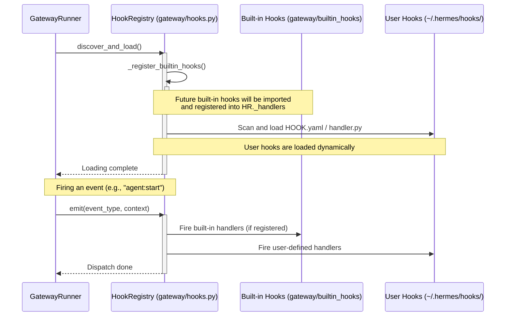

# gateway/builtin_hooks Design Documentation

## Goal
The `gateway/builtin_hooks` directory is designed as an extension point for always-active, built-in gateway hooks in the Hermes messaging gateway. It is intended to house event handlers that respond to key lifecycle events in the gateway (e.g., startup, session lifecycle, agent steps, command executions) and are registered automatically without requiring discovery from the user's local directory.

Currently this directory ships no hook implementations and serves as a placeholder for future core gateway hooks. The corresponding registration point, `HookRegistry._register_builtin_hooks()` in `gateway/hooks.py`, is intentionally a no-op (`return`) so future built-ins can drop in here without re-plumbing `discover_and_load()`.

## File Enumeration
* `__init__.py`: Marks the directory as a Python package. Its only content is the module docstring `"""Built-in gateway hooks that are always registered."""`, declaring the package's intended role. No code or hook implementations yet.

## Workflow
Built-in hooks are loaded during the initialization phase of the `HookRegistry` within `gateway/hooks.py`. The runtime registration and execution sequence is as follows:



## System Architecture
The relationship between built-in hooks, the hook registry, and the rest of the gateway is outlined in the block diagram below:

```text
┌────────────────────────────────────────────────────────────────┐
│                       Hermes Gateway Core                      │
│                                                                │
│   ┌────────────────┐                                           │
│   │ GatewayRunner  ├───────────────────────────────┐           │
│   └───────┬────────┘                               │           │
│           │ Fires Events                           │           │
│           ▼                                        ▼           │
│   ┌────────────────┐                       ┌──────────────┐    │
│   │  HookRegistry  │                       │   AIAgent    │    │
│   │(gateway/hooks) │                       │(run_agent.py)│    │
│   └───────┬────────┘                       └──────────────┘    │
│           │                                                    │
│           ├──────────────────────────────┐                     │
│           │ Loads always-active          │ Loads dynamically   │
│           ▼                              ▼                     │
│   ┌──────────────────────┐       ┌───────────────┐             │
│   │ gateway/builtin_hooks│       │ ~/.hermes/    │             │
│   │  (Extension Point)   │       │    hooks/     │             │
│   └──────────────────────┘       └───────────────┘             │
└────────────────────────────────────────────────────────────────┘
```
