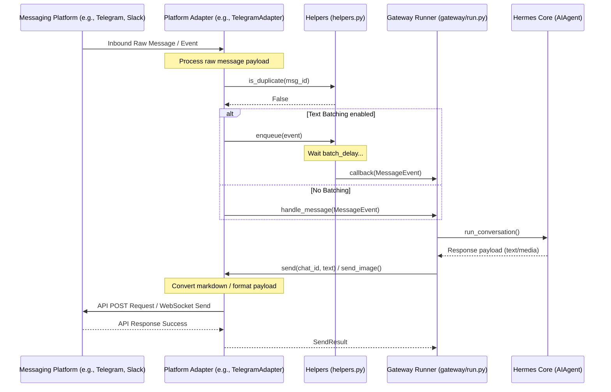

# gateway/platforms Design Documentation

## Goal
The `gateway/platforms` directory implements the messaging platform integration layer of the Hermes gateway. It acts as the bridging tier between the Hermes agent core (the LLM reasoning loop, tools, and session database) and external communication platforms. 

The main responsibilities of the files in this directory include:
- Establishing and managing long-lived connections (via WebSockets, long polling, or HTTP webhooks) to platforms like Telegram, Slack, Feishu, WeCom, DingTalk, Matrix, Signal, WhatsApp, WeChat, and Tencent Yuanbao.
- Translating incoming raw platform payloads into a unified, platform-agnostic `MessageEvent` representation.
- Standardizing outgoing agent messages (including rich media like images, audio, video, documents, and interactive buttons/keyboards) into platform-compliant formats.
- Implementing common gateway concerns such as request rate-limiting, message deduplication, text batching/aggregation, and access control.

## File Enumeration
- [__init__.py](file:///home/castincar/hermes-agent/gateway/platforms/__init__.py): Packages and exposes the public platform package API. Defer-loads heavy dependencies (like `QQAdapter` and `YuanbaoAdapter`) via PEP 562 `__getattr__` to keep CLI startup overhead minimal.
- [_http_client_limits.py](file:///home/castincar/hermes-agent/gateway/platforms/_http_client_limits.py): Configures custom `httpx.Limits` (short keepalive expiry, limited connections) for adapters maintaining persistent HTTP clients to prevent file-descriptor starvation.
- [api_server.py](file:///home/castincar/hermes-agent/gateway/platforms/api_server.py): Implements `APIServerAdapter`, exposing direct REST API endpoints for programmatic HTTP interactions with Hermes.
- [base.py](file:///home/castincar/hermes-agent/gateway/platforms/base.py): Declares the abstract base `BasePlatformAdapter` class, standard message transfer structures (`MessageEvent`, `SendResult`), and common adapter lifecycle/busy-tracking states.
- [bluebubbles.py](file:///home/castincar/hermes-agent/gateway/platforms/bluebubbles.py): Implements `BlueBubblesAdapter` for Apple iMessage integration using the BlueBubbles server API.
- [dingtalk.py](file:///home/castincar/hermes-agent/gateway/platforms/dingtalk.py): Implements `DingTalkAdapter` for Alibaba DingTalk integration via incoming HTTP callback webhooks.
- [email.py](file:///home/castincar/hermes-agent/gateway/platforms/email.py): Implements `EmailAdapter` which polls via IMAP for incoming emails and sends replies using SMTP.
- [feishu.py](file:///home/castincar/hermes-agent/gateway/platforms/feishu.py): Implements `FeishuAdapter` for ByteDance Feishu (Lark) messaging integration.
- [feishu_comment.py](file:///home/castincar/hermes-agent/gateway/platforms/feishu_comment.py): Extends Feishu integrations to handle Feishu drive document comment streams and reply directly inside drive documents.
- [feishu_comment_rules.py](file:///home/castincar/hermes-agent/gateway/platforms/feishu_comment_rules.py): Implements hierarchical access-control rules and document pairing for Feishu drive comment integrations.
- [feishu_meeting_invite.py](file:///home/castincar/hermes-agent/gateway/platforms/feishu_meeting_invite.py): Parses Feishu meeting invitation events (`vc.bot.meeting_invited_v1`) into synthetic message events to allow auto-joining meetings.
- [helpers.py](file:///home/castincar/hermes-agent/gateway/platforms/helpers.py): Provides shared utilities including `MessageDeduplicator` (TTL-based duplicate detection), `TextBatchAggregator` (rapid event aggregation), `strip_markdown`, `ThreadParticipationTracker` (persisting thread participation status), and `redact_phone`.
- [matrix.py](file:///home/castincar/hermes-agent/gateway/platforms/matrix.py): Implements `MatrixAdapter` for Matrix room integrations, managing encryption state and room message events.
- [msgraph_webhook.py](file:///home/castincar/hermes-agent/gateway/platforms/msgraph_webhook.py): Implements `MSGraphWebhookAdapter` for Microsoft Graph (Teams/Outlook) webhook integration.
- [qqbot/](file:///home/castincar/hermes-agent/gateway/platforms/qqbot): Subdirectory implementing the official QQ Bot API (v2) adapter. For more details, see [qqbot/DESIGN.md](file:///home/castincar/hermes-agent/designs/gateway/platforms/qqbot/DESIGN.md).
- [signal.py](file:///home/castincar/hermes-agent/gateway/platforms/signal.py): Implements `SignalAdapter` for Signal integration via `signal-cli` JSON-RPC daemon interactions.
- [signal_rate_limit.py](file:///home/castincar/hermes-agent/gateway/platforms/signal_rate_limit.py): Implements token-bucket rate limit scheduling to throttle Signal attachment uploads and prevent 429 errors.
- [slack.py](file:///home/castincar/hermes-agent/gateway/platforms/slack.py): Implements `SlackAdapter` for Slack workspace integration supporting Socket Mode and Web APIs.
- [sms.py](file:///home/castincar/hermes-agent/gateway/platforms/sms.py): Implements `SmsAdapter` for SMS text messaging (e.g. via Twilio webhooks).
- [telegram.py](file:///home/castincar/hermes-agent/gateway/platforms/telegram.py): Implements `TelegramAdapter` for the Telegram Bot API, handling forums/topics, inline button keyboards, and file attachments.
- [telegram_network.py](file:///home/castincar/hermes-agent/gateway/platforms/telegram_network.py): Implements fallback IP mapping and DNS-over-HTTPS (DoH) discovery to bypass regional blocks targeting api.telegram.org.
- [webhook.py](file:///home/castincar/hermes-agent/gateway/platforms/webhook.py): Implements `WebhookAdapter` for incoming custom HTTP webhook messaging.
- [wecom.py](file:///home/castincar/hermes-agent/gateway/platforms/wecom.py): Implements `WeComAdapter` for Tencent WeCom (Enterprise WeChat) bot integration using websockets.
- [wecom_callback.py](file:///home/castincar/hermes-agent/gateway/platforms/wecom_callback.py): Implements `WecomCallbackAdapter` for self-built enterprise applications using encrypted HTTP POST callbacks.
- [wecom_crypto.py](file:///home/castincar/hermes-agent/gateway/platforms/wecom_crypto.py): Implements `WXBizMsgCrypt` AES-CBC wire-format encryption/decryption compatible with WeCom's official SDK.
- [weixin.py](file:///home/castincar/hermes-agent/gateway/platforms/weixin.py): Implements `WeixinAdapter` for WeChat Official Accounts (Weixin).
- [whatsapp.py](file:///home/castincar/hermes-agent/gateway/platforms/whatsapp.py): Implements `WhatsAppAdapter` for WhatsApp messaging using Baileys bridge.
- [whatsapp_cloud.py](file:///home/castincar/hermes-agent/gateway/platforms/whatsapp_cloud.py): Implements `WhatsAppCloudAdapter` using the official WhatsApp Cloud API.
- [whatsapp_common.py](file:///home/castincar/hermes-agent/gateway/platforms/whatsapp_common.py): Implements `WhatsAppBehaviorMixin` providing WhatsApp-specific mentions, markdown formatting, and group policy gating shared by both WhatsApp adapters.
- [yuanbao.py](file:///home/castincar/hermes-agent/gateway/platforms/yuanbao.py): Implements `YuanbaoAdapter` for Tencent Yuanbao chatbot platform integration over websockets.
- [yuanbao_media.py](file:///home/castincar/hermes-agent/gateway/platforms/yuanbao_media.py): Handles Tencent Cloud COS upload authorization and TIM media message construction for Yuanbao.
- [yuanbao_proto.py](file:///home/castincar/hermes-agent/gateway/platforms/yuanbao_proto.py): Implements pure-Python Varint/Protobuf wire-format encoders/decoders for Yuanbao connection protocols.
- [yuanbao_sticker.py](file:///home/castincar/hermes-agent/gateway/platforms/yuanbao_sticker.py): Provides catalog mapping and TIMFaceElem message formatting for Yuanbao animated stickers.

## Workflow
The runtime flow of messaging through the platforms layer is illustrated below:



## System Architecture
The relationship between platform adapters, helper modules, and the Hermes core is outlined in the diagram below:

```
                  +-----------------------------------------+
                  |               Hermes Core               |
                  |  (AIAgent, run_agent.py, cron scheduler)|
                  +--------------------+--------------------+
                                       |
                                       v
                  +-----------------------------------------+
                  |              Gateway Runner             |
                  |             (gateway/run.py)            |
                  +--------------------+--------------------+
                                       |
                                       v (implements)
+-----------------------------------------------------------------------------------+
|                            gateway/platforms/                                     |
|                                                                                   |
|                   +----------------------------------+                            |
|                   | BasePlatformAdapter (base.py)    |                            |
|                   +-----------------+----------------+                            |
|                                     |                                             |
|          +--------------------------+--------------------------+                  |
|          | (inherits / implements)                             |                  |
|          v                                                     v                  |
|  +------------------------------+                      +-----------------------+  |
|  | Platform Adapters            |                      | Helpers & Core Utils  |  |
|  | - telegram.py                |                      | - helpers.py          |  |
|  | - slack.py                   |                      | - _http_client_       |  |
|  | - feishu.py (comments/mgt)   |                      |   limits.py           |  |
|  | - wecom.py (callbacks/crypto)|                      +-----------+-----------+  |
|  | - whatsapp.py (mixins/cloud) |                                  ^              |
|  | - qqbot/ (WS & COS)          |                                  |              |
|  | - yuanbao.py (proto/sticker) |----------------------------------+              |
|  | - signal.py (rate limits)    | (uses helper tools)                             |
|  | - matrix.py / msgraph_web... |                                                 |
|  | - api_server.py / webhook.py |                                                 |
|  | - bluebubbles.py / email.py  |                                                 |
|  | - sms.py / weixin.py         |                                                 |
|  +------------------------------+                                                 |
+-----------------------------------------------------------------------------------+
```
