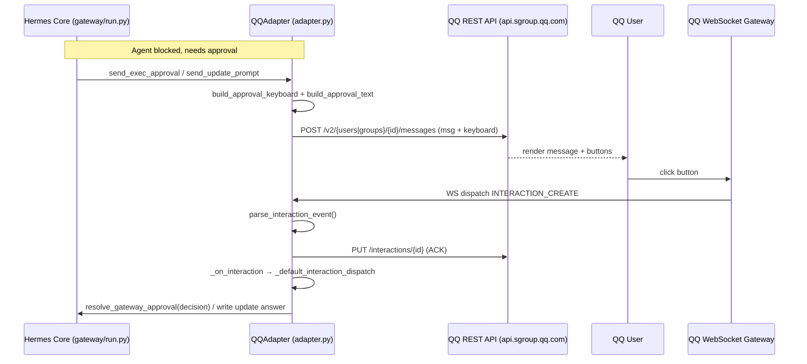

# qqbot Design Documentation

## Goal
The `gateway/platforms/qqbot` directory implements the platform adapter and integration layer for the **Official QQ Bot API (v2)**. It acts as a gateway bridge, allowing the Hermes agent core to communicate with QQ users and groups. Its primary tasks include:
- Managing long-lived WebSocket connections to the QQ Bot Gateway for receiving real-time events.
- Interfacing with the QQ REST API for sending messages, rich media, and managing interactions.
- Supporting QR-code based "scan-to-configure" onboarding for automated local credential setup and decryption.
- Handling chunked uploads for large media files (up to 100MB) to Tencent Cloud Object Storage (COS) via pre-signed URLs.
- Rendering and handling interactive inline keyboards, enabling user-driven tool/command approvals and configuration prompts.
- Transcribing incoming voice messages using QQ's built-in ASR or configured speech-to-text (STT) services.

## File Enumeration
- [__init__.py](file:///home/samlin/hermes-agent/gateway/platforms/qqbot/__init__.py): Package façade. Re-exports the public API from the sub-modules (`QQAdapter`, `QQCloseError`, `check_qq_requirements`, `_ssrf_redirect_guard`; onboard `qr_register` / `BindStatus` / `build_connect_url`; crypto `generate_bind_key` / `decrypt_secret`; utils `build_user_agent` / `get_api_headers` / `coerce_list`; chunked-upload `ChunkedUploader` + upload errors; keyboard builders/parsers and `ApprovalRequest` / `ApprovalSender` / `InlineKeyboard` / `InteractionEvent`) so all import paths stay stable.
- [adapter.py](file:///home/samlin/hermes-agent/gateway/platforms/qqbot/adapter.py): The bulk of the package (~3200 lines). Defines `QQAdapter(BasePlatformAdapter)` plus `QQCloseError` and `check_qq_requirements`. Owns the WebSocket lifecycle (identify/resume, heartbeat, listen + reconnect with backoff), token fetch/refresh, REST calls via `_api_request`, inbound routing for C2C / group / guild / direct messages, dedup, quote-context merging, attachment download/caching, voice→WAV conversion + STT transcription, outbound text/media sending (chunked when >limit), inline-keyboard sends, and `INTERACTION_CREATE` ACK + dispatch (approvals / update prompts). Imports `_ssrf_redirect_guard` from `gateway.platforms.base` and re-exports it.
- [chunked_upload.py](file:///home/samlin/hermes-agent/gateway/platforms/qqbot/chunked_upload.py): `ChunkedUploader` for files above the ~10MB inline cap. Drives the 3-step flow: `upload_prepare` (returns `upload_id`, block size, pre-signed COS part URLs) → PUT each part to COS + `upload_part_finish` (bounded concurrency, default 1) → `POST .../files` with just `upload_id` to complete. Computes md5 / sha1 / md5_10m hashes. Maps biz-codes to `UploadDailyLimitExceededError` (40093002) and retries `upload_part_finish` on 40093001; also exports `UploadFileTooLargeError` and `format_size`.
- [constants.py](file:///home/samlin/hermes-agent/gateway/platforms/qqbot/constants.py): Shared constants — adapter version, API/token/gateway and onboard endpoints (`PORTAL_HOST` env-overridable), timeouts, reconnect backoff/limits, dedup window, message-type codes (`MSG_TYPE_*`) and media-type codes (`MEDIA_TYPE_*`).
- [crypto.py](file:///home/samlin/hermes-agent/gateway/platforms/qqbot/crypto.py): `generate_bind_key` (random base64 AES-256 key) and `decrypt_secret` (AES-256-GCM, layout `IV(12) ‖ ciphertext ‖ tag(16)`) — used to decrypt the bot client_secret locally during QR onboarding.
- [keyboards.py](file:///home/samlin/hermes-agent/gateway/platforms/qqbot/keyboards.py): Inline-keyboard dataclasses (`InlineKeyboard` → rows → `KeyboardButton`), builders (`build_approval_keyboard` 3-button allow-once/allow-always/deny; `build_update_prompt_keyboard` yes/no), text renderers (`build_approval_text`, `ApprovalRequest`), `button_data` parsers (`parse_approval_button_data`, `parse_update_prompt_button_data`), the `parse_interaction_event` → `InteractionEvent` decoder, and `ApprovalSender` (adapter-decoupled helper that posts an approval message + keyboard).
- [onboard.py](file:///home/samlin/hermes-agent/gateway/platforms/qqbot/onboard.py): Synchronous scan-to-configure flow. `qr_register` creates a bind task (`create_bind_task`), renders the QR / connect URL in the terminal, polls `poll_bind_result` (with refresh on expiry), and on completion returns `{app_id, client_secret, user_openid}` (secret decrypted via crypto). `BindStatus` enum + `build_connect_url`.
- [utils.py](file:///home/samlin/hermes-agent/gateway/platforms/qqbot/utils.py): `build_user_agent` (QQBotAdapter/Python/OS/Hermes string), `get_api_headers` (JSON headers; `Accept: application/json` required to avoid q.qq.com's anti-bot page), and `coerce_list` (normalize config values to a trimmed string list).

## Workflow
End-to-end inline-keyboard approval flow. The agent core (via `gateway/run.py`) asks the adapter to send an approval; the user clicks a button; the adapter ACKs and routes the decision back.



## System Architecture
The following diagram highlights how modules in the `gateway/platforms/qqbot` directory relate to each other and integrate with the main Hermes gateway framework:

```
            +----------------------------------------------+
            |  Hermes Core (gateway/run.py, AIAgent)       |
            +----------------------------------------------+
                 |                              ^
   (BasePlatformAdapter)              (inbound MessageEvent /
        send_* calls                  approval resolution)
                 v                              |
   +-------------------------------------------------------------+
   |                  QQAdapter  (adapter.py)                    |
   |  WS gateway loop (identify/resume, heartbeat, reconnect)    |
   |  REST _api_request | inbound routing (c2c/group/guild/dm)   |
   |  attachments + voice STT | outbound text/media | dedup      |
   |  INTERACTION_CREATE ACK + dispatch                          |
   +----+-------------------+-------------------+----------------+
        | imports           | imports           | imports
        v                   v                   v
 +-------------+   +------------------+   +------------------+
 | keyboards.py|   | chunked_upload.py|   |    utils.py      |
 | kbd build / |   | >10MB COS upload |   | UA / headers /   |
 | parse / ACK |   | (prepare→PUT→    |   | coerce_list      |
 | dataclasses |   |  complete)       |   +------------------+
 +-------------+   +------------------+
                                        QR onboarding (standalone, CLI):
                                        +------------------+
                                        |    onboard.py    |
                                        | qr_register flow |
                                        +---+----------+---+
                                            | uses     | uses
                                            v          v
                                     +-----------+  +----------+
                                     | crypto.py |  | utils.py |
                                     | AES-GCM   |  +----------+
                                     +-----------+

      All modules import shared values from  ──>  constants.py
      adapter.py also imports _ssrf_redirect_guard from gateway.platforms.base
```
