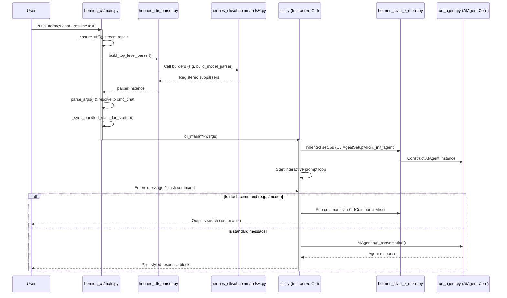

# hermes_cli Design Documentation

## Goal
The `hermes_cli` directory implements the user-facing command-line interface, configuration wizards, profile isolation sandboxes, local proxy services, web-based dashboard authentication systems, and overall CLI tooling for the Hermes Agent.

Its key responsibilities are:
1. **CLI Entry Point & Argument Routing**: Ensures cross-platform stream compatibility, configures terminal code pages, builds argparse parsing trees via modular parser builders, and routes commands to their respective action handlers or interactive prompt sessions.
2. **Interactive CLI Setup & Session Management**: Manages setup wizards for model and provider configurations, loads configuration files dynamically, tracks sandboxed profile workspaces, and initializes and resumes interactive prompt sessions.
3. **Local Tooling and Utilities**: Drives Kanban collaboration boards, handles Model Context Protocol (MCP) clients, interacts with external secret managers (e.g. Bitwarden), schedules recurring cron tasks, tails service logs, and packages archives/backups.
4. **Child Submodule Rollup Services**:
   - **Modular Subcommand Definition**: [subcommands/](file:///home/castincar/hermes-agent/hermes_cli/subcommands) splits argument definition for cleanliness, preventing a monolithic parse tree. For details, see [subcommands/DESIGN.md](file:///home/castincar/hermes-agent/designs/hermes_cli/subcommands/DESIGN.md).
   - **Local Proxy Server**: [proxy/](file:///home/castincar/hermes-agent/hermes_cli/proxy) forwards client requests to remote LLM endpoints using active authenticated bearer tokens. Dynamic credential rotations are delegated to adapters in [proxy/adapters/](file:///home/castincar/hermes-agent/hermes_cli/proxy/adapters). For details, see [proxy/DESIGN.md](file:///home/castincar/hermes-agent/designs/hermes_cli/proxy/DESIGN.md) and [adapters/DESIGN.md](file:///home/castincar/hermes-agent/designs/hermes_cli/proxy/adapters/DESIGN.md).
   - **Dashboard Authentication**: [dashboard_auth/](file:///home/castincar/hermes-agent/hermes_cli/dashboard_auth) implements modular authentication middleware, cookie scopes, audit logs, and WebSocket ticketing for the dashboard's web interface. For details, see [dashboard_auth/DESIGN.md](file:///home/castincar/hermes-agent/designs/hermes_cli/dashboard_auth/DESIGN.md).

## File Enumeration

### Subdirectories
* [dashboard_auth/](file:///home/castincar/hermes-agent/hermes_cli/dashboard_auth): Directory managing dashboard security, cookie handling, session lifecycles, and WebSocket upgrade token validation. See [dashboard_auth/DESIGN.md](file:///home/castincar/hermes-agent/designs/hermes_cli/dashboard_auth/DESIGN.md).
* [proxy/](file:///home/castincar/hermes-agent/hermes_cli/proxy): Local OpenAI-compatible HTTP proxy server allowing external clients to access active subscriptions without static keys. See [proxy/DESIGN.md](file:///home/castincar/hermes-agent/designs/hermes_cli/proxy/DESIGN.md).
* [subcommands/](file:///home/castincar/hermes-agent/hermes_cli/subcommands): Modular subcommand argparse parser definitions. See [subcommands/DESIGN.md](file:///home/castincar/hermes-agent/designs/hermes_cli/subcommands/DESIGN.md).

### Source Files
* [__init__.py](file:///home/castincar/hermes-agent/hermes_cli/__init__.py): Package initialization, exposing version metadata (`__version__`, `__release_date__`) and executing an early POSIX/Windows UTF-8 standard stream compatibility patch (`_ensure_utf8()`).
* [_parser.py](file:///home/castincar/hermes-agent/hermes_cli/_parser.py): Defines top-level argparse arguments and formats the global help message.
* [_subprocess_compat.py](file:///home/castincar/hermes-agent/hermes_cli/_subprocess_compat.py): Implements Windows-specific subprocess execution workarounds to handle non-ASCII terminal encodings and I/O.
* [active_sessions.py](file:///home/castincar/hermes-agent/hermes_cli/active_sessions.py): Coordinates cross-process lock files and active chat session leases.
* [auth.py](file:///home/castincar/hermes-agent/hermes_cli/auth.py): Main authentication subsystem coordinating tokens, refresh states, and vendor-specific login configurations.
* [auth_commands.py](file:///home/castincar/hermes-agent/hermes_cli/auth_commands.py): Subcommand action implementations for listing and removing authenticated identities.
* [azure_detect.py](file:///home/castincar/hermes-agent/hermes_cli/azure_detect.py): Detects endpoints and model names for Azure Foundry LLM environments.
* [backup.py](file:///home/castincar/hermes-agent/hermes_cli/backup.py): Implements backup creation and package archiving commands for config files and databases.
* [banner.py](file:///home/castincar/hermes-agent/hermes_cli/banner.py): Renders the welcome banner, system version info, loaded skills summaries, and schedules background upgrade availability queries.
* [blueprint_cmd.py](file:///home/castincar/hermes-agent/hermes_cli/blueprint_cmd.py): Implements the shared `/blueprint` command to export current rules and guidelines templates.
* [browser_connect.py](file:///home/castincar/hermes-agent/hermes_cli/browser_connect.py): Helps locate and connect to running Chrome/Chromium instances via the Chrome DevTools Protocol (CDP).
* [build_info.py](file:///home/castincar/hermes-agent/hermes_cli/build_info.py): Generates static version and hash build stamps for the codebase.
* [bundles.py](file:///home/castincar/hermes-agent/hermes_cli/bundles.py): Commands to create and manage bundled skill groupings (referenced under a single slash command).
* [callbacks.py](file:///home/castincar/hermes-agent/hermes_cli/callbacks.py): Prompt-toolkit callback hooks integrated into terminal execution tools.
* [checkpoints.py](file:///home/castincar/hermes-agent/hermes_cli/checkpoints.py): Command logic for viewing and pruning the shadowed git checkpoints directory (`~/.hermes/checkpoints/`).
* [claw.py](file:///home/castincar/hermes-agent/hermes_cli/claw.py): Subcommand handlers migrating OpenClaw server configurations to the unified Hermes model format.
* [cli_agent_setup_mixin.py](file:///home/castincar/hermes-agent/hermes_cli/cli_agent_setup_mixin.py): Extension class providing LLM agent creation, model resolution, and session resumption screens to the interactive CLI.
* [cli_commands_mixin.py](file:///home/castincar/hermes-agent/hermes_cli/cli_commands_mixin.py): Interactive prompt slash command execution callbacks (e.g. `/model`, `/skills`, `/exit`).
* [cli_output.py](file:///home/castincar/hermes-agent/hermes_cli/cli_output.py): Common utility methods for structured console output prints.
* [clipboard.py](file:///home/castincar/hermes-agent/hermes_cli/clipboard.py): Dynamic image/text extraction hooks from system clipboard for macOS, Linux, Windows, and WSL2.
* [codex_models.py](file:///home/castincar/hermes-agent/hermes_cli/codex_models.py): Resolves models from Codex inference backends, local cache, or settings.
* [codex_runtime_plugin_migration.py](file:///home/castincar/hermes-agent/hermes_cli/codex_runtime_plugin_migration.py): Migrates existing MCP catalogs and plugins to match Codex standards.
* [codex_runtime_switch.py](file:///home/castincar/hermes-agent/hermes_cli/codex_runtime_switch.py): Orchestrates the `/codex-runtime` switch logic between execution environments.
* [colors.py](file:///home/castincar/hermes-agent/hermes_cli/colors.py): Helper colors dictionary using standard ANSI escape sequences.
* [commands.py](file:///home/castincar/hermes-agent/hermes_cli/commands.py): Canonical registry of interactive slash commands, alias mappings, category descriptors, and autocomplete utilities.
* [completion.py](file:///home/castincar/hermes-agent/hermes_cli/completion.py): Generates shell completion scripts (e.g. bash, zsh) dynamically for CLI arguments.
* [config.py](file:///home/castincar/hermes-agent/hermes_cli/config.py): Core configuration schema validations, file read-writes, and safe, read-only cache profiles.
* [container_boot.py](file:///home/castincar/hermes-agent/hermes_cli/container_boot.py): Configures and restarts per-profile s6 gateway services within containers.
* [copilot_auth.py](file:///home/castincar/hermes-agent/hermes_cli/copilot_auth.py): Authenticates the GitHub Copilot client and retrieves API tokens.
* [cron.py](file:///home/castincar/hermes-agent/hermes_cli/cron.py): Actions to list, stop, and verify running background scheduler timers.
* [curator.py](file:///home/castincar/hermes-agent/hermes_cli/curator.py): Configures background skill curating agents which review, prune, and consolidate custom user skills.
* [curses_ui.py](file:///home/castincar/hermes-agent/hermes_cli/curses_ui.py): Exposes curses-based console selection boxes and wizards.
* [dashboard_register.py](file:///home/castincar/hermes-agent/hermes_cli/dashboard_register.py): Commands to register local or self-hosted dashboard OAuth instances.
* [debug.py](file:///home/castincar/hermes-agent/hermes_cli/debug.py): Gathers runtime flags, builds zip diagnostic logs, and outputs debug info cards.
* [default_soul.py](file:///home/castincar/hermes-agent/hermes_cli/default_soul.py): Seeding template for the agent's initial rules behavior guidelines.
* [dep_ensure.py](file:///home/castincar/hermes-agent/hermes_cli/dep_ensure.py): Lazy-loader confirming required third-party binaries (e.g. `uv`) are present.
* [dingtalk_auth.py](file:///home/castincar/hermes-agent/hermes_cli/dingtalk_auth.py): Implements DingTalk OAuth Device Flow authorization.
* [doctor.py](file:///home/castincar/hermes-agent/hermes_cli/doctor.py): Evaluates directory setups, API endpoints, python installations, and dependencies for anomalies.
* [dump.py](file:///home/castincar/hermes-agent/hermes_cli/dump.py): Writes compact text summaries of system states and configuration.
* [env_loader.py](file:///home/castincar/hermes-agent/hermes_cli/env_loader.py): Consistently loads and merges `.env` values into `os.environ` keys.
* [fallback_cmd.py](file:///home/castincar/hermes-agent/hermes_cli/fallback_cmd.py): Command routing to manage fallback LLM provider queues (`hermes fallback`).
* [fallback_config.py](file:///home/castincar/hermes-agent/hermes_cli/fallback_config.py): Resolves config values for the active fallback LLM list.
* [gateway.py](file:///home/castincar/hermes-agent/hermes_cli/gateway.py): Action handlers managing the background messaging gateway processes.
* [gateway_windows.py](file:///home/castincar/hermes-agent/hermes_cli/gateway_windows.py): Implements Windows Task Scheduler hooks and startup tasks to auto-run the gateway.
* [goals.py](file:///home/castincar/hermes-agent/hermes_cli/goals.py): Persistent session goals compiler implementing the Ralph feedback loop.
* [gui_uninstall.py](file:///home/castincar/hermes-agent/hermes_cli/gui_uninstall.py): Teardown routines uninstalling Electron desktop wrappers.
* [hooks.py](file:///home/castincar/hermes-agent/hermes_cli/hooks.py): Actions validating or registers shell hook integration scripts.
* [inventory.py](file:///home/castincar/hermes-agent/hermes_cli/inventory.py): Collects supported providers, model configurations, and local environments in a unified format.
* [kanban.py](file:///home/castincar/hermes-agent/hermes_cli/kanban.py): Subcommands client for task board workflows.
* [kanban_db.py](file:///home/castincar/hermes-agent/hermes_cli/kanban_db.py): Implements SQLite schema setup and CRUD queries for boards, cards, and assignments.
* [kanban_decompose.py](file:///home/castincar/hermes-agent/hermes_cli/kanban_decompose.py): Automatically breaks complex parent tasks into child cards.
* [kanban_diagnostics.py](file:///home/castincar/hermes-agent/hermes_cli/kanban_diagnostics.py): Checks tasks for stalled columns, blocked states, and anomalies.
* [kanban_specify.py](file:///home/castincar/hermes-agent/hermes_cli/kanban_specify.py): Refines raw task titles into complete specifications.
* [kanban_swarm.py](file:///home/castincar/hermes-agent/hermes_cli/kanban_swarm.py): Multi-agent coordinates assignments for swarming Kanban boards.
* [logs.py](file:///home/castincar/hermes-agent/hermes_cli/logs.py): Implements viewing, filtration, and continuous tailing of agent logs.
* [main.py](file:///home/castincar/hermes-agent/hermes_cli/main.py): Main entry point resolving command-line streams, self-healing installations, building top-level argparse subparsers, and routing arguments.
* [managed_uv.py](file:///home/castincar/hermes-agent/hermes_cli/managed_uv.py): Wrapper executing commands via `uv` in sandbox environments.
* [mcp_catalog.py](file:///home/castincar/hermes-agent/hermes_cli/mcp_catalog.py): Hardcoded registry of curated Model Context Protocol servers.
* [mcp_config.py](file:///home/castincar/hermes-agent/hermes_cli/mcp_config.py): Commands modifying client-side MCP server listings.
* [mcp_picker.py](file:///home/castincar/hermes-agent/hermes_cli/mcp_picker.py): Interactive selection CLI for enabling/disabling MCP sources.
* [mcp_security.py](file:///home/castincar/hermes-agent/hermes_cli/mcp_security.py): Validation logic auditing paths, binaries, and parameters of custom MCP configs.
* [mcp_startup.py](file:///home/castincar/hermes-agent/hermes_cli/mcp_startup.py): Asynchronous setup verification tasks for configured MCP processes.
* [memory_setup.py](file:///home/castincar/hermes-agent/hermes_cli/memory_setup.py): Settings and connections check commands for memory backends.
* [middleware.py](file:///home/castincar/hermes-agent/hermes_cli/middleware.py): Shared interface validators for dashboard security integrations.
* [migrate.py](file:///home/castincar/hermes-agent/hermes_cli/migrate.py): Script updating legacy OpenClaw structures and retired settings parameters.
* [model_catalog.py](file:///home/castincar/hermes-agent/hermes_cli/model_catalog.py): Fetches remote models catalogs and caches lists locally.
* [model_cost_guard.py](file:///home/castincar/hermes-agent/hermes_cli/model_cost_guard.py): Prompts for user verification before enabling highly expensive models.
* [model_normalize.py](file:///home/castincar/hermes-agent/hermes_cli/model_normalize.py): Standardizes model naming inconsistencies across APIs.
* [model_setup_flows.py](file:///home/castincar/hermes-agent/hermes_cli/model_setup_flows.py): Walkthrough questions mapping API credentials to provider records.
* [model_switch.py](file:///home/castincar/hermes-agent/hermes_cli/model_switch.py): Updates LLM targets dynamically during active CLI/TUI chat sessions.
* [models.py](file:///home/castincar/hermes-agent/hermes_cli/models.py): Defines standard known models, context limitations, and price configurations.
* [nous_account.py](file:///home/castincar/hermes-agent/hermes_cli/nous_account.py): Validates subscriber authorization and credit balances with Nous Portal.
* [nous_subscription.py](file:///home/castincar/hermes-agent/hermes_cli/nous_subscription.py): Identifies tools and model features granted by current Nous user status.
* [oneshot.py](file:///home/castincar/hermes-agent/hermes_cli/oneshot.py): Executes instant non-interactive prompts (`-z` mode) and pipes LLM outputs.
* [pairing.py](file:///home/castincar/hermes-agent/hermes_cli/pairing.py): Implements connection keys generation and validation for remote dashboards.
* [partial_compress.py](file:///home/castincar/hermes-agent/hermes_cli/partial_compress.py): Helper summarizing older context history elements to prevent token overflow.
* [platforms.py](file:///home/castincar/hermes-agent/hermes_cli/platforms.py): Register of active notification, chat gateway, and platform connectors.
* [plugins.py](file:///home/castincar/hermes-agent/hermes_cli/plugins.py): Dynamic plugin registration, installation, and environment management.
* [plugins_cmd.py](file:///home/castincar/hermes-agent/hermes_cli/plugins_cmd.py): CLI commands to manage the git-based plugin library.
* [portal_cli.py](file:///home/castincar/hermes-agent/hermes_cli/portal_cli.py): CLI tools querying active Nous Portal usage records and settings.
* [profile_describer.py](file:///home/castincar/hermes-agent/hermes_cli/profile_describer.py): Auto-generates summary cards describing profile workspaces.
* [profile_distribution.py](file:///home/castincar/hermes-agent/hermes_cli/profile_distribution.py): Clones, imports, or bundles isolated workspace setups using profiles.
* [profiles.py](file:///home/castincar/hermes-agent/hermes_cli/profiles.py): Core isolation directory mappings and workspace switcher controllers.
* [prompt_size.py](file:///home/castincar/hermes-agent/hermes_cli/prompt_size.py): Diagnostic tool evaluating payload sizes and parsing parameters.
* [providers.py](file:///home/castincar/hermes-agent/hermes_cli/providers.py): Canonical listing of supported LLM API providers.
* [psutil_android.py](file:///home/castincar/hermes-agent/hermes_cli/psutil_android.py): Android Termux setup wrapper confirming process diagnostics capabilities.
* [pt_input_extras.py](file:///home/castincar/hermes-agent/hermes_cli/pt_input_extras.py): Customized inputs and prompt-toolkit keyboard mappings.
* [pty_bridge.py](file:///home/castincar/hermes-agent/hermes_cli/pty_bridge.py): Terminal stream encoder for the dashboard's interactive console tab.
* [relaunch.py](file:///home/castincar/hermes-agent/hermes_cli/relaunch.py): Restart logic invoking updated packages or profile shifts securely.
* [runtime_provider.py](file:///home/castincar/hermes-agent/hermes_cli/runtime_provider.py): Determines the fallback and active LLM configuration for operations.
* [secret_prompt.py](file:///home/castincar/hermes-agent/hermes_cli/secret_prompt.py): Standard password/key obscured console field.
* [secrets_cli.py](file:///home/castincar/hermes-agent/hermes_cli/secrets_cli.py): CLI wrapper interacting with Bitwarden Secrets Manager.
* [security_advisories.py](file:///home/castincar/hermes-agent/hermes_cli/security_advisories.py): Audits codebases against OSV vulnerability databases.
* [security_audit.py](file:///home/castincar/hermes-agent/hermes_cli/security_audit.py): Audits local python setups, path binaries, and modules.
* [send_cmd.py](file:///home/castincar/hermes-agent/hermes_cli/send_cmd.py): CLI command wrapper targeting and writing data to active agent threads.
* [service_manager.py](file:///home/castincar/hermes-agent/hermes_cli/service_manager.py): Abstract daemon runner controller.
* [session_recap.py](file:///home/castincar/hermes-agent/hermes_cli/session_recap.py): Generates chronological session reports.
* [setup.py](file:///home/castincar/hermes-agent/hermes_cli/setup.py): Interactively seeds configuration files on first start.
* [setup_whatsapp_cloud.py](file:///home/castincar/hermes-agent/hermes_cli/setup_whatsapp_cloud.py): Meta Business integration wizard.
* [skills_config.py](file:///home/castincar/hermes-agent/hermes_cli/skills_config.py): Custom skill execution guidelines settings.
* [skills_hub.py](file:///home/castincar/hermes-agent/hermes_cli/skills_hub.py): Commands searching and installing skills from remote endpoints.
* [skin_engine.py](file:///home/castincar/hermes-agent/hermes_cli/skin_engine.py): Dynamic banner, spinner, and theme formatting engine.
* [slack_cli.py](file:///home/castincar/hermes-agent/hermes_cli/slack_cli.py): Prepares Slack app integrations manifest config files.
* [status.py](file:///home/castincar/hermes-agent/hermes_cli/status.py): Outputs overall service diagnostics status reports.
* [stdio.py](file:///home/castincar/hermes-agent/hermes_cli/stdio.py): Reconfigures output parameters for Windows environments.
* [suggestions_cmd.py](file:///home/castincar/hermes-agent/hermes_cli/suggestions_cmd.py): Shared slash command listing features tips.
* [telegram_managed_bot.py](file:///home/castincar/hermes-agent/hermes_cli/telegram_managed_bot.py): Telegram connector onboarding setup.
* [timeouts.py](file:///home/castincar/hermes-agent/hermes_cli/timeouts.py): Resolves provider timeouts configurations.
* [tips.py](file:///home/castincar/hermes-agent/hermes_cli/tips.py): Database card containing help information shown at CLI start.
* [tools_config.py](file:///home/castincar/hermes-agent/hermes_cli/tools_config.py): Exposes CLI toggles allowing/disallowing specific toolsets execution permissions.
* [uninstall.py](file:///home/castincar/hermes-agent/hermes_cli/uninstall.py): Teardown program purging data folders and dependencies.
* [voice.py](file:///home/castincar/hermes-agent/hermes_cli/voice.py): TTS voice output player.
* [web_server.py](file:///home/castincar/hermes-agent/hermes_cli/web_server.py): Core web client backend housing routers and dashboard PTY connections.
* [webhook.py](file:///home/castincar/hermes-agent/hermes_cli/webhook.py): Handles event hooks registrations.
* [win_pty_bridge.py](file:///home/castincar/hermes-agent/hermes_cli/win_pty_bridge.py): Windows ConPTY terminal socket handler.
* [write_approval_commands.py](file:///home/castincar/hermes-agent/hermes_cli/write_approval_commands.py): Coordinates security confirm gates.
* [xai_retirement.py](file:///home/castincar/hermes-agent/hermes_cli/xai_retirement.py): Triggers model migration warnings for old xAI Grok versions.

## Workflow

The Mermaid diagram below outlines the runtime logic beginning from command invocation (`hermes chat --resume last`), building parsers dynamically via `subcommands/`, initializing the interactive prompt, resolving configs and models, and booting the Agent core loop.



## System Architecture

The block diagram below describes how `hermes_cli` entry points, configuration helpers, submodules (`subcommands/`, `dashboard_auth/`, `proxy/`), and interactive setup flows relate to the root execution modules and the runtime agent loop:

```
+---------------------------------------------------------------------------------------+
|                                     pyproject.toml                                    |
|                             (Declares entrypoint: hermes)                             |
+----------------------------------------------+----------------------------------------+
                                               |
                                               v
+----------------------------------------------+----------------------------------------+
|                                hermes_cli/main.py (Entry)                             |
|    - Ensures stream UTF-8 compatibility                                               |
|    - Builds CLI argument tree using subparsers                                        |
|    - Resolves subcommands and dispatches function handlers                            |
+--------+-------------------------------------+--------------------------------+-------+
         |                                     |                                |
         | imports builders                    | instantiates                   | runs
         v                                     v                                v
+--------+-----------------+        +----------+-----------+        +-----------+-------+
|      subcommands/        |        |      cli.py          |        |   web_server.py   |
|  (Modular argparse CLI   |        |  (Project Root)      |        | (Dashboard Server)|
|   subcommand builders)   |        |                      |        +---------+---------+
+--------------------------+        |   +--------------+   |                  |
                                    |   |  HermesCLI   |   |                  v
                                    |   +------+-------+   |        +---------+---------+
                                    +----------|-----------+        |  dashboard_auth/  |
                                               |                    | (Session Cookies, |
                                               v (Inherits)         |  WS ticket mint)  |
                            +------------------+------------------+ +-------------------+
                            | hermes_cli/                         |
                            |  - cli_agent_setup_mixin.py         |
                            |  - cli_commands_mixin.py            |
                            +------------------+------------------+
                                               |
                   Loads configuration,        | Spawns agent
                   resolves models, & auth     v
                            +------------------+------------------+
                            | hermes_cli/                         |
                            |  - config.py      - auth.py         |
                            |  - models.py      - providers.py    |
                            |  - commands.py    - skin_engine.py  |
                            +-------------------------------------+
                                               |
                                               v
                            +-------------------------------------+
                            |         run_agent.py (Core)         |
                            +-------------------------------------+
                                               ^
                                               | requests API completion
                            +------------------+------------------+
                            |               proxy/                |
                            |  (Local OpenAI-compatible gateway)  |
                            |                  |                  |
                            |                  v                  |
                            |              adapters/              |
                            |   (Token rotation, failover logic)  |
                            +-------------------------------------+
```
