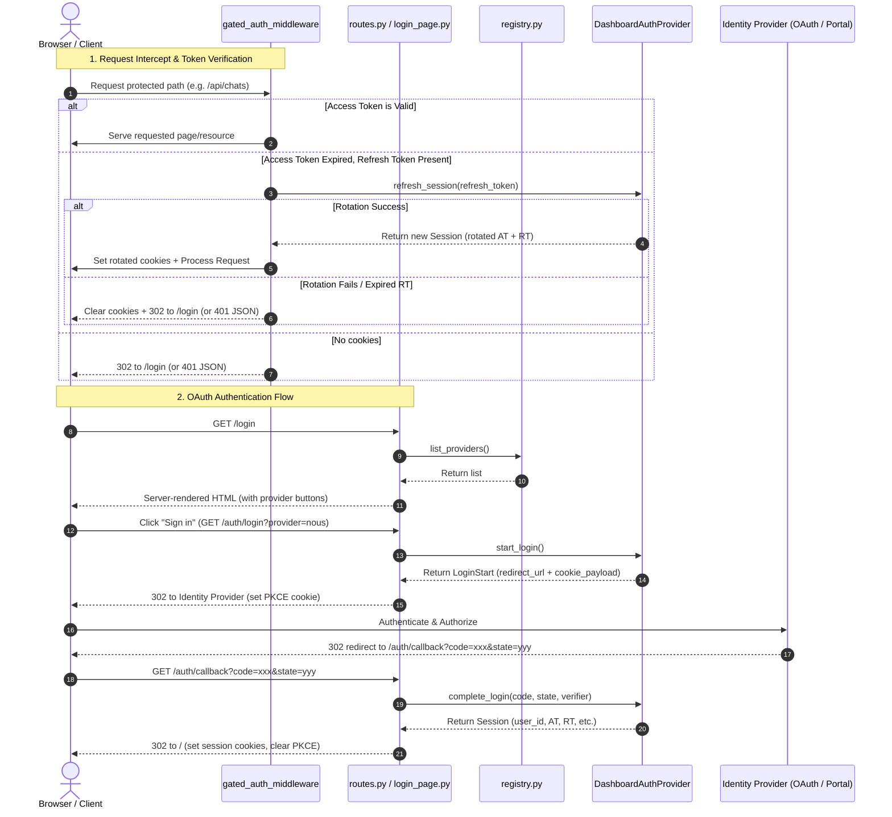
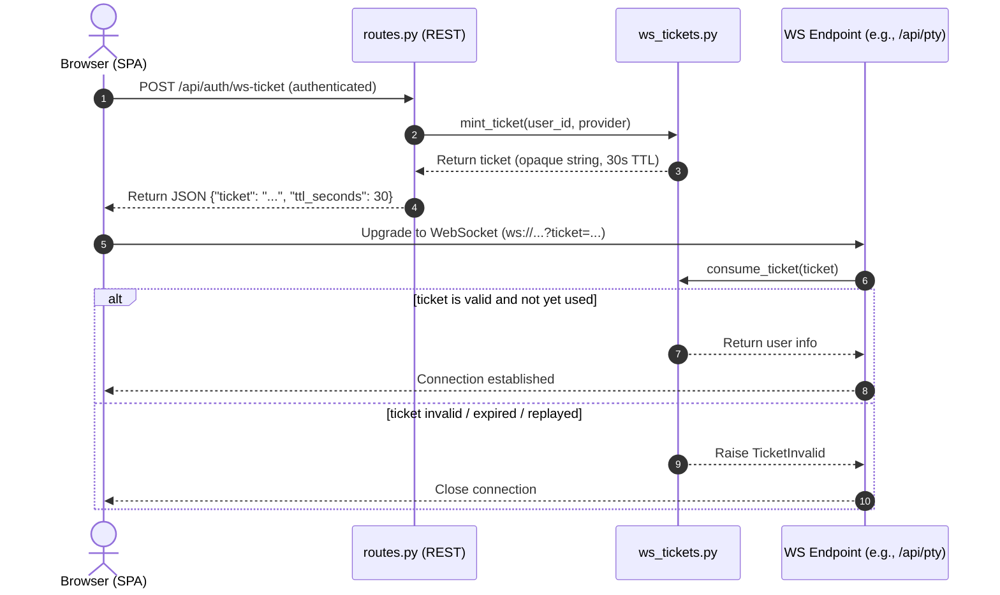

# dashboard_auth Design Documentation

## Goal
The `hermes_cli/dashboard_auth` directory houses the modular, plugin-based authentication framework for the Hermes Agent dashboard when bound to a public/non-loopback network interface. It secures the dashboard's REST endpoints and WebSocket upgrades, preventing unauthorized access while facilitating transparent access token refreshes via rotating refresh tokens.

## File Enumeration
* [__init__.py](../../../hermes_cli/dashboard_auth/__init__.py): Exposes key auth-related classes, registry functions, and exceptions as the package entry point.
* [audit.py](../../../hermes_cli/dashboard_auth/audit.py): Implements a thread-safe, JSON-formatted audit logger that records authentication lifecycle events (e.g. login failures/successes, token refreshes, WebSocket ticket creation) to `$HERMES_HOME/logs/dashboard-auth.log`. Automatically redacts credentials and tokens.
* [base.py](../../../hermes_cli/dashboard_auth/base.py): Declares the abstract base class `DashboardAuthProvider` specifying methods for authentication flows (`start_login`, `complete_login`, `verify_session`, `refresh_session`, `revoke_session`, and optional password login via `complete_password_login`). Also defines the `Session` and `LoginStart` dataclasses and protocol compliance checking.
* [cookies.py](../../../hermes_cli/dashboard_auth/cookies.py): Coordinates reading and writing HTTP session cookies (`hermes_session_at` for access tokens, `hermes_session_rt` for refresh tokens, and `hermes_session_pkce` for PKCE/CSRF state). Implements browser-hardening cookie-prefixing (`__Host-` / `__Secure-`) and scope rules based on proxy prefixes.
* [login_page.py](../../../hermes_cli/dashboard_auth/login_page.py): Dynamically renders a lightweight, JS-free login HTML page, adapting its form to display password fields for credentials-based providers or sign-in buttons for redirect-based OAuth providers.
* [middleware.py](../../../hermes_cli/dashboard_auth/middleware.py): Implements the core FastAPI ASGI auth middleware. Directs unauthenticated users to `/login` (redirect or 401 JSON for APIs), executes provider-specific access token verification, and transparently initiates token rotation using refresh tokens.
* [prefix.py](../../../hermes_cli/dashboard_auth/prefix.py): Processes proxy prefixing configuration (`X-Forwarded-Prefix`) and operator-defined public URLs to guarantee redirect URLs and cookie scopes remain valid behind reverse-proxies.
* [public_paths.py](../../../hermes_cli/dashboard_auth/public_paths.py): Houses the centralized allowlist of public API endpoints (e.g. `/api/status`, static resources) exempt from auth constraints.
* [registry.py](../../../hermes_cli/dashboard_auth/registry.py): A thread-safe, in-memory catalog mapping registered `DashboardAuthProvider` implementation names to their instances.
* [routes.py](../../../hermes_cli/dashboard_auth/routes.py): Configures the FastAPI router with authentication end-points supporting OAuth redirecting, password POST logins, session inquiries, and WS ticket generation.
* [ws_tickets.py](../../../hermes_cli/dashboard_auth/ws_tickets.py): Mints and consumes short-lived (30-second TTL), single-use ticketing strings for WebSockets upgrades, as well as process-lifetime credentials for server-internal clients.

## Workflow
The authentication process handles initial client requests, transparent session refreshes, redirect-based OAuth, and WebSocket ticketing.

### OAuth & Transparent Session Refresh Workflow


### WebSocket Ticket Flow
Since browsers cannot supply headers during WebSocket upgrades, WebSockets are authenticated via short-lived, single-use tickets:


## System Architecture
The following diagram showcases how the core dashboard auth components relate to each other and to the rest of the Hermes system:
```
                  +----------------------------------------------+
                  |                  FastAPI                     |
                  +-------+-----------------------------+--------+
                          |                             |
                          | (Incoming Request)          | (Mounts Auth Routes)
                          v                             v
             +------------+-------------+     +---------+-----------+
             |  gated_auth_middleware   |     |      routes.py      |
             +------------+-------------+     +----+-----+----+-----+
                          |                        |     |    |
       (Check Allowlist)|                        |     |    | (Mint WS Tickets)
                          v                        v     |    v
             +------------+-------------+     +----+---+ | +--+-------------+
             |     public_paths.py      |     | login_ | | | ws_tickets.py  |
             +--------------------------+     | page.py| | +----------------+
                                              +----+---+ |
         (Read / Write Session Cookies)            |     | (Resolve prefix / public URL)
                          v                        v     v
             +------------+-------------+     +----+-----+----------+
             |        cookies.py        |     |      prefix.py      |
             +--------------------------+     +---------------------+
                          |                              |
                          +---------------+--------------+
                                          |
                                          v (Verify / Refresh Session)
             +----------------------------+-------------------------+
             |                      registry.py                     |
             +----------------------------+-------------------------+
                                          | (Look up registered providers)
                                          v
             +----------------------------+-------------------------+
             |                 DashboardAuthProvider (base.py)      |
             +----------------------------+-------------------------+
                                          |
                                          v (Implemented by plugins)
             +----------------------------+-------------------------+
             |             plugins/dashboard-auth-nous/             |
             |           (or other third-party providers)           |
             +------------------------------------------------------+
                                          |
                                          +-- (Writes audit logs) --> [ audit.py ]
                                                                             |
                                                                             v
                                                        $HERMES_HOME/logs/dashboard-auth.log
```
