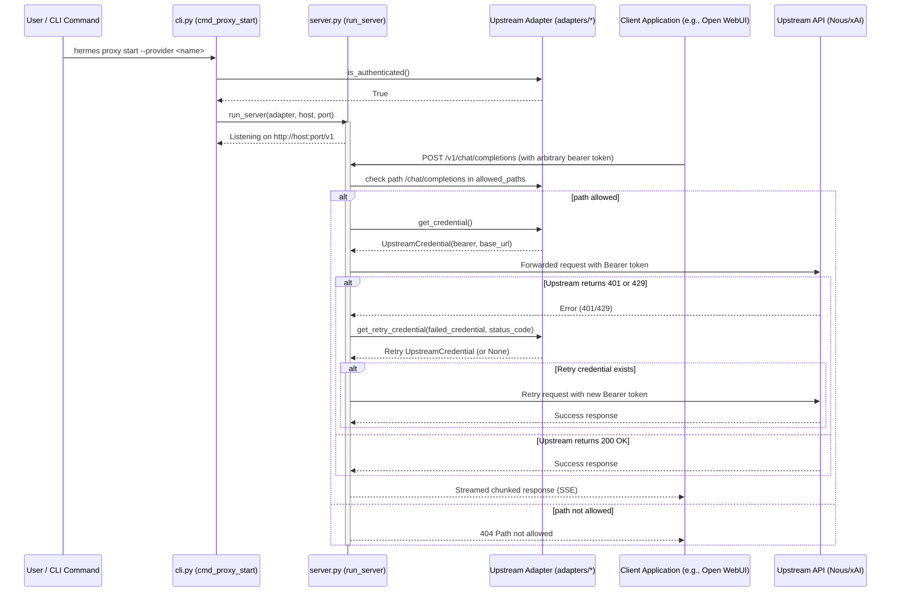

# hermes_cli/proxy Design Documentation

## Goal
The goal of the `hermes_cli/proxy` directory is to implement a local, OpenAI-compatible HTTP proxy server that forwards client requests to upstream AI models using the user's active, authenticated OAuth provider subscriptions (such as Nous Portal or xAI Grok).

By acting as a credential-attaching forwarder, it enables external applications (e.g., Open WebUI, LibreChat, Karakeep) to query a local endpoint (`127.0.0.1:8645` by default) without needing static API keys. The proxy strips incoming client authorization headers, attaches the resolved upstream bearer token, forwards the request body verbatim to the upstream API, handles client-transparent retry logic (rotating/refreshing credentials once on `401`/`429`), and streams the response back unmodified (SSE preserved). It does not log, transform, or rewrite request/response bodies.

## File Enumeration
* [__init__.py](./__init__.py): Packages the module, documents the proxy's purpose, and re-exports the base `UpstreamAdapter` class for defining upstream providers.
* [cli.py](./cli.py): Implements the `hermes proxy` command group. `cmd_proxy` dispatches subcommands: `start` (`cmd_proxy_start`) runs the server in the foreground after checking `aiohttp` availability and adapter authentication; `status` (`cmd_proxy_status`) prints per-adapter readiness and bearer expiry; `providers`/`list` (`cmd_proxy_list_providers`) lists available upstreams. No subcommand prints short help.
* [server.py](./server.py): Implements the aiohttp HTTP proxy. `create_app(adapter)` builds the app with a `/health` JSON status route and a catch-all `*` route on `/v1/{tail}` (`handle_proxy`). The handler validates the path against `adapter.allowed_paths` (else 404), resolves a credential, forwards the request with the upstream `Authorization` header, retries once with `get_retry_credential` on `401`/`429`, then streams the response chunk-by-chunk. Helpers `_filter_request_headers`/`_filter_response_headers` strip hop-by-hop + auth headers; `_json_error` returns OpenAI-style error JSON. `run_server(...)` starts the TCP site and runs until a shutdown event or SIGINT/SIGTERM.
* [adapters/](./adapters): Subdirectory containing the vendor-agnostic adapter interface (`base.py`), adapter registry (`__init__.py`), and concrete `nous`/`xai` adapters with token resolution, validation, and retry/rotation logic. For details, see [adapters/DESIGN.md](./adapters/DESIGN.md).

## Workflow
The sequence diagram below shows how the CLI initializes the server and how an incoming HTTP request is proxied to the upstream provider using the active adapter's credentials.



## System Architecture
The block diagram below describes the relationship between the proxy command interface, the HTTP forwarding server, the upstream adapters, and the credential stores.

```
+-------------------------------------------------------------+
|                     hermes CLI / Core                       |
|           (e.g., hermes command line entrypoint)            |
+------------------------------+------------------------------+
                               |
                               | invokes subcommand
                               v
+-------------------------------------------------------------+
|                      hermes_cli/proxy/                      |
|                                                             |
|   +------------------+             +--------------------+   |
|   |      cli.py      |------------>|     server.py      |   |
|   | (CLI Subcommands)|             |  (aiohttp Server)  |   |
|   +--------+---------+             +---------+----------+   |
|            |                                 |              |
|            | resolves                        | uses         |
|            v                                 v              |
|   +-----------------------------------------------------+   |
|   |                     adapters/                       |   |
|   |                                                     |   |
|   |         +---------------------------------+         |   |
|   |         |             base.py             |         |   |
|   |         | (UpstreamAdapter Interface)     |         |   |
|   |         +--------+------------------+-----+         |   |
|   |                  ^                  ^               |   |
|   |                  | inherits         | inherits      |   |
|   |         +--------+---------+  +-----+----------+    |   |
|   |         |  nous_portal.py  |  |     xai.py     |    |   |
|   |         +------------------+  +----------------+    |   |
|   +-----------------------------------------------------+   |
+-------------------------------------------------------------+
                               |
             interacts with    v
        +-------------------------------------------+
        | Local Authentication Stores               |
        | (~/.hermes/auth.json / Credential Pool)   |
        +-------------------------------------------+
```
