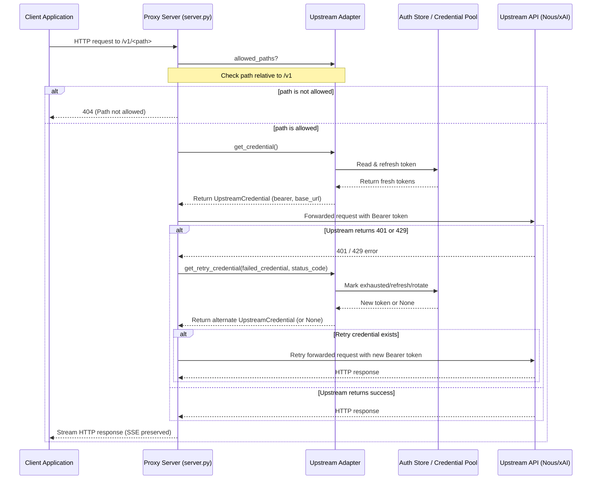

# hermes_cli/proxy/adapters Design Documentation

## Goal
The goal of the `hermes_cli/proxy/adapters` directory is to define and implement a unified, vendor-agnostic interface for proxying local client requests to upstream AI models using the user's active, authenticated OAuth subscriptions (such as Nous Portal and xAI Grok). 

By decoupling vendor-specific OAuth token rotation, credential verification, and error-handling (like rate limiting cooldowns or quarantining invalid tokens) from the core HTTP proxy server, this package allows any external application to query localhost and seamlessly authenticate with remote API endpoints without managing API keys directly.

## File Enumeration
* [__init__.py](./__init__.py): Adapter registry. `ADAPTERS` dict maps the `--provider` CLI string (`"nous"`, `"xai"`) to its adapter class. `get_adapter(name)` instantiates one by name (case-insensitive, trimmed); raises `ValueError` listing available names if unknown.
* [base.py](./base.py): Defines the `UpstreamCredential` frozen dataclass and the abstract `UpstreamAdapter` base class.
  * `UpstreamCredential` fields: `bearer` (token only, no `Bearer` prefix), `base_url`, `token_type` (default `"Bearer"`), `expires_at` (optional ISO-8601, informational).
  * `UpstreamAdapter` abstract members: `name`, `display_name`, `allowed_paths`, `is_authenticated()` (cheap, no network), `get_credential()` (refresh/rotate + persist; raises `RuntimeError` on failure → proxy returns 401). Concrete defaults: `get_retry_credential(...)` returns `None` (no retry) and `describe()` returns a one-line `proxy status` summary.
* [nous_portal.py](./nous_portal.py): `NousPortalAdapter` for the Nous Portal inference API. `get_credential` calls `resolve_nous_runtime_credentials` (cross-process refresh/persist) under a per-instance lock, then validates the base URL via `_validate_nous_inference_url_from_network` (falls back to `DEFAULT_NOUS_INFERENCE_URL`). On terminal refresh errors it quarantines the OAuth state and pool entries in `~/.hermes/auth.json`. `get_retry_credential` only acts on `401`, force-refreshing the inference JWT once. Allowed paths: `/chat/completions`, `/completions`, `/embeddings`, `/models`.
* [xai.py](./xai.py): `XAIGrokAdapter` for xAI Grok via the OAuth `CredentialPool` (`load_pool("xai-oauth")`). `get_credential` selects an available pooled credential under a lock and caches the pool. `get_retry_credential` acts on `401`/`429`: on `429` it marks the key exhausted (1-hour cooldown) and rotates; on `401` it tries refreshing the current key, else rotates. Returns `None` if no other key (error flows back to client) or if the rotated key matches the failed one. Allowed paths add `/responses` (xAI codex_responses mode) to the Nous set.

## Workflow
The diagram below details the sequence of operations when a local OpenAI-compatible client issues a request through the proxy server.



## System Architecture
This ASCII block diagram shows how files in the `adapters` directory relate to the proxy HTTP server and the underlying authentication subsystems.

```
                            +--------------------------+
                            |      External Apps       |
                            |   (Open WebUI, etc.)     |
                            +------------+-------------+
                                         | HTTP requests
                                         v
                            +--------------------------+
                            |   proxy/server.py        |
                            |      (Proxy Server)      |
                            +------------+-------------+
                                         |
                        Uses adapter     | Resolves adapter via get_adapter()
                                         v
                            +--------------------------+
                            |  adapters/__init__.py    |
                            |    (Adapter Registry)    |
                            +------------+-------------+
                                         |
                                         v
+--------------------------------------------------------------------------------------+
| hermes_cli/proxy/adapters/                                                           |
|                                                                                      |
|                 +--------------------------------------------------+                 |
|                 |                     base.py                      |                 |
|                 |     Defines UpstreamAdapter & UpstreamCredential |                 |
|                 +---------^------------------------------^---------+                 |
|                           | Inherits                     | Inherits                  |
|                           |                              |                           |
|                 +---------+----------+         +---------+----------+                |
|                 |   nous_portal.py   |         |       xai.py       |                |
|                 | (NousPortalAdapter)|         |  (XAIGrokAdapter)  |                |
|                 +---------+----------+         +---------+----------+                |
+---------------------------|------------------------------|---------------------------+
                            |                              |
                            | Calls resolver               | Selects / rotates
                            v                              v
                  +--------------------+         +--------------------+
                  |   hermes_cli.auth  |         |agent.credential_pool|
                  | resolve_nous_      |         |  load_pool(         |
                  |  runtime_creds()   |         |   "xai-oauth")      |
                  +---------+----------+         +---------+----------+
                            |                              |
                   Persists |                              | Persists
                            v                              v
                  +--------------------+         +--------------------+
                  |~/.hermes/auth.json |         |~/.hermes/auth.json |
                  |  (providers block) |         | (credential_pools) |
                  +--------------------+         +--------------------+
```
