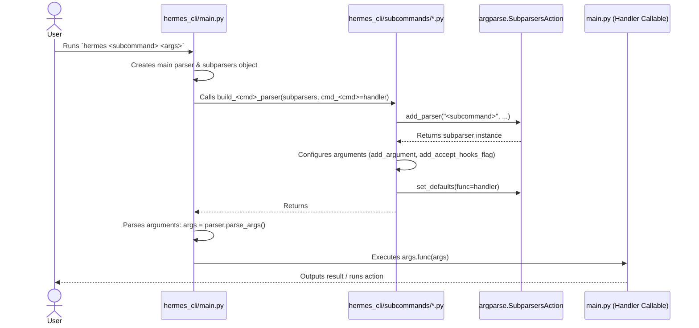

# subcommands Design Documentation

## Goal
The `hermes_cli/subcommands` directory contains modular command-line subcommand parser builders for the Hermes CLI (`hermes <subcommand>`). 

Historically, the entire CLI argparse tree was defined inline inside a single monolithic function in `hermes_cli/main.py`. This package modularizes that structure by delegating the parser definition of each subcommand group to its own file. The main entry point in `main.py` imports these builders and calls them to construct the argparse tree, using dependency injection to register the handlers (`cmd_*` functions) without causing circular imports.

## File Enumeration
* [__init__.py](file:///home/castincar/hermes-agent/hermes_cli/subcommands/__init__.py) - Package initialization; documents the argparse decomposition architecture.
* [_shared.py](file:///home/castincar/hermes-agent/hermes_cli/subcommands/_shared.py) - Shared argument definitions (e.g., `--accept-hooks`) used across multiple subcommands.
* [acp.py](file:///home/castincar/hermes-agent/hermes_cli/subcommands/acp.py) - Subcommand builder for `hermes acp` (Model Context Protocol editor integration).
* [auth.py](file:///home/castincar/hermes-agent/hermes_cli/subcommands/auth.py) - Subcommand builder for `hermes auth` (credentials and tokens management).
* [backup.py](file:///home/castincar/hermes-agent/hermes_cli/subcommands/backup.py) - Subcommand builder for `hermes backup` (zipping configuration and state databases).
* [claw.py](file:///home/castincar/hermes-agent/hermes_cli/subcommands/claw.py) - Subcommand builder for `hermes claw` (migration utilities from OpenClaw).
* [config.py](file:///home/castincar/hermes-agent/hermes_cli/subcommands/config.py) - Subcommand builder for `hermes config` (configuration viewing, editing, and migration).
* [cron.py](file:///home/castincar/hermes-agent/hermes_cli/subcommands/cron.py) - Subcommand builder for `hermes cron` (scheduled/recurring tasks and jobs).
* [dashboard.py](file:///home/castincar/hermes-agent/hermes_cli/subcommands/dashboard.py) - Subcommand builder for `hermes dashboard` (Web UI control center).
* [debug.py](file:///home/castincar/hermes-agent/hermes_cli/subcommands/debug.py) - Subcommand builder for `hermes debug` (support diagnostics and log collection).
* [doctor.py](file:///home/castincar/hermes-agent/hermes_cli/subcommands/doctor.py) - Subcommand builder for `hermes doctor` (configuration and system sanity checks).
* [dump.py](file:///home/castincar/hermes-agent/hermes_cli/subcommands/dump.py) - Subcommand builder for `hermes dump` (compact plain-text state reports).
* [gateway.py](file:///home/castincar/hermes-agent/hermes_cli/subcommands/gateway.py) - Subcommand builder for `hermes gateway` and `hermes proxy` (chat integrations and proxy).
* [gui.py](file:///home/castincar/hermes-agent/hermes_cli/subcommands/gui.py) - Subcommand builder for `hermes desktop`/`gui` (Electron desktop launcher).
* [hooks.py](file:///home/castincar/hermes-agent/hermes_cli/subcommands/hooks.py) - Subcommand builder for `hermes hooks` (automated shell hook management).
* [import_cmd.py](file:///home/castincar/hermes-agent/hermes_cli/subcommands/import_cmd.py) - Subcommand builder for `hermes import` (restoring configuration/state zip archives).
* [insights.py](file:///home/castincar/hermes-agent/hermes_cli/subcommands/insights.py) - Subcommand builder for `hermes insights` (usage and cost analytics tracking).
* [login.py](file:///home/castincar/hermes-agent/hermes_cli/subcommands/login.py) - Subcommand builder for `hermes login` (OAuth authorization flow).
* [logout.py](file:///home/castincar/hermes-agent/hermes_cli/subcommands/logout.py) - Subcommand builder for `hermes logout` (clearing session tokens).
* [logs.py](file:///home/castincar/hermes-agent/hermes_cli/subcommands/logs.py) - Subcommand builder for `hermes logs` (viewing and tailing service logs).
* [mcp.py](file:///home/castincar/hermes-agent/hermes_cli/subcommands/mcp.py) - Subcommand builder for `hermes mcp` (Model Context Protocol client configuration).
* [memory.py](file:///home/castincar/hermes-agent/hermes_cli/subcommands/memory.py) - Subcommand builder for `hermes memory` (external memory providers settings).
* [model.py](file:///home/castincar/hermes-agent/hermes_cli/subcommands/model.py) - Subcommand builder for `hermes model` (default LLM model/provider selector).
* [pairing.py](file:///home/castincar/hermes-agent/hermes_cli/subcommands/pairing.py) - Subcommand builder for `hermes pairing` (DM authorization keys).
* [plugins.py](file:///home/castincar/hermes-agent/hermes_cli/subcommands/plugins.py) - Subcommand builder for `hermes plugins` (git-based plugin lifecycle management).
* [postinstall.py](file:///home/castincar/hermes-agent/hermes_cli/subcommands/postinstall.py) - Subcommand builder for `hermes postinstall` (system binary dependencies installation).
* [profile.py](file:///home/castincar/hermes-agent/hermes_cli/subcommands/profile.py) - Subcommand builder for `hermes profile` (multi-profile sandbox workspace management).
* [prompt_size.py](file:///home/castincar/hermes-agent/hermes_cli/subcommands/prompt_size.py) - Subcommand builder for `hermes prompt-size` (dry-run byte size calculation).
* [security.py](file:///home/castincar/hermes-agent/hermes_cli/subcommands/security.py) - Subcommand builder for `hermes security` (OSV vulnerability scanner integrations).
* [setup.py](file:///home/castincar/hermes-agent/hermes_cli/subcommands/setup.py) - Subcommand builder for `hermes setup` (the interactive onboarding setup wizard).
* [skills.py](file:///home/castincar/hermes-agent/hermes_cli/subcommands/skills.py) - Subcommand builder for `hermes skills` (skill package search and installation).
* [slack.py](file:///home/castincar/hermes-agent/hermes_cli/subcommands/slack.py) - Subcommand builder for `hermes slack` (app manifest generation).
* [status.py](file:///home/castincar/hermes-agent/hermes_cli/subcommands/status.py) - Subcommand builder for `hermes status` (component health checklist).
* [tools.py](file:///home/castincar/hermes-agent/hermes_cli/subcommands/tools.py) - Subcommand builder for `hermes tools` (enabling/disabling tool permissions).
* [uninstall.py](file:///home/castincar/hermes-agent/hermes_cli/subcommands/uninstall.py) - Subcommand builder for `hermes uninstall` (clean configuration/binary teardown).
* [update.py](file:///home/castincar/hermes-agent/hermes_cli/subcommands/update.py) - Subcommand builder for `hermes update` (git pulls and auto-dependency updates).
* [version.py](file:///home/castincar/hermes-agent/hermes_cli/subcommands/version.py) - Subcommand builder for `hermes version` (reporting version strings).
* [webhook.py](file:///home/castincar/hermes-agent/hermes_cli/subcommands/webhook.py) - Subcommand builder for `hermes webhook` (event trigger webhook subscriptions).
* [whatsapp.py](file:///home/castincar/hermes-agent/hermes_cli/subcommands/whatsapp.py) - Subcommand builder for `hermes whatsapp` (WhatsApp setup & authentication QR).

## Workflow


## System Architecture
```
                             +-----------------------+
                             |     User Terminal     |
                             +-----------+-----------+
                                         |
                                         v
                             +-----------+-----------+
                             |   hermes_cli/main.py  | <----+
                             |  (CLI Entry / Handlers)|      |
                             +-----+-----------+-----+      |
                                   |           |            | Dependency
                 Imports & Calls   |           |            | Injection
                 Subcommand        |           |            | (cmd_* Handlers)
                 Builders          v           |            |
                      +------------+----+      |            |
                      | hermes_cli/     |      |            |
                      | subcommands/    |      |            |
                      +------------+----+      |            |
                                   |           |            |
                        Configures |           |            |
                        Parsers    v           v            |
                       +-----------+-----------+------------+
                       |    argparse.ArgumentParser Tree    |
                       +-------------------+----------------+
                                           |
                                           v
                       +-------------------+----------------+
                       |     Dispatched Subcommand Handler   |
                       |       (e.g., cmd_version, etc.)     |
                       +------------------------------------+
```
