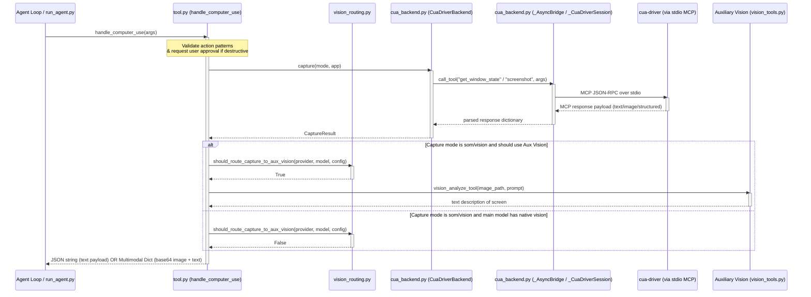

# tools/computer_use Design Documentation

## Goal
The goal of the `tools/computer_use` directory is to provide a model-agnostic, background-safe desktop control interface for macOS. Unlike standard computer-use tools that hijack the user's cursor or require active foreground focus, this module interacts with macOS applications in the background using `cua-driver` via SkyLight private SPIs. 

It handles screen capture (with optional Set-of-Mark (SOM) annotations or accessibility tree extraction), cursor/keyboard input emulation, window/application targeting, safety checks, and user approvals. It also integrates an auxiliary vision routing system (`vision_routing.py`) to pre-analyze screenshots for main models lacking native vision capabilities.

## File Enumeration
* [__init__.py](../../../tools/computer_use/__init__.py) — Initializes the module and exposes the main public surface of the computer-use toolset.
* [backend.py](../../../tools/computer_use/backend.py) — Defines abstract interfaces (`ComputerUseBackend`) and data containers (`UIElement`, `CaptureResult`, `ActionResult`) to ensure a decoupled, pluggable architecture.
* [cua_backend.py](../../../tools/computer_use/cua_backend.py) — The default macOS-specific implementation. Connects to `cua-driver` over an MCP stdio transport, managing a background thread/event loop to handle async MCP commands synchronously.
* [schema.py](../../../tools/computer_use/schema.py) — Centralizes the OpenAI function-calling schema (`COMPUTER_USE_SCHEMA`) for all model-directed computer operations.
* [tool.py](../../../tools/computer_use/tool.py) — Orchestrates overall execution flow. Handles safety blocks, requests user permissions for mutating operations, dispatches requests to the active backend, and formats the return results (multimodal or text payload).
* [vision_routing.py](../../../tools/computer_use/vision_routing.py) — Implements policy decisions to determine whether captures should be processed via `auxiliary.vision` or returned natively as multimodal images.

## Workflow
The diagram below illustrates a screen capture action showing how safety configuration, backend execution, and optional auxiliary vision routing interact.



## System Architecture
The following diagram highlights how files inside `tools/computer_use` interface with one another and integrate with the rest of the Hermes system.

```
                  +-----------------------------------+
                  |      run_agent.py / Agent Loop     |
                  +-----------------+-----------------+
                                    |
                                    | calls
                                    v
                  +-----------------------------------+
                  |            __init__.py            |
                  +-----------------+-----------------+
                                    |
                                    | re-exports API
                                    v
                  +-----------------------------------+
                  |              tool.py              |
                  +----+------------+------------+----+
                       |            |            |
             defines / |    uses to |   decides  | evaluates
             validate  |    execute |   routing  | capability
                       v            v            v
        +--------------+---+  +-----+----+  +----+--------------+
        |     schema.py    |  |backend.py|  | vision_routing.py |
        +------------------+  +-----+----+  +-------------------+
                                    ^
                                    | implements
                                    |
                              +-----+-----+
                              |cua_backend|
                              +-----+-----+
                                    |
                                    | talks MCP over stdio
                                    v
                              +-----+-----+
                              |cua-driver |
                              +-----------+
```
