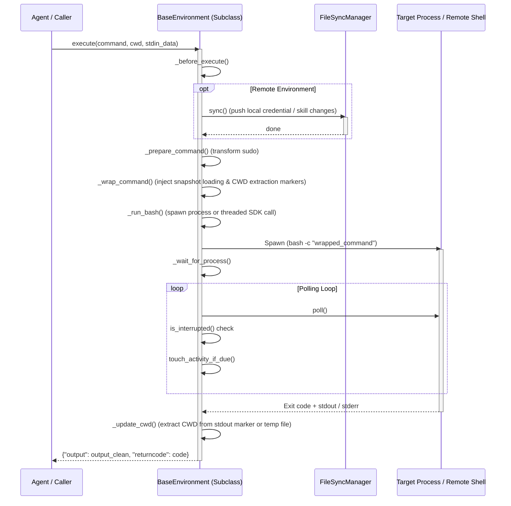

# tools/environments Design Documentation

## Goal
The goal of this directory is to define a unified interface and set of backend implementations for executing shell commands and scripts in isolated environments. The module acts as the sandboxed execution layer of the Hermes Agent. It encapsulates all host-level subprocess execution, container virtualization (Docker, Apptainer/Singularity), SSH remote execution, and cloud sandboxing (Daytona, Modal, Nous Tool Gateway). Key tasks include setting up session snapshots (persisting environment variables, functions, and aliases across command calls), filtering credentials and secrets to prevent leaks, sanitizing working directories (CWD), handling activity reporting, managing file synchronization, and enforcing execution timeouts or interrupts.

## File Enumeration
* [__init__.py](file:///home/castincar/hermes-agent/tools/environments/__init__.py): Exposes `BaseEnvironment` as the unified execution backend interface.
* [base.py](file:///home/castincar/hermes-agent/tools/environments/base.py): Defines the abstract `BaseEnvironment` class, `ProcessHandle` protocols, and core command-wrapping, polling, and CWD marker parsing logic.
* [daytona.py](file:///home/castincar/hermes-agent/tools/environments/daytona.py): Implements `DaytonaEnvironment` to run commands inside cloud sandboxes using the Daytona Python SDK, including batch file sync.
* [docker.py](file:///home/castincar/hermes-agent/tools/environments/docker.py): Implements `DockerEnvironment` to run commands in security-hardened Docker/Podman containers with CPU, memory, and disk limits, container reuse, and orphan reaping.
* [file_sync.py](file:///home/castincar/hermes-agent/tools/environments/file_sync.py): Implements `FileSyncManager` to track local changes via mtime/size, and transactional push/pull (sync back) of credentials, skills, and cache to remote sandboxes.
* [local.py](file:///home/castincar/hermes-agent/tools/environments/local.py): Implements `LocalEnvironment` to run commands directly on the host with environment variable sanitization, PATH injection, and MSYS/Windows normalization.
* [managed_modal.py](file:///home/castincar/hermes-agent/tools/environments/managed_modal.py): Implements `ManagedModalEnvironment` to interface with Modal containers managed via the Nous Tool Gateway API.
* [modal.py](file:///home/castincar/hermes-agent/tools/environments/modal.py): Implements `ModalEnvironment` using the native Modal SDK to create sandboxes, stream tar archives via stdin, and snapshot filesystems.
* [modal_utils.py](file:///home/castincar/hermes-agent/tools/environments/modal_utils.py): Provides the shared execution state machinery, polling, and command wrappers (`BaseModalExecutionEnvironment`) for direct/managed Modal backends.
* [singularity.py](file:///home/castincar/hermes-agent/tools/environments/singularity.py): Implements `SingularityEnvironment` to execute commands inside Apptainer/Singularity container instances with overlay filesystem mounts.
* [ssh.py](file:///home/castincar/hermes-agent/tools/environments/ssh.py): Implements `SSHEnvironment` to execute commands on remote hosts using OpenSSH with ControlMaster connection persistence and streaming file transfers.

## Workflow
The following sequence diagram outlines the unified execution flow for remote and local environments:



## System Architecture
The diagram below illustrates the inheritance hierarchy and helper integration within the `tools/environments` package:

```
                  +--------------------------------+
                  |       [ terminal_tool ]        |
                  |  (Factory entry & dispatcher)  |
                  +----------------+---------------+
                                   |
                                   | Instantiates
                                   v
                  +--------------------------------+
                  |       BaseEnvironment          | <------+
                  |           (base.py)            |        |
                  +-------+----------------+-------+        |
                          |                |                | Uses for remote
                          |                | Inherits       |
                          |                v                |
                          |     +--------------------+      |
                          |     |    LocalEnv        |      |
                          |     |   (local.py)       |      v
                          |     +--------------------+   +--------------------+
                          |                              |  FileSyncManager   |
                          |     +--------------------+   |   (file_sync.py)   |
                          |     |    DockerEnv       |   +--------------------+
                          |     |   (docker.py)      |
                          |     +--------------------+
                          |
                          |     +--------------------+
                          +---> |    SSHAgentEnv     |
                          |     |     (ssh.py)       |
                          |     +--------------------+
                          |
                          |     +--------------------+
                          +---> |   SingularityEnv   |
                          |     |  (singularity.py)  |
                          |     +--------------------+
                          |
                          |     +--------------------+
                          +---> |    DaytonaEnv      |
                          |     |    (daytona.py)    |
                          |     +--------------------+
                          |
                          v
                +--------------------+
                |  BaseModalExecEnv  |
                |  (modal_utils.py)  |
                +---+------------+---+
                    |            |
                    | Inherits   | Inherits
                    v            v
        +---------------+    +--------------------+
        |   ModalEnv    |    |  ManagedModalEnv   |
        |  (modal.py)   |    | (managed_modal.py) |
        +---------------+    +--------------------+
```
