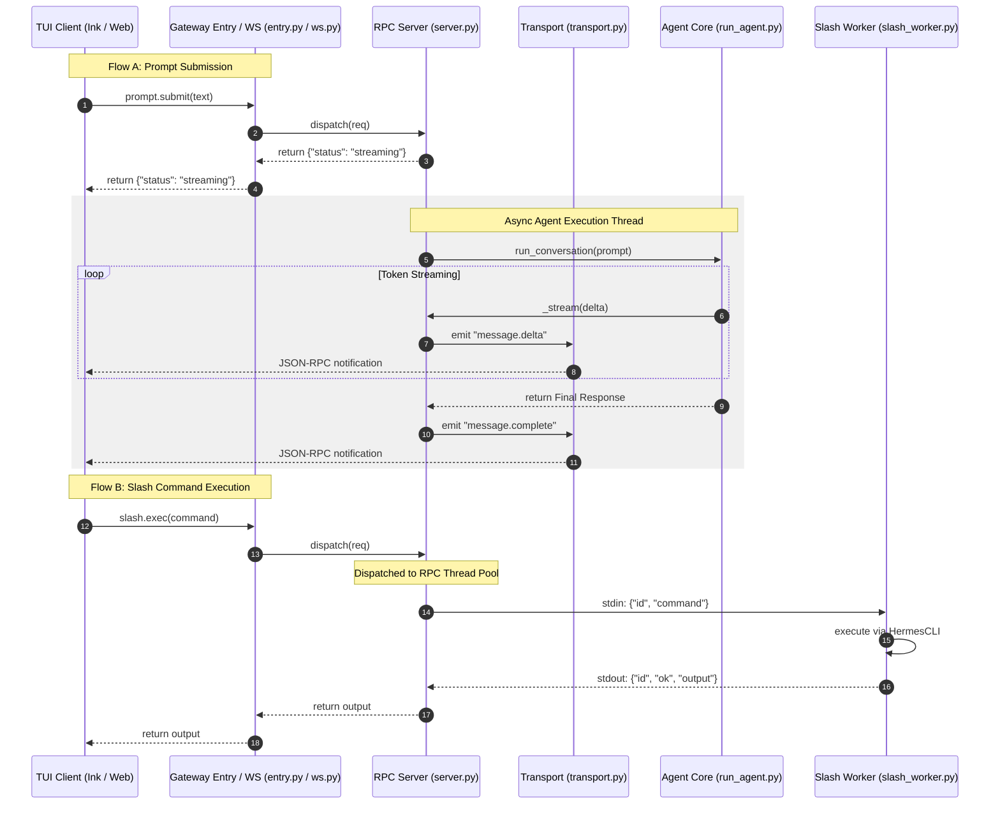

# tui_gateway Design Documentation

## Goal
The `tui_gateway` directory serves as the backend communication layer for the Hermes Agent's Terminal User Interface (TUI) and Web/Desktop Client. It exposes a JSON-RPC 2.0 interface over both standard input/output (stdio) and WebSockets, facilitating real-time bidirectional communication between frontends (such as Ink-based terminals or local dashboard interfaces) and the Python-based agent core.

Its primary responsibilities include:
1. **JSON-RPC Dispatching**: Parsing, routing, and executing actions like prompt submissions, session management, slash command execution, and configuration updates.
2. **Session Lifecycle Management**: Resuming, branching, and persisting agent conversation histories within a SQLite database.
3. **Execution Offloading**: Offloading long-running operations (e.g., executing code in shell, slash commands, resuming sessions) to a background thread pool to prevent blocking UI event loops.
4. **Sidecar Process Delegation**: Reusing the existing CLI-based `HermesCLI` environment via a persistent sidecar subprocess (`slash_worker.py`) to process interactive slash commands efficiently.
5. **Output Formatting**: Streaming token deltas and formatting raw outputs using terminal/rich layout components.

## File Enumeration
* [__init__.py](file:///home/castincar/hermes-agent/tui_gateway/__init__.py): Initializes the `tui_gateway` package.
* [entry.py](file:///home/castincar/hermes-agent/tui_gateway/entry.py): The main command-line entry point for standard-input/output-driven TUI sessions. It manages startup, handles process termination signals cleanly, configures crash logging, initiates background MCP discovery, and routes incoming JSON-RPC lines to the dispatcher.
* [event_publisher.py](file:///home/castincar/hermes-agent/tui_gateway/event_publisher.py): Implements `WsPublisherTransport`, an asynchronous, best-effort WebSocket client that mirrors JSON-RPC messages and notifications to a dashboard sidecar URL (`HERMES_TUI_SIDECAR_URL`) via a daemon worker thread.
* [render.py](file:///home/castincar/hermes-agent/tui_gateway/render.py): Acts as a formatting bridge, redirecting output text and diff formatting tasks to Python-side rich renderers in `agent.rich_output` (such as `format_response`, `render_diff`, and `StreamingRenderer`) if available, falling back to client-side Markdown rendering otherwise.
* [server.py](file:///home/castincar/hermes-agent/tui_gateway/server.py): The core JSON-RPC dispatcher and handler registry. Defines over 75 API methods for sessions, handoffs, terminal manipulation, model interactions, and configurations. It orchestrates agent execution threads, controls file/image attachment pipelines, manages active session slots, and delegates slash command executions to the persistent sidecar worker.
* [slash_worker.py](file:///home/castincar/hermes-agent/tui_gateway/slash_worker.py): A persistent sidecar subprocess that wraps a single `HermesCLI` instance per session. It executes incoming interactive slash commands to avoid initialization overhead and utilizes a watchdog thread to monitor parent process death for clean shutdown.
* [transport.py](file:///home/castincar/hermes-agent/tui_gateway/transport.py): Abstract definition and management of the I/O transmission channel. Implements `StdioTransport` (handling atomic standard output writes) and `TeeTransport` (enabling mirroring to secondary transports like `event_publisher.py`). Uses `contextvars.ContextVar` to keep track of the active request's transport.
* [ws.py](file:///home/castincar/hermes-agent/tui_gateway/ws.py): Implements a Starlette/FastAPI-compatible WebSocket handler (`handle_ws`) and transport (`WSTransport`) to run JSON-RPC sessions over WebSocket connections. Configures TCP options to disable Nagle's algorithm for preserving real-time token streaming cadence.

## Workflow
The diagram below details the two primary runtime interaction models: submitting a prompt that runs the AIAgent loop asynchronously, and executing a slash command delegated to the persistent worker.



## System Architecture
The relationships and dependencies between files in `tui_gateway` and external components of the system:

```
                      ┌────────────────────────────────────────┐
                      │    TUI / Desktop Client (Ink / Web)    │
                      └──────────┬───────────────────▲─────────┘
                                 │ Stdin / WS        │ Stdout / WS
                                 ▼                   │
┌────────────────────────────────────────────────────┴───────────────────────────────────────┐
│ tui_gateway                                                                                │
│                                                                                            │
│  ┌────────────────────────┐                ┌────────────────────────┐                      │
│  │        entry.py        │                │         ws.py          │                      │
│  │ (Stdio Entry & Daemon) │                │  (FastAPI WS Handler)  │                      │
│  └───────────┬────────────┘                └───────────┬────────────┘                      │
│              │                                         │                                   │
│              └───────────────────┬─────────────────────┘                                   │
│                                  ▼                                                         │
│                      ┌────────────────────────┐                                            │
│                      │       server.py        ├────────────────────────┐                   │
│                      │  (RPC Core Registry)   │                        │                   │
│                      └───────────┬────────────┘                        │                   │
│                                  │                                     │                   │
│         ┌────────────────────────┼────────────────────────┐            │                   │
│         ▼                        ▼                        ▼            ▼                   │
│  ┌──────────────┐         ┌──────────────┐         ┌──────────────┐  ┌───────────────────┐ │
│  │ transport.py │         │  render.py   │         │ slash_worker │  │event_publisher.py │ │
│  │ (IO Sinks:   │         │ (Formatting  │         │     .py      │  │ (Sidecar WS Mirror│ │
│  │  Stdio/WS)   │         │    Bridge)   │         │(CLI Sidecar) │  │    to Dashboard)  │ │
│  └──────┬───────┘         └──────┬───────┘         └──────┬───────┘  └─────────┬─────────┘ │
└─────────┼────────────────────────┼────────────────────────┼────────────────────┼───────────┘
          │                        │                        │                    │
          ▼                        ▼                        ▼                    ▼
 ┌─────────────────┐      ┌─────────────────┐      ┌─────────────────┐  ┌──────────────────┐
 │  run_agent.py   │      │ agent/          │      │     cli.py      │  │    Dashboard     │
 │  (AIAgent Core) │      │ rich_output.py  │      │   (HermesCLI)   │  │   Sidebar WS     │
 └─────────────────┘      └─────────────────┘      └─────────────────┘  └──────────────────┘
```
