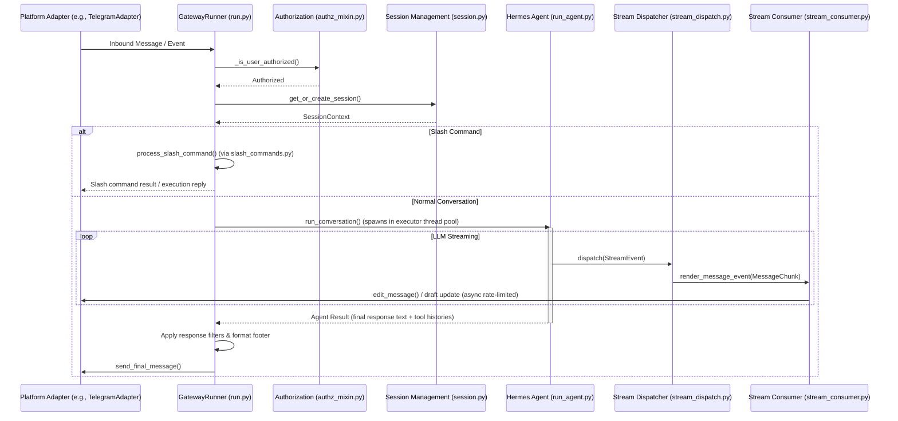

# gateway Design Documentation

## Goal
The `gateway` directory implements the multi-platform messaging integration layer of the Hermes agent. It acts as an asynchronous bridging tier that connects the Hermes agent core (the LLM reasoning loop, tools, and profile configurations) to external communication platforms (such as Telegram, Discord, Slack, WhatsApp, and custom APIs).

The main responsibilities of the files in this directory include:
- Managing daemon lifecycle, PID locks, process memory logging, and diagnostics on termination.
- Routing, authorizing, and dispatching incoming user messages to corresponding persistent agent conversation sessions.
- Parsing and executing slash commands while gating access using admin/user rule configurations.
- Translating synchronous agent outputs and streaming chunks into platform-appropriate progressive edits, formatting options, and media delivery schemas.
- Providing core hooks for registering built-in and user-provided gateway event handlers.

---

## File Enumeration

- [__init__.py](file:///home/castincar/hermes-agent/gateway/__init__.py): Exposes public gateway configurations, session structures, and routing components.
- [authz_mixin.py](file:///home/castincar/hermes-agent/gateway/authz_mixin.py): Implements `GatewayAuthorizationMixin`, providing inbound message authorization, access validation, and WhatsApp-specific identity alias checks.
- [channel_directory.py](file:///home/castincar/hermes-agent/gateway/channel_directory.py): Builds and periodically refreshes a mapping of reachable channels/contacts to facilitate lookup and name-to-ID resolution for message delivery.
- [config.py](file:///home/castincar/hermes-agent/gateway/config.py): Manages parsing and validation of YAML settings, platform-specific configurations, session reset rules, and environment variable overrides.
- [delivery.py](file:///home/castincar/hermes-agent/gateway/delivery.py): Implements the `DeliveryRouter` and `DeliveryTarget` classes, routing job outputs, agent logs, or notifications back to original chats, home channels, or local logs.
- [display_config.py](file:///home/castincar/hermes-agent/gateway/display_config.py): Resolves verbosity and display settings (`tool_progress`, reasoning toggles) with platform-specific overrides, using capabilities-based tiers.
- [hooks.py](file:///home/castincar/hermes-agent/gateway/hooks.py): Implements `HookRegistry`, discovering, loading, and triggering hook functions on startup, agent actions, session changes, or slash command execution.
- [kanban_watchers.py](file:///home/castincar/hermes-agent/gateway/kanban_watchers.py): Implements `GatewayKanbanWatchersMixin`, containing background polling loops for task events, subscriber notifications, and worker task dispatching.
- [memory_monitor.py](file:///home/castincar/hermes-agent/gateway/memory_monitor.py): Spawns a background thread to log process resident set size (RSS) and Python garbage collection details at regular intervals to aid leak detection.
- [mirror.py](file:///home/castincar/hermes-agent/gateway/mirror.py): Appends delivery-mirror entries to target conversation transcripts so the agent maintains context on outbound messages sent outside its direct chat execution path.
- [pairing.py](file:///home/castincar/hermes-agent/gateway/pairing.py): Implements `PairingStore`, providing code-based pairing authentication, rate limits, lockouts, and approved user tracking for direct message onboarding.
- [platform_registry.py](file:///home/castincar/hermes-agent/gateway/platform_registry.py): Defines `PlatformRegistry` to register, validate, and dynamically instantiate both built-in and plugin-provided messaging adapters.
- [response_filters.py](file:///home/castincar/hermes-agent/gateway/response_filters.py): Checks for control tokens (e.g., `[SILENT]`, `NO_REPLY`) to determine if the agent's turn should be intentionally silenced, suppressing delivery.
- [restart.py](file:///home/castincar/hermes-agent/gateway/restart.py): Holds constants and parsers for gateway reload exit codes (sysexits `EX_TEMPFAIL`) and graceful connection-draining timeouts.
- [run.py](file:///home/castincar/hermes-agent/gateway/run.py): Serves as the primary `GatewayRunner` implementation, managing the master connection, task execution queue, session lifetime coordination, and audio/ASR transcription routing.
- [runtime_footer.py](file:///home/castincar/hermes-agent/gateway/runtime_footer.py): Constructs and appends a metadata footer (active model, context usage, cwd) to the final output of an agent turn.
- [session.py](file:///home/castincar/hermes-agent/gateway/session.py): Manages `SessionStore` persistence (SQLite + JSONL transcripts), session source metadata (`SessionSource`), and reset policies.
- [session_context.py](file:///home/castincar/hermes-agent/gateway/session_context.py): Maintains task-local session variables via `contextvars.ContextVar`, preventing race conditions between concurrent requests.
- [shutdown_forensics.py](file:///home/castincar/hermes-agent/gateway/shutdown_forensics.py): Captures a snapshot of the operating environment, parent processes, and active commands immediately upon intercepting shutdown signals.
- [slash_access.py](file:///home/castincar/hermes-agent/gateway/slash_access.py): Resolves permission checks for slash commands to restrict administrative tools to configured user IDs.
- [slash_commands.py](file:///home/castincar/hermes-agent/gateway/slash_commands.py): Implements `GatewaySlashCommandsMixin` housing the handlers for all gateway-side slash commands (e.g., `/model`, `/reset`, `/usage`, `/compress`).
- [status.py](file:///home/castincar/hermes-agent/gateway/status.py): Implements mutex lock files and PID files to verify daemon running state, manage re-entry, and support remote CLI checks.
- [sticker_cache.py](file:///home/castincar/hermes-agent/gateway/sticker_cache.py): Caches visual descriptions of Telegram stickers to bypass redundant vision model invocations.
- [stream_consumer.py](file:///home/castincar/hermes-agent/gateway/stream_consumer.py): Buffers and rate-limits incoming LLM stream tokens, progressively editing the active platform message or updating drafts.
- [stream_dispatch.py](file:///home/castincar/hermes-agent/gateway/stream_dispatch.py): Synchronously routes structured streaming events to the consumer or the gateway's progress queue.
- [stream_events.py](file:///home/castincar/hermes-agent/gateway/stream_events.py): Defines the typed dataclasses representing streaming events (`MessageChunk`, `ToolCallChunk`, etc.) that act as the interface between the agent and the gateway.
- [whatsapp_identity.py](file:///home/castincar/hermes-agent/gateway/whatsapp_identity.py): Standardizes and expands WhatsApp sender identities by resolving LID and phone number mappings.

### Subdirectories
- [platforms/](file:///home/castincar/hermes-agent/gateway/platforms/DESIGN.md): The messaging platform adapter library containing target integrations (Telegram, Slack, Discord, Matrix, etc.).
- [platforms/qqbot/](file:///home/castincar/hermes-agent/gateway/platforms/qqbot/DESIGN.md): Specific integration details for the Tencent QQ Bot API (v2) adapter.
- [builtin_hooks/](file:///home/castincar/hermes-agent/gateway/builtin_hooks/DESIGN.md): Extension point for always-active, built-in gateway event hooks.

---

## Workflow

The Mermaid diagram below outlines the message intake, authorization, session management, slash command dispatch, agent processing, and streaming delivery flow:



---

## System Architecture

The following ASCII block diagram demonstrates the relationship between files in the `gateway` directory and external packages:

```
+--------------------------------------------------------------------------------------------------+
|                                      Hermes Gateway (gateway/)                                   |
|                                                                                                  |
|   +------------------------------------------------------------------------------------------+   |
|   |                              GatewayRunner (run.py)                                      |   |
|   |   - Orchestrates connection lifecycle, queues, and task dispatching                      |   |
|   |   - Coordinates threads/async tasks for the agent runtime loop                           |   |
|   +----+-------------------------+----------------------------+-------------------------+----+   |
|        | (inherits)              | (inherits)                 | (uses)                  | (uses) |
|        v                         v                            v                         v        |
|  +-----+---------------+   +-----+----------------+   +-------+--------------+   +------+------+ |
|  | GatewayAuthorization|   | GatewaySlashCommands |   | HookRegistry         |   |PairingStore | |
|  | Mixin               |   | Mixin                |   | (hooks.py)           |   |(pairing.py) | |
|  | (authz_mixin.py)    |   | (slash_commands.py)  |   +----------+-----------+   +-------------+ |
|  +---------------------+   +----------------------+              |                               |
|                                                                  v (loads)                       |
|   +--------------------------+  +----------------------+  +------+---------------+               |
|   | SessionStore             |  | DeliveryRouter       |  | Built-in / User Hooks|               |
|   | (session.py)             |  | (delivery.py)        |  | (builtin_hooks/)     |               |
|   +------------+-------------+  +----------+-----------+  +----------------------+               |
|                |                           |                                                     |
|                v (task-local state)        v (resolves channels)                                 |
|   +------------+-------------+  +----------+-----------+                                         |
|   | SessionContext / Context |  | ChannelDirectory     |                                         |
|   | (session_context.py)     |  | (channel_directory.py)                                         |
|   +--------------------------+  +----------------------+                                         |
|                                                                                                  |
|   +------------------------------------------------------------------------------------------+   |
|   |                             Streaming & Presentation Layer                               |   |
|   |                                                                                          |   |
|   |  +--------------------+      +--------------------+      +--------------------+          |   |
|   |  | StreamEvent        |      | GatewayEvent       |      | GatewayStream      |          |   |
|   |  | Definitions        | ---> | Dispatcher         | ---> | Consumer           |          |   |
|   |  | (stream_events.py) |      | (stream_dispatch.py)      | (stream_consumer.py)          |   |
|   |  +--------------------+      +--------------------+      +--------------------+          |   |
|   +------------------------------------------------------------------------------------------+   |
|                                                                                                  |
|   +------------------------------------------------------------------------------------------+   |
|   |                             Supporting Services & Utilities                              |   |
|   |                                                                                          |   |
|   |  +--------------------+   +--------------------+   +-------------------+  +-----------+  |   |
|   |  | Memory Monitor     |   | Response Filters   |   | Runtime Footer    |  | Status /  |  |   |
|   |  | (memory_monitor.py)|   | (response_filters.py)  | (runtime_footer.py)|  | PID Locks |  |   |
|   |  +--------------------+   +--------------------+   +-------------------+  | (status.py)|  |   |
|   |                                                                           +-----------+  |   |
|   +------------------------------------------------------------------------------------------+   |
|                                                                                                  |
+------------------------------------+-------------------------------------------------------------+
                                     |
                                     v
                  +------------------+------------------+
                  |            Platform Adapters        |
                  | (platforms/ / platforms/qqbot/ etc.)|
                  +-------------------------------------+
```
