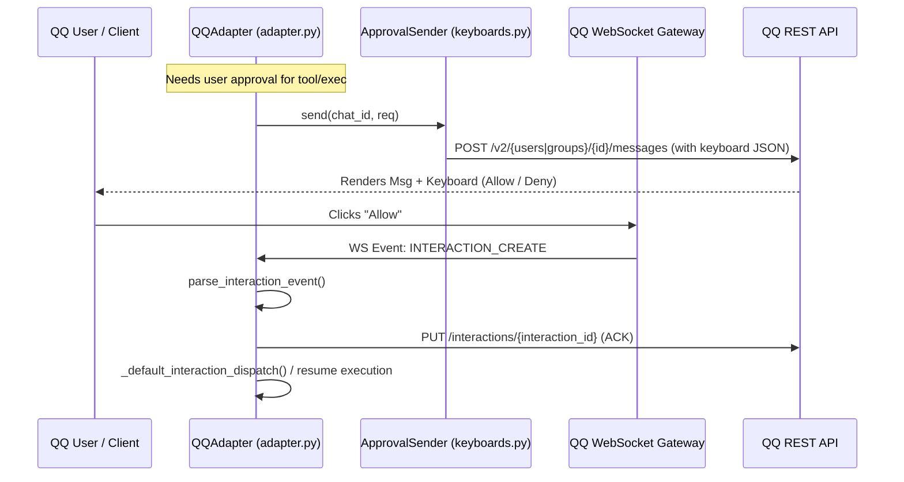

# qqbot Design Documentation

## Goal
The `gateway/platforms/qqbot` directory implements the platform adapter and integration layer for the **Official QQ Bot API (v2)**. It acts as a gateway bridge, allowing the Hermes agent core to communicate with QQ users and groups. Its primary tasks include:
- Managing long-lived WebSocket connections to the QQ Bot Gateway for receiving real-time events.
- Interfacing with the QQ REST API for sending messages, rich media, and managing interactions.
- Supporting QR-code based "scan-to-configure" onboarding for automated local credential setup and decryption.
- Handling chunked uploads for large media files (up to 100MB) to Tencent Cloud Object Storage (COS) via pre-signed URLs.
- Rendering and handling interactive inline keyboards, enabling user-driven tool/command approvals and configuration prompts.
- Transcribing incoming voice messages using QQ's built-in ASR or configured speech-to-text (STT) services.

## File Enumeration
- [__init__.py](file:///home/castincar/hermes-agent/gateway/platforms/qqbot/__init__.py): Packages and exposes the public API of the QQBot platform, including the main adapter class (`QQAdapter`), requirements checks, onboarding flows, keyboard structures, and uploader classes.
- [adapter.py](file:///home/castincar/hermes-agent/gateway/platforms/qqbot/adapter.py): Contains the `QQAdapter` class which inherits from `BasePlatformAdapter`. It handles WebSocket listener/heartbeat loops, REST API communication, message routing (C2C, group, guild, and direct messages), attachment/media downloading, voice message conversion, transcription/STT integration, and interaction dispatching.
- [chunked_upload.py](file:///home/castincar/hermes-agent/gateway/platforms/qqbot/chunked_upload.py): Implements the `ChunkedUploader` class, driving the 3-step chunked upload flow (`upload_prepare`, concurrent uploading of parts via PUT to pre-signed COS URLs, and completion acknowledgment via `files` endpoint) for large files (>10MB).
- [constants.py](file:///home/castincar/hermes-agent/gateway/platforms/qqbot/constants.py): Defines shared constants such as version strings, base URL endpoints, default request timeouts, limits, reconnect policies, and message/media type codes.
- [crypto.py](file:///home/castincar/hermes-agent/gateway/platforms/qqbot/crypto.py): Provides cryptographic utilities (`generate_bind_key`, `decrypt_secret`) for generating ephemeral AES-256-GCM keys and decrypting bot credentials locally during QR-code onboarding.
- [keyboards.py](file:///home/castincar/hermes-agent/gateway/platforms/qqbot/keyboards.py): Defines the data structures and templates for inline keyboards (`InlineKeyboard`, `KeyboardButton`, `KeyboardRow`), handles markdown/layout generation for tool approvals (`build_approval_keyboard`, `build_approval_text`) and update prompts (`build_update_prompt_keyboard`), and parses `INTERACTION_CREATE` payload data.
- [onboard.py](file:///home/castincar/hermes-agent/gateway/platforms/qqbot/onboard.py): Drives the scan-to-configure registration flow (`qr_register`) by requesting a bind task, printing the scannable QR code (or URL) in the terminal, polling for confirmation, and returning decrypted bot credentials.
- [utils.py](file:///home/castincar/hermes-agent/gateway/platforms/qqbot/utils.py): Holds utility functions such as User-Agent formatting (`build_user_agent`), standard request header construction (`get_api_headers`), and config value list coercion (`coerce_list`).

## Workflow
Below is the sequence diagram illustrating the interactive inline keyboard tool-approval flow between the QQ User, the QQBot Adapter, and the QQ APIs:



## System Architecture
The following diagram highlights how modules in the `gateway/platforms/qqbot` directory relate to each other and integrate with the main Hermes gateway framework:

```
+--------------------------------------------------------+
|                      Hermes Core                       |
|          (AIAgent, run_agent.py, gateway/run.py)       |
+---------------------------+----------------------------+
                            | (implements BasePlatformAdapter)
                            v
+--------------------------------------------------------+
|                    QQAdapter (adapter.py)              |
|  - Manages WS & REST connection                        |
|  - Transcribes voice/ASR                               |
|  - Orchestrates sub-modules                            |
+---------+--------------+--------------+----------------+
          |              |              |
          | (configures) | (uploads)    | (interacts)
          v              v              v
  +---------------+ +------------+ +-------------------+
  |   onboard.py  | |  chunked_  | |   keyboards.py    |
  |  (QR Onboard) | |  upload.py | | (Inline Keyboards)|
  +-------+-------+ +------------+ +-------------------+
          |                             |
          | (decrypts)                  | (button_data)
          v                             v
  +---------------+                +-------------------+
  |   crypto.py   |                |   constants.py    |
  | (AES-256-GCM) |                | (Types & Configs) |
  +---------------+                +-------------------+
          |                             |
          +--------------+--------------+
                         | (User-Agent, Headers)
                         v
                  +------------+
                  |  utils.py  |
                  +------------+
```
