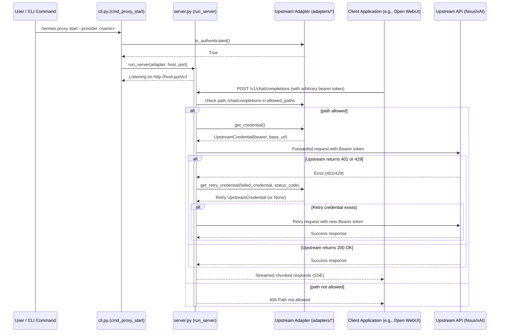

# hermes_cli/proxy Design Documentation

## Goal
The goal of the `hermes_cli/proxy` directory is to implement a local, OpenAI-compatible HTTP proxy server that forwards client requests to upstream AI models using the user's active, authenticated OAuth provider subscriptions (such as Nous Portal or xAI Grok).

By acting as a credential-attaching forwarder, it enables external applications (e.g., Open WebUI, LibreChat) to query a local endpoint (`127.0.0.1:8645` by default) without needing static API keys. The proxy strips incoming client authorization headers, attaches the resolved upstream bearer token, forwards requests to the upstream API, handles client-transparent retry logic (e.g., rotating credentials on rate limits or authorization failures), and streams the response back.

## File Enumeration
* [__init__.py](file:///home/castincar/hermes-agent/hermes_cli/proxy/__init__.py): Packages the module and exposes the base `UpstreamAdapter` class for defining upstream providers.
* [cli.py](file:///home/castincar/hermes-agent/hermes_cli/proxy/cli.py): Implements the CLI interface for the `hermes proxy` command group, defining subcommands to start the proxy (`start`), inspect adapter statuses (`status`), and list available upstream providers (`providers`).
* [server.py](file:///home/castincar/hermes-agent/hermes_cli/proxy/server.py): Implements the core aiohttp-based HTTP proxy server that routes traffic, filters request/response headers, manages token attachments, interacts with the chosen adapter to rotate credentials on 401/429 responses, and streams responses chunk-by-chunk.
* [adapters/](file:///home/castincar/hermes-agent/hermes_cli/proxy/adapters): Subdirectory containing vendor-specific token resolvers, token validation, and retry handlers. For details, see [adapters/DESIGN.md](file:///home/castincar/hermes-agent/hermes_cli/proxy/adapters/DESIGN.md).

## Workflow
The sequence diagram below shows how the CLI initializes the server and how an incoming HTTP request is proxied to the upstream provider using the active adapter's credentials.



## System Architecture
The block diagram below describes the relationship between the proxy command interface, the HTTP forwarding server, the upstream adapters, and the credential stores.

```
+-------------------------------------------------------------+
|                     hermes CLI / Core                       |
|           (e.g., hermes command line entrypoint)            |
+------------------------------+------------------------------+
                               |
                               | invokes subcommand
                               v
+-------------------------------------------------------------+
|                      hermes_cli/proxy/                      |
|                                                             |
|   +------------------+             +--------------------+   |
|   |      cli.py      |------------>|     server.py      |   |
|   | (CLI Subcommands)|             |  (aiohttp Server)  |   |
|   +--------+---------+             +---------+----------+   |
|            |                                 |              |
|            | resolves                        | uses         |
|            v                                 v              |
|   +-----------------------------------------------------+   |
|   |                     adapters/                       |   |
|   |                                                     |   |
|   |         +---------------------------------+         |   |
|   |         |             base.py             |         |   |
|   |         | (UpstreamAdapter Interface)     |         |   |
|   |         +--------+------------------+-----+         |   |
|   |                  ^                  ^               |   |
|   |                  | inherits         | inherits      |   |
|   |         +--------+---------+  +-----+----------+    |   |
|   |         |  nous_portal.py  |  |     xai.py     |    |   |
|   |         +------------------+  +----------------+    |   |
|   +-----------------------------------------------------+   |
+-------------------------------------------------------------+
                               |
             interacts with    v
        +-------------------------------------------+
        | Local Authentication Stores               |
        | (~/.hermes/auth.json / Credential Pool)   |
        +-------------------------------------------+
```
