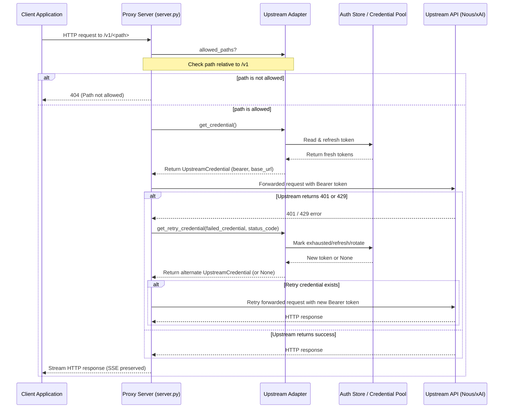

# hermes_cli/proxy/adapters Design Documentation

## Goal
The goal of the `hermes_cli/proxy/adapters` directory is to define and implement a unified, vendor-agnostic interface for proxying local client requests to upstream AI models using the user's active, authenticated OAuth subscriptions (such as Nous Portal and xAI Grok). 

By decoupling vendor-specific OAuth token rotation, credential verification, and error-handling (like rate limiting cooldowns or quarantining invalid tokens) from the core HTTP proxy server, this package allows any external application to query localhost and seamlessly authenticate with remote API endpoints without managing API keys directly.

## File Enumeration
* [__init__.py](file:///home/castincar/hermes-agent/hermes_cli/proxy/adapters/__init__.py): Exposes the adapter registry dictionary `ADAPTERS` mapping CLI-compatible strings (like `"nous"` and `"xai"`) to their respective class types, and provides the `get_adapter(name: str) -> UpstreamAdapter` helper function to dynamically instantiate registered adapters.
* [base.py](file:///home/castincar/hermes-agent/hermes_cli/proxy/adapters/base.py): Defines the abstract `UpstreamAdapter` base class and the `UpstreamCredential` frozen dataclass. `UpstreamCredential` represents a resolved bearer token, auth scheme (default: `Bearer`), expiration timestamp, and upstream URL. `UpstreamAdapter` defines the required interface for resolving active credentials, verifying authentication status, registering allowed HTTP paths, and handling retry/failover strategies.
* [nous_portal.py](file:///home/castincar/hermes-agent/hermes_cli/proxy/adapters/nous_portal.py): Implements `NousPortalAdapter` for proxying requests to the Nous Portal inference API. Handles token reading and dynamic token refreshes by invoking `resolve_nous_runtime_credentials`. Quarantines invalid credentials back into `~/.hermes/auth.json` when terminal authentication errors are encountered.
* [xai.py](file:///home/castincar/hermes-agent/hermes_cli/proxy/adapters/xai.py): Implements `XAIGrokAdapter` for proxying requests to the xAI Grok API. Leverages a multi-credential `CredentialPool` loaded via `load_pool("xai-oauth")` to rotate keys automatically when a client receives `429` (Rate Limited) or `401` (Unauthorized) status codes from the upstream.

## Workflow
The diagram below details the sequence of operations when a local OpenAI-compatible client issues a request through the proxy server.



## System Architecture
This ASCII block diagram shows how files in the `adapters` directory relate to the proxy HTTP server and the underlying authentication subsystems.

```
                            +--------------------------+
                            |      External Apps       |
                            |   (Open WebUI, etc.)     |
                            +------------+-------------+
                                         | HTTP requests
                                         v
                            +--------------------------+
                            |   proxy/server.py        |
                            |      (Proxy Server)      |
                            +------------+-------------+
                                         |
                        Uses adapter     | Resolves adapter via get_adapter()
                                         v
                            +--------------------------+
                            |  adapters/__init__.py    |
                            |    (Adapter Registry)    |
                            +------------+-------------+
                                         |
                                         v
+--------------------------------------------------------------------------------------+
| hermes_cli/proxy/adapters/                                                           |
|                                                                                      |
|                 +--------------------------------------------------+                 |
|                 |                     base.py                      |                 |
|                 |     Defines UpstreamAdapter & UpstreamCredential |                 |
|                 +---------^------------------------------^---------+                 |
|                           | Inherits                     | Inherits                  |
|                           |                              |                           |
|                 +---------+----------+         +---------+----------+                |
|                 |   nous_portal.py   |         |       xai.py       |                |
|                 | (NousPortalAdapter)|         |  (XAIGrokAdapter)  |                |
|                 +---------+----------+         +---------+----------+                |
+---------------------------|------------------------------|---------------------------+
                            |                              |
                            | Calls resolver               | Selects / rotates
                            v                              v
                  +--------------------+         +--------------------+
                  |    cli/auth.py     |         |  credential_pool   |
                  |  (Nous resolution) |         |  (Grok Oauth Pool) |
                  +---------+----------+         +---------+----------+
                            |                              |
                   Persists |                              | Persists
                            v                              v
                  +--------------------+         +--------------------+
                  |~/.hermes/auth.json |         |~/.hermes/auth.json |
                  |  (providers block) |         | (credential_pools) |
                  +--------------------+         +--------------------+
```
