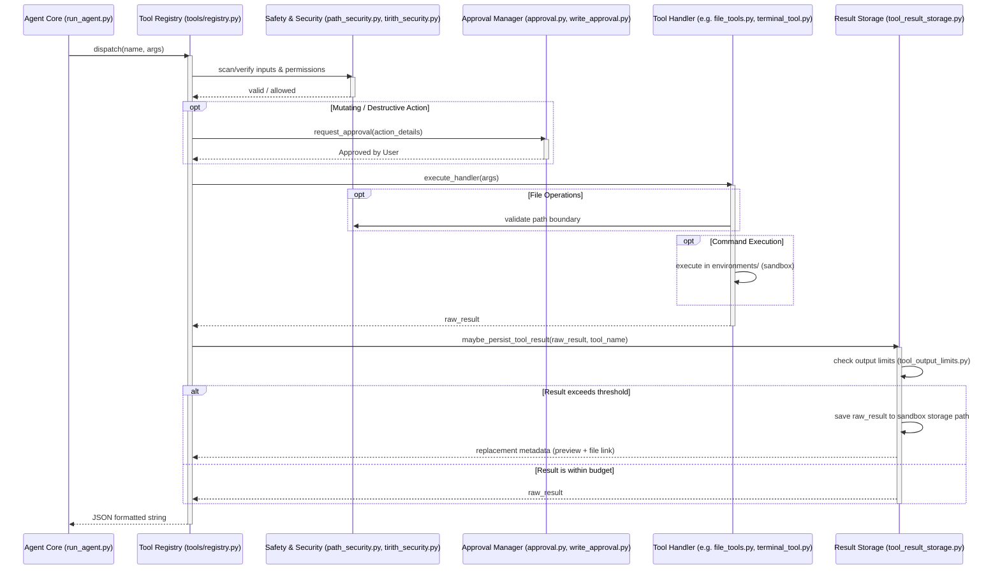

# tools Design Documentation

## Goal
The `tools` directory is the core extensibility and capability layer of the Hermes Agent. It implements all capabilities exposed to the LLM agent as callable schemas (tools). The primary architecture role is to provide a safe, secure, and resource-bounded tool execution engine.

Main tasks performed by this module:
* **Tool Registration & Schema Discovery**: Implements self-registering modules via `registry.py` and automatic schema generation.
* **Security & Sandboxing**: Enforces path validation (`path_security.py`), validates URLs (`url_safety.py`), audits file edits (`credential_files.py`), monitors threat patterns (`threat_patterns.py`), and executes shell commands in isolated sandboxes (`tools/environments/`).
* **Result Persistence & Size Caps**: Implements a three-level output management system (`tool_result_storage.py`, `tool_output_limits.py`, `budget_config.py`) to prevent context window overflow.
* **User Consent & Approvals**: Gates destructive or mutating actions through interactive approval workflows (`approval.py`, `write_approval.py`).
* **Extension Systems**: Implements the Model Context Protocol (`mcp_tool.py`) for dynamic third-party integrations and progressive disclosure of agent Skills (`skills_tool.py`).
* **Rich Capability Interfaces**: Exposes browser automation (`browser_tool.py`), OS-level control (`tools/computer_use/`), media generation (image/video/speech), calendar/mail integrations, and subagent orchestration (`delegate_tool.py`).

## File Enumeration
* [__init__.py](file:///home/castincar/hermes-agent/tools/__init__.py): Namespace entry point; exposes requirements verification for file tools.
* [ansi_strip.py](file:///home/castincar/hermes-agent/tools/ansi_strip.py): Strips ANSI escape sequences and colors from execution outputs to ensure clean text processing.
* [approval.py](file:///home/castincar/hermes-agent/tools/approval.py): Orchestrates user approval gates for potentially destructive or mutating operations.
* [binary_extensions.py](file:///home/castincar/hermes-agent/tools/binary_extensions.py): Helper utility to check if a file path is a binary file based on its file extension.
* [blueprints.py](file:///home/castincar/hermes-agent/tools/blueprints.py): Manages blueprint templates and playbooks to pre-configure execution tasks or setups.
* [browser_camofox.py](file:///home/castincar/hermes-agent/tools/browser_camofox.py): Headless/headed browser wrapper using Camoufox to evade bot protection checks.
* [browser_camofox_state.py](file:///home/castincar/hermes-agent/tools/browser_camofox_state.py): Manages session profiles, cookie storage, and proxy configurations for Camoufox.
* [browser_cdp_tool.py](file:///home/castincar/hermes-agent/tools/browser_cdp_tool.py): Low-level browser automation via direct Chrome DevTools Protocol (CDP) connections.
* [browser_dialog_tool.py](file:///home/castincar/hermes-agent/tools/browser_dialog_tool.py): Event listeners to automatically dismiss or accept browser alerts, prompts, and confirmations.
* [browser_supervisor.py](file:///home/castincar/hermes-agent/tools/browser_supervisor.py): Coordinates high-level tab tracking, visual/structural validation, and screenshot capturing.
* [browser_tool.py](file:///home/castincar/hermes-agent/tools/browser_tool.py): Playwright browser interface exposing click, fill, type, navigation, and CSS/XPath selectors.
* [budget_config.py](file:///home/castincar/hermes-agent/tools/budget_config.py): Resolves size limits and turn character constraints using the 3-layer persistence model.
* [checkpoint_manager.py](file:///home/castincar/hermes-agent/tools/checkpoint_manager.py): Automated Git-based file checkpointing system to enable rolling back workspace changes.
* [clarify_gateway.py](file:///home/castincar/hermes-agent/tools/clarify_gateway.py): Relays user-clarification requests to users over platform messaging networks (Slack, Telegram, etc.).
* [clarify_tool.py](file:///home/castincar/hermes-agent/tools/clarify_tool.py): Prompts the user interactively in the CLI or TUI to resolve ambiguous instructions.
* [code_execution_tool.py](file:///home/castincar/hermes-agent/tools/code_execution_tool.py): Executes Python, JS, or shell script snippets inside the target execution environment.
* [computer_use_tool.py](file:///home/castincar/hermes-agent/tools/computer_use_tool.py): Model-facing wrapper for OS-level control via macOS SkyLight SPIs.
* [credential_files.py](file:///home/castincar/hermes-agent/tools/credential_files.py): Scans text file modifications to prevent accidentally committing API keys or credentials to disk.
* [cronjob_tools.py](file:///home/castincar/hermes-agent/tools/cronjob_tools.py): Registers and manages background scheduled jobs running through the internal scheduler.
* [debug_helpers.py](file:///home/castincar/hermes-agent/tools/debug_helpers.py): Helper functions to trace tool calls and debug state.
* [delegate_tool.py](file:///home/castincar/hermes-agent/tools/delegate_tool.py): Spawns child subagents to parallelize work and exchange context.
* [discord_tool.py](file:///home/castincar/hermes-agent/tools/discord_tool.py): Interacts with Discord channels, search features, and messaging payloads.
* [env_passthrough.py](file:///home/castincar/hermes-agent/tools/env_passthrough.py): Sanitization rules controlling which host variables are forwarded to target environments.
* [env_probe.py](file:///home/castincar/hermes-agent/tools/env_probe.py): Queries host OS variables, paths, and shells to configure container backends.
* [fal_common.py](file:///home/castincar/hermes-agent/tools/fal_common.py): Common HTTP helpers for generating assets via Fal.ai APIs.
* [feishu_doc_tool.py](file:///home/castincar/hermes-agent/tools/feishu_doc_tool.py): Reads and writes document structures inside Feishu/Lark.
* [feishu_drive_tool.py](file:///home/castincar/hermes-agent/tools/feishu_drive_tool.py): Manages file uploads, downloads, and listings inside Feishu/Lark cloud storage.
* [file_operations.py](file:///home/castincar/hermes-agent/tools/file_operations.py): Core filesystem operations (grep, diff, search, replace, and patching).
* [file_state.py](file:///home/castincar/hermes-agent/tools/file_state.py): Tracks dirty files, backup states, and supports undo/redo chains.
* [file_tools.py](file:///home/castincar/hermes-agent/tools/file_tools.py): High-level LLM tools: `read_file`, `write_file`, `patch`, and `search_files`.
* [fuzzy_match.py](file:///home/castincar/hermes-agent/tools/fuzzy_match.py): Implements quick line search and fuzzy code/symbol locating algorithms.
* [homeassistant_tool.py](file:///home/castincar/hermes-agent/tools/homeassistant_tool.py): Queries and triggers smart home devices through Home Assistant APIs.
* [image_generation_tool.py](file:///home/castincar/hermes-agent/tools/image_generation_tool.py): Integrates generative image models (DALL-E, Fal) with the agent.
* [interrupt.py](file:///home/castincar/hermes-agent/tools/interrupt.py): Listens to abort signals and interrupts running tools.
* [kanban_tools.py](file:///home/castincar/hermes-agent/tools/kanban_tools.py): Interfaces with the Kanban multi-agent board system to track task cards.
* [lazy_deps.py](file:///home/castincar/hermes-agent/tools/lazy_deps.py): Prevents slow startup by wrapping heavy library imports in dynamic loaders.
* [managed_tool_gateway.py](file:///home/castincar/hermes-agent/tools/managed_tool_gateway.py): Executes tasks in remote sandboxes using the Nous Tool Gateway API.
* [mcp_oauth.py](file:///home/castincar/hermes-agent/tools/mcp_oauth.py): OAuth client handler for MCP servers that require authentication.
* [mcp_oauth_manager.py](file:///home/castincar/hermes-agent/tools/mcp_oauth_manager.py): Stores credentials and handles OAuth access token refreshes.
* [mcp_tool.py](file:///home/castincar/hermes-agent/tools/mcp_tool.py): Core MCP (Model Context Protocol) client module; discovers external schemas and dispatches calls.
* [memory_tool.py](file:///home/castincar/hermes-agent/tools/memory_tool.py): Provides semantic and structured read/write access to long-term memory.
* [microsoft_graph_auth.py](file:///home/castincar/hermes-agent/tools/microsoft_graph_auth.py): Authentication client for Microsoft 365 services.
* [microsoft_graph_client.py](file:///home/castincar/hermes-agent/tools/microsoft_graph_client.py): Integrates Outlook mail, Teams chat, calendar, and OneDrive.
* [mixture_of_agents_tool.py](file:///home/castincar/hermes-agent/tools/mixture_of_agents_tool.py): Coordinates multiple LLM endpoints to synthesize a single optimized response.
* [neutts_synth.py](file:///home/castincar/hermes-agent/tools/neutts_synth.py): Standalone subprocess executor for the heavy (~500MB) NeuTTS models to optimize memory footprint.
* [openrouter_client.py](file:///home/castincar/hermes-agent/tools/openrouter_client.py): A lightweight client module for OpenRouter completions.
* [osv_check.py](file:///home/castincar/hermes-agent/tools/osv_check.py): Audits dependencies against the Open Source Vulnerabilities database.
* [patch_parser.py](file:///home/castincar/hermes-agent/tools/patch_parser.py): Secure parser validating context hunks before code patches are applied.
* [path_security.py](file:///home/castincar/hermes-agent/tools/path_security.py): Security boundary enforcement, validating that file operations remain inside the workspace.
* [process_registry.py](file:///home/castincar/hermes-agent/tools/process_registry.py): Monitors and registers background subprocesses.
* [read_extract.py](file:///home/castincar/hermes-agent/tools/read_extract.py): Extracts text content from formatted assets (PDF, DOCX, HTML).
* [read_terminal_tool.py](file:///home/castincar/hermes-agent/tools/read_terminal_tool.py): Reads scrollback buffer context from active terminals.
* [registry.py](file:///home/castincar/hermes-agent/tools/registry.py): Central schema database and dispatch coordinator.
* [schema_sanitizer.py](file:///home/castincar/hermes-agent/tools/schema_sanitizer.py): Validates and cleans JSON parameter schemas for tool definitions.
* [send_message_tool.py](file:///home/castincar/hermes-agent/tools/send_message_tool.py): Routes messages and notifications back to users on active channels.
* [session_search_tool.py](file:///home/castincar/hermes-agent/tools/session_search_tool.py): Enables LLM agent to search database records of past conversations.
* [skill_manager_tool.py](file:///home/castincar/hermes-agent/tools/skill_manager_tool.py): Exposes CLI workflows to edit, test, and package custom Skills.
* [skill_provenance.py](file:///home/castincar/hermes-agent/tools/skill_provenance.py): Audits origin and security signatures of loaded Skill directories.
* [skill_usage.py](file:///home/castincar/hermes-agent/tools/skill_usage.py): Logs executions, compute footprint, and statistics for Skills.
* [skills_ast_audit.py](file:///home/castincar/hermes-agent/tools/skills_ast_audit.py): Analyzes syntax trees to ensure Skills do not import malicious modules.
* [skills_guard.py](file:///home/castincar/hermes-agent/tools/skills_guard.py): Enforces runtime restrictions on system accesses within custom Skills.
* [skills_hub.py](file:///home/castincar/hermes-agent/tools/skills_hub.py): Coordinates skill sharing with remote registries.
* [skills_sync.py](file:///home/castincar/hermes-agent/tools/skills_sync.py): Synchronizes local directories with updated hub skills.
* [skills_tool.py](file:///home/castincar/hermes-agent/tools/skills_tool.py): Core progressive disclosure listing and viewing API for Skills.
* [slash_confirm.py](file:///home/castincar/hermes-agent/tools/slash_confirm.py): Confirms administrative settings and critical commands.
* [terminal_tool.py](file:///home/castincar/hermes-agent/tools/terminal_tool.py): Executes commands inside target environments.
* [thread_context.py](file:///home/castincar/hermes-agent/tools/thread_context.py): Stores session and task context across thread boundaries.
* [threat_patterns.py](file:///home/castincar/hermes-agent/tools/threat_patterns.py): Regular expressions for prompt injection and credential leak scanning.
* [tirith_security.py](file:///home/castincar/hermes-agent/tools/tirith_security.py): Evaluates tool call parameters against Tirith policies.
* [todo_tool.py](file:///home/castincar/hermes-agent/tools/todo_tool.py): Manages execution goals and task checklists.
* [tool_backend_helpers.py](file:///home/castincar/hermes-agent/tools/tool_backend_helpers.py): Text decoding and command response helper utilities.
* [tool_output_limits.py](file:///home/castincar/hermes-agent/tools/tool_output_limits.py): Enforces max bytes and line limits based on user configuration.
* [tool_result_storage.py](file:///home/castincar/hermes-agent/tools/tool_result_storage.py): Persists oversized outputs to disk, replacing context replies with file links.
* [tool_search.py](file:///home/castincar/hermes-agent/tools/tool_search.py): Searches registered metadata for matching tools.
* [transcription_tools.py](file:///home/castincar/hermes-agent/tools/transcription_tools.py): Transcribes audio recordings using Whisper/speech APIs.
* [tts_tool.py](file:///home/castincar/hermes-agent/tools/tts_tool.py): Orchestrates Text-to-Speech synthesis (NeuTTS, OS speech engine, or APIs).
* [url_safety.py](file:///home/castincar/hermes-agent/tools/url_safety.py): Enforces URL validation, blocking private IPs and invalid targets.
* [video_generation_tool.py](file:///home/castincar/hermes-agent/tools/video_generation_tool.py): Triggers AI video rendering using Fal.ai pipelines.
* [vision_tools.py](file:///home/castincar/hermes-agent/tools/vision_tools.py): Annotates or describes screenshots/images for non-vision LLMs.
* [voice_mode.py](file:///home/castincar/hermes-agent/tools/voice_mode.py): Implements live audio stream routing.
* [web_tools.py](file:///home/castincar/hermes-agent/tools/web_tools.py): Fetches remote web pages and executes search queries.
* [website_policy.py](file:///home/castincar/hermes-agent/tools/website_policy.py): Enforces crawler permissions by fetching robots.txt rules.
* [write_approval.py](file:///home/castincar/hermes-agent/tools/write_approval.py): Shows unified diff proposals to the user for confirmation.
* [x_search_tool.py](file:///home/castincar/hermes-agent/tools/x_search_tool.py): Queries Twitter/X platforms.
* [xai_http.py](file:///home/castincar/hermes-agent/tools/xai_http.py): Client handler helper for xAI endpoints.
* [yuanbao_tools.py](file:///home/castincar/hermes-agent/tools/yuanbao_tools.py): Queries Tencent Yuanbao search services.

### Subdirectories
* [environments/](file:///home/castincar/hermes-agent/tools/environments/DESIGN.md): Sandbox command execution layer (Local, Docker, SSH, Daytona, Modal, Apptainer).
* [computer_use/](file:///home/castincar/hermes-agent/tools/computer_use/DESIGN.md): Background macOS desktop UI control.

## Workflow
The runtime flow within the `tools` directory when an agent invokes a capability is illustrated below:



## System Architecture
The diagram below shows the structural composition of the `tools/` directory and how the core modules interface with one another and the rest of the Hermes system:

```
                                +---------------------------+
                                | Agent Core (run_agent.py) |
                                +-------------+-------------+
                                              |
                                              | invokes
                                              v
+------------------------------------------------------------------------------------------+
| tools/ Directory                                                                         |
|                                                                                          |
|                                  +-------------------+                                   |
|                                  |    registry.py    | <--- schema_sanitizer.py          |
|                                  +---------+---------+      lazy_deps.py                 |
|                                            |                                             |
|        +-----------------------------------+-----------------------------------+         |
|        |                                   |                                   |         |
|        v                                   v                                   v         |
|  +------------+                      +-----------+                       +-----------+   |
|  |   Safety   |                      | Approvals |                       |  Storage  |   |
|  |  Scanners  |                      |  Engine   |                       | & Budget  |   |
|  | (path_sec, |                      | (approval,|                       | (storage, |   |
|  |  threats,  |                      | write_app)|                       |  limits,  |   |
|  |  tirith)   |                      +-----------+                       |  budget)  |   |
|  +------------+                                                          +-----------+   |
|        |                                                                                 |
|        +-------------------------+-------------------------+                             |
|                                  |                         |                             |
|                                  v                         v                             |
|                    +---------------------------+  +------------------+                   |
|                    |     Core Agent Tools      |  | MCP Client Tools |                   |
|                    | - File Operations         |  | - mcp_tool.py    |                   |
|                    | - Sandboxed Execution     |  | - mcp_oauth.py   |                   |
|                    | - Browser Automation      |  +------------------+                   |
|                    | - Agent Delegation & Msg  |                                         |
|                    | - Voice, Media, Home Auto |                                         |
|                    | - Memory & Skills Systems |                                         |
|                    +-------------+-------------+                                         |
|                                  |                                                       |
+----------------------------------|-------------------------------------------------------+
                                   |
            +----------------------+----------------------+
            |                                             |
            v                                             v
+-----------------------+                     +-----------------------+
|  tools/environments/  |                     |  tools/computer_use/  |
|  (Local, Docker, SSH, |                     |  (Mac CUA background  |
|  Modal, Daytona, etc.)|                     |  desktop automation)  |
+-----------------------+                     +-----------------------+
```
